# GURNAAZ - Product Requirement Document (PRD)
# Luxury Multi-Vendor Fashion Marketplace

**Version:** 1.0  
**Date:** June 2026  
**Project Type:** Multi-Vendor E-commerce Marketplace  
**Target Scale:** 100K+ Users | 10K+ Sellers | 1M+ Products

---

## Table of Contents

1. [Executive Summary](#1-executive-summary)
2. [Product Overview](#2-product-overview)
3. [Sitemap & Navigation Structure](#3-sitemap--navigation-structure)
4. [Role Structure & Permissions](#4-role-structure--permissions)
5. [Customer Side - Complete Breakdown](#5-customer-side---complete-breakdown)
6. [Seller Side - Complete Ecosystem](#6-seller-side---complete-ecosystem)
7. [Product Creation Module](#7-product-creation-module)
8. [Admin Panel - Platform Management](#8-admin-panel---platform-management)
9. [Super Admin Panel - System Controls](#9-super-admin-panel---system-controls)
10. [Database Planning & Entity Relationships](#10-database-planning--entity-relationships)
11. [API Architecture & Planning](#11-api-architecture--planning)
12. [User Flows & Lifecycles](#12-user-flows--lifecycles)
13. [Business Rules & Logic](#13-business-rules--logic)
14. [Phase-Wise Roadmap](#14-phase-wise-roadmap)
15. [Scaling Strategy](#15-scaling-strategy)

---
## 1. Executive Summary

### 1.1 Project Vision
GURNAAZ is a premium multi-vendor marketplace platform designed specifically for luxury South Asian fashion, focusing on Punjabi suits, Pakistani suits, designer wear, boutique collections, wedding wear, and luxury pret. The platform connects independent designers, boutiques, and brands with fashion-conscious customers seeking authentic, high-quality ethnic wear.

### 1.2 Business Model
- **Type:** Commission-based Multi-Vendor Marketplace
- **Inventory Model:** Zero inventory (sellers manage their own stock)
- **Revenue Streams:**
  - Commission on sales (5-20% tiered based on seller performance)
  - Premium seller subscriptions
  - Featured listings and promotions
  - Advertisement placements
  - Premium customer memberships

### 1.3 Product Goals
1. **Marketplace Excellence:** Create a trusted, scalable platform connecting 10K+ verified sellers with 100K+ active customers
2. **Seller Empowerment:** Provide comprehensive tools for boutiques and designers to digitize and scale their businesses
3. **Customer Experience:** Deliver a premium, personalized shopping experience with AI-powered recommendations
4. **Quality Assurance:** Maintain high standards through rigorous seller verification and product moderation
5. **Scalability:** Build infrastructure to support 1M+ products and handle peak loads during wedding seasons

### 1.4 User Stories

**As a Customer:**
- I want to discover unique designer outfits from verified boutiques so that I can find exclusive pieces for special occasions
- I want to filter products by fabric, embroidery work, and price range so that I can find exactly what matches my requirements
- I want to track my order in real-time and have easy returns so that I feel confident making high-value purchases online

**As a Seller/Boutique Owner:**
- I want to easily upload and manage my entire catalog with detailed specifications so that I can showcase my designs professionally
- I want insights into my store performance and customer preferences so that I can make data-driven inventory decisions
- I want automated order processing and shipping integrations so that I can focus on creating beautiful designs

**As an Admin:**
- I want to monitor platform health and seller/customer activities so that I can ensure quality and prevent fraud
- I want to manage disputes and returns efficiently so that both parties are satisfied
- I want comprehensive analytics to understand marketplace trends and make strategic decisions

**As a Super Admin:**
- I want granular control over platform configurations and commission structures so that I can optimize business operations
- I want to manage system-wide features and security settings so that the platform remains secure and scalable

### 1.5 Competitive Analysis

| Competitor | Strengths | Weaknesses | Market Position |
|------------|-----------|------------|-----------------|
| **Pernia's Pop-Up Shop** | Premium brand, curated designers, strong social media | High commission, limited seller autonomy | High-end luxury |
| **Myntra** | Large user base, strong logistics, brand trust | Generic ethnic wear, not specialist | Mass market |
| **Ajio Luxe** | Reliance backing, good UI/UX | Limited ethnic wear focus | Premium general fashion |
| **Jaypore** | Authentic artisan products, storytelling | Limited tech features, smaller scale | Artisan-focused niche |
| **Utsav Fashion** | Specialized ethnic wear, global shipping | Outdated interface, single vendor | Traditional single-vendor |
| **Meesho** | Massive seller base, low prices | Quality concerns, reseller model | Budget mass market |
| **GURNAAZ** | Luxury ethnic specialist, seller-first platform, AI-powered | New entrant, building trust | Premium ethnic marketplace |

### 1.6 Competitive Quadrant Chart

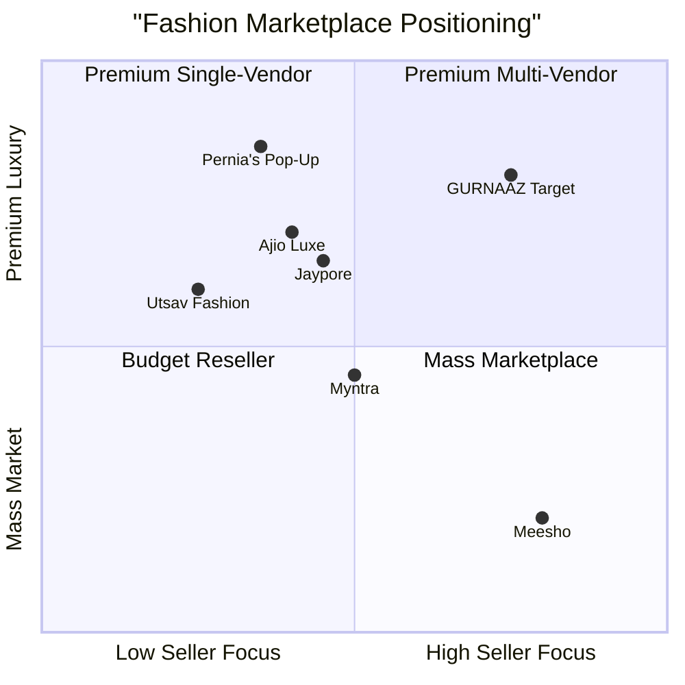

### 1.7 Requirements Analysis

**Functional Requirements:**
- P0: User authentication and authorization for all roles
- P0: Product catalog with advanced filtering and search
- P0: Shopping cart and checkout with multiple payment options
- P0: Order management and tracking system
- P0: Seller onboarding and store management
- P0: Admin dashboard for platform oversight
- P1: Wishlist and favorites functionality
- P1: Review and rating system
- P1: Returns and refunds workflow
- P1: Seller analytics and reporting
- P1: Coupon and promotion engine
- P2: AI-powered recommendations
- P2: Fashion journal and content management
- P2: Referral program
- P2: Live chat support

**Non-Functional Requirements:**
- **Performance:** Page load < 2s, API response < 300ms, support 10K concurrent users
- **Scalability:** Horizontal scaling to handle 1M+ products and 100K+ daily active users
- **Security:** PCI DSS compliance, GDPR/data privacy compliance, secure payment processing
- **Availability:** 99.9% uptime, automated failover, disaster recovery
- **Usability:** Mobile-first responsive design, accessibility (WCAG 2.1 AA)
- **Reliability:** Data backup every 6 hours, transaction integrity, audit trails

### 1.8 Technology Stack Recommendation

**Frontend:**
- Framework: Next.js 14+ (React) with TypeScript
- UI Library: Shadcn-ui + Tailwind CSS
- State Management: Zustand / Redux Toolkit
- Mobile: Progressive Web App (PWA) + React Native for native apps (Phase 3)

**Backend:**
- Runtime: Node.js with Express.js / NestJS
- Database: PostgreSQL (primary), Redis (caching, sessions)
- Search: Elasticsearch / Algolia
- File Storage: AWS S3 / Cloudflare R2
- Queue: Bull / RabbitMQ for async processing

**Infrastructure:**
- Hosting: Atoms Cloud
- CDN: Cloudflare
- Payment Gateway: Razorpay / Stripe
- SMS/Email: Twilio, SendGrid
- Analytics: Mixpanel, Google Analytics 4

**AI/ML:**
- Recommendation Engine: TensorFlow / PyTorch
- Image Processing: OpenCV, Cloudinary AI
- Search Relevance: Elasticsearch ML

### 1.9 Open Questions
1. What is the exact commission structure? (Fixed % vs. tiered vs. category-based?)
2. Who handles shipping - platform or individual sellers?
3. What is the returns policy - who bears the cost?
4. Is there a seller subscription model or only commission-based?
5. What payment methods need to be supported? (COD, wallets, BNPL?)
6. What is the seller verification process timeline?
7. Are international sellers/customers in scope for MVP?
8. What is the dispute resolution process and SLA?

---
## 2. Product Overview

### 2.1 Platform Architecture Overview

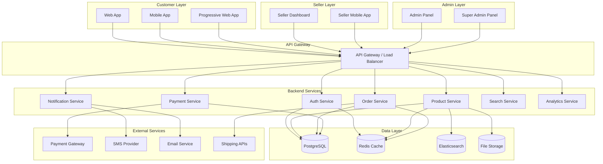

### 2.2 Core Modules Overview

| Module | Purpose | Users | Priority |
|--------|---------|-------|----------|
| **Authentication & Authorization** | User login, signup, role management, session handling | All | P0 |
| **Product Catalog** | Product browsing, search, filtering, details | Customers, Sellers | P0 |
| **Shopping Cart & Checkout** | Cart management, checkout flow, payment processing | Customers | P0 |
| **Order Management** | Order creation, tracking, fulfillment, history | Customers, Sellers, Admin | P0 |
| **Seller Management** | Onboarding, store setup, product management, analytics | Sellers, Admin | P0 |
| **Payment Processing** | Payment gateway integration, wallet, refunds | All | P0 |
| **User Management** | Profile, preferences, addresses, KYC | Customers, Sellers | P0 |
| **Admin Dashboard** | Platform oversight, moderation, analytics | Admin, Super Admin | P0 |
| **Review & Rating** | Product reviews, seller ratings, moderation | Customers, Sellers, Admin | P1 |
| **Wishlist** | Save products for later, collections | Customers | P1 |
| **Returns & Refunds** | Return requests, approval workflow, refund processing | Customers, Sellers, Admin | P1 |
| **Coupon & Promotions** | Discount codes, campaigns, flash sales | Customers, Sellers, Admin | P1 |
| **Notifications** | Email, SMS, push notifications, in-app alerts | All | P1 |
| **Customer Support** | Ticket system, live chat, FAQ | Customers, Admin | P1 |
| **Analytics & Reporting** | Business intelligence, dashboards, exports | Sellers, Admin, Super Admin | P1 |
| **Content Management** | Fashion journal, blog, pages | Customers, Admin | P2 |
| **Referral Program** | Referral codes, rewards, tracking | Customers | P2 |
| **AI Recommendations** | Personalized suggestions, similar products | Customers | P2 |
| **Seller Subscriptions** | Premium plans, feature unlocking | Sellers, Admin | P2 |

### 2.3 Key Features Summary

**Customer Features:**
- Advanced product search with filters (fabric, color, price, occasion, designer)
- Personalized recommendations based on browsing and purchase history
- Virtual try-on (future phase)
- Size guide and measurement tools
- Wishlist and collections
- Easy checkout with multiple payment options
- Order tracking with real-time updates
- Easy returns and refunds
- Loyalty program and referral rewards
- Fashion journal for styling inspiration

**Seller Features:**
- Quick onboarding with guided setup
- Comprehensive product management with bulk upload
- Inventory tracking with low-stock alerts
- Order management dashboard
- Sales analytics and insights
- Marketing tools (coupons, featured listings)
- Customer review management
- Wallet and payout tracking
- AI-powered image enhancement
- Store branding and customization

**Admin Features:**
- Real-time platform health dashboard
- User and seller management
- Product and order moderation
- Commission tracking and payouts
- Dispute resolution tools
- Content management system
- Analytics and reporting
- Marketing campaign management
- System configuration

**Super Admin Features:**
- Role and permission management
- System-wide settings and feature flags
- Commission structure configuration
- Security and access controls
- Audit logs and compliance
- Database management tools

---
## 3. Sitemap & Navigation Structure

### 3.1 Complete Platform Sitemap

```mermaid
graph TD
    Root[GURNAAZ Platform]
    
    Root --> Customer[Customer Portal]
    Root --> Seller[Seller Dashboard]
    Root --> Admin[Admin Panel]
    Root --> SuperAdmin[Super Admin Panel]
    
    Customer --> CAuth[Authentication]
    Customer --> CHome[Homepage]
    Customer --> CShop[Shopping]
    Customer --> CAccount[My Account]
    Customer --> CSupport[Support]
    
    CAuth --> CLogin[Login]
    CAuth --> CSignup[Sign Up]
    CAuth --> CForgot[Forgot Password]
    CAuth --> COTP[OTP Verification]
    
    CHome --> CHero[Hero Banner]
    CHome --> CFeatured[Featured Collections]
    CHome --> CCategories[Shop by Category]
    CHome --> CBoutiques[Top Boutiques]
    CHome --> CTrending[Trending Now]
    CHome --> CJournal[Fashion Journal Preview]
    
    CShop --> CSearch[Search Results]
    CShop --> CCollections[Collections]
    CShop --> CCategoryPage[Category Pages]
    CShop --> CBoutiquePage[Boutique Stores]
    CShop --> CProductDetail[Product Detail]
    CShop --> CWishlist[Wishlist]
    CShop --> CCart[Shopping Cart]
    CShop --> CCheckout[Checkout]
    
    CAccount --> CProfile[Profile Settings]
    CAccount --> COrders[My Orders]
    CAccount --> CAddresses[Saved Addresses]
    CAccount --> CPayments[Payment Methods]
    CAccount --> CWallet[Wallet]
    CAccount --> CReviews[My Reviews]
    CAccount --> CReturns[Returns & Refunds]
    CAccount --> CCoupons[My Coupons]
    CAccount --> CReferrals[Referral Program]
    CAccount --> CNotifications[Notifications]
    
    CSupport --> CFAQ[FAQ]
    CSupport --> CContactUs[Contact Us]
    CSupport --> CTickets[Support Tickets]
    CSupport --> CLiveChat[Live Chat]
    CSupport --> CPolicies[Policies]
    
    Seller --> SAuth[Seller Authentication]
    Seller --> SDashboard[Dashboard]
    Seller --> SProducts[Products]
    Seller --> SOrders[Orders]
    Seller --> SStore[Store Management]
    Seller --> SFinance[Finance]
    Seller --> SMarketing[Marketing]
    Seller --> SSupport[Support]
    
    SDashboard --> SOverview[Overview]
    SDashboard --> SAnalytics[Analytics]
    SDashboard --> SNotifications[Notifications]
    
    SProducts --> SProductList[Product List]
    SProducts --> SAddProduct[Add Product]
    SProducts --> SBulkUpload[Bulk Upload]
    SProducts --> SInventory[Inventory Management]
    SProducts --> SCategories[Manage Categories]
    
    SOrders --> SOrderList[Order List]
    SOrders --> SOrderDetail[Order Details]
    SOrders --> SShipping[Shipping Management]
    SOrders --> SReturns[Returns Management]
    
    SStore --> SStoreProfile[Store Profile]
    SStore --> SBranding[Store Branding]
    SStore --> SPolicies[Store Policies]
    SStore --> SVerification[Verification Status]
    
    SFinance --> SWallet[Wallet]
    SFinance --> SPayouts[Payouts]
    SFinance --> SCommissions[Commission Reports]
    SFinance --> STransactions[Transaction History]
    
    SMarketing --> SCoupons[Coupons]
    SMarketing --> SPromotions[Promotions]
    SMarketing --> SFeatured[Featured Listings]
    SMarketing --> SReviews[Customer Reviews]
    
    Admin --> ADashboard[Admin Dashboard]
    Admin --> AUsers[User Management]
    Admin --> ASellers[Seller Management]
    Admin --> AProducts[Product Management]
    Admin --> AOrders[Order Management]
    Admin --> AFinance[Finance Management]
    Admin --> ACMS[Content Management]
    Admin --> AReports[Reports & Analytics]
    Admin --> ASettings[Settings]
    
    SuperAdmin --> SADashboard[System Dashboard]
    SuperAdmin --> SARoles[Roles & Permissions]
    SuperAdmin --> SAConfig[System Configuration]
    SuperAdmin --> SACommission[Commission Structure]
    SuperAdmin --> SAFeatures[Feature Flags]
    SuperAdmin --> SASecurity[Security Controls]
    SuperAdmin --> SAAudit[Audit Logs]
```

### 3.2 Customer Portal Navigation

**Primary Navigation:**
```
┌─────────────────────────────────────────────────────────────┐
│  GURNAAZ Logo  | Shop ▼ | Collections | Boutiques | Journal │
│                                                    Search 🔍  │
│                                     Wishlist | Cart | Account │
└─────────────────────────────────────────────────────────────┘
```

**Shop Dropdown Menu:**
- Categories
  - Punjabi Suits
  - Pakistani Suits
  - Designer Wear
  - Wedding Collection
  - Luxury Pret
  - Accessories
- By Occasion
  - Wedding
  - Festive
  - Party Wear
  - Casual
- By Fabric
  - Silk
  - Georgette
  - Chiffon
  - Cotton
  - Velvet
- New Arrivals
- Sale & Offers

**Footer Navigation:**
- About Us
- How It Works
- Seller Sign Up
- Customer Support
- Shipping & Returns
- Privacy Policy
- Terms & Conditions
- Fashion Journal
- Size Guide
- Social Media Links

### 3.3 Seller Dashboard Navigation

**Sidebar Navigation:**
```
┌─────────────────────────┐
│ Dashboard 📊            │
│ ├─ Overview             │
│ └─ Analytics            │
│                         │
│ Products 📦             │
│ ├─ All Products         │
│ ├─ Add New              │
│ ├─ Bulk Upload          │
│ └─ Inventory            │
│                         │
│ Orders 📋               │
│ ├─ All Orders           │
│ ├─ Pending              │
│ ├─ Processing           │
│ ├─ Shipped              │
│ ├─ Completed            │
│ └─ Returns              │
│                         │
│ Store 🏪                │
│ ├─ Profile              │
│ ├─ Branding             │
│ ├─ Policies             │
│ └─ Verification         │
│                         │
│ Finance 💰              │
│ ├─ Wallet               │
│ ├─ Payouts              │
│ ├─ Commissions          │
│ └─ Transactions         │
│                         │
│ Marketing 📢            │
│ ├─ Coupons              │
│ ├─ Promotions           │
│ ├─ Featured Listings    │
│ └─ Reviews              │
│                         │
│ Support 💬              │
│ ├─ Messages             │
│ ├─ Tickets              │
│ └─ Help Center          │
│                         │
│ Settings ⚙️             │
└─────────────────────────┘
```

### 3.4 Admin Panel Navigation

**Main Navigation Tabs:**
```
┌───────────────────────────────────────────────────────────┐
│ Dashboard | Users | Sellers | Products | Orders | Finance  │
│ CMS | Reports | Marketing | Settings | Support             │
└───────────────────────────────────────────────────────────┘
```

**Dashboard Sidebar:**
- Overview
- Platform Metrics
- Recent Activities
- Alerts & Warnings

**Users Module:**
- All Users
- Active Users
- Banned Users
- KYC Verification
- User Groups

**Sellers Module:**
- All Sellers
- Pending Approval
- Active Sellers
- Suspended Sellers
- Seller Verification
- Performance Metrics

**Products Module:**
- All Products
- Pending Approval
- Published
- Rejected
- Out of Stock
- Categories Management
- Attributes Management

**Orders Module:**
- All Orders
- Order Status
- Disputes
- Returns & Refunds
- Order Reports

**Finance Module:**
- Transactions
- Commissions
- Payouts
- Refunds
- Revenue Reports
- Tax Reports

**CMS Module:**
- Pages
- Blogs
- Collections
- Banners
- Fashion Journal
- SEO Management

**Reports Module:**
- Sales Reports
- User Reports
- Seller Reports
- Product Reports
- Financial Reports
- Export Data

**Marketing Module:**
- Campaigns
- Promotions
- Coupons
- Email Marketing
- Push Notifications
- Referral Program

**Settings Module:**
- General Settings
- Payment Settings
- Shipping Settings
- Email Templates
- SMS Templates
- Notification Settings

### 3.5 Super Admin Panel Navigation

**Sidebar Menu:**
```
┌─────────────────────────────┐
│ System Dashboard           │
│ Roles & Permissions        │
│ Admin Management           │
│ System Configuration       │
│ ├─ General Settings        │
│ ├─ Platform Fees           │
│ ├─ Commission Rules        │
│ └─ Feature Flags           │
│ Security Controls          │
│ ├─ Access Management       │
│ ├─ IP Whitelist            │
│ └─ Two-Factor Auth         │
│ Audit Logs                 │
│ ├─ User Activities         │
│ ├─ Admin Activities        │
│ └─ System Events           │
│ Database Management        │
│ Backup & Recovery          │
│ API Management             │
│ Integration Settings       │
└─────────────────────────────┘
```

---
## 4. Role Structure & Permissions

### 4.1 Role Hierarchy

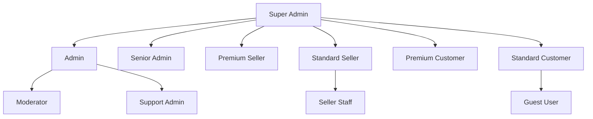

### 4.2 Detailed Role Definitions

#### 4.2.1 Super Admin Role

**Goals:**
- Maintain platform security and stability
- Configure system-wide settings
- Manage admin team and permissions
- Oversee compliance and audit trails
- Control feature releases

**Permissions:**
| Permission | Access Level | Description |
|------------|--------------|-------------|
| User Management | Full | Create, edit, delete any user |
| Admin Management | Full | Create, edit admins and assign roles |
| Seller Management | Full | Approve, suspend, delete sellers |
| Product Management | Full | Edit, delete any product |
| Order Management | Full | View, modify any order |
| Financial Access | Full | View all transactions, configure fees |
| System Configuration | Full | Modify all settings |
| Database Access | Full | Direct database management |
| API Management | Full | Create, revoke API keys |
| Feature Flags | Full | Enable/disable features |
| Audit Logs | Full | View all system activities |
| Security Controls | Full | Manage security policies |

**Dashboard Sections:**
1. System Health Monitoring
   - Server status
   - Database performance
   - API response times
   - Error rates
   - Active users count

2. Platform Metrics
   - Total users (with growth trend)
   - Total sellers (active vs inactive)
   - Total products (by category)
   - Daily/Monthly orders
   - Revenue metrics

3. Admin Activity Log
   - Recent admin actions
   - Permission changes
   - Configuration updates

4. Security Alerts
   - Failed login attempts
   - Suspicious activities
   - IP blocklist alerts

5. Quick Actions
   - Create new admin
   - Manage feature flags
   - View audit logs
   - System backup
   - Send platform-wide notifications

**Forms & Fields:**

**Create Admin Form:**
- Full Name* (text, 3-50 chars)
- Email* (email, unique)
- Phone* (phone, unique)
- Role* (dropdown: Admin, Senior Admin, Moderator, Support Admin)
- Permissions* (multi-select checkboxes)
- Department (text)
- Reporting To (dropdown, other admins)
- Status* (dropdown: Active, Inactive)
- Two-Factor Auth* (toggle, default: enabled)

**System Configuration Form:**
- Platform Name (text)
- Platform Logo (image upload)
- Primary Domain (text)
- Support Email (email)
- Support Phone (phone)
- Default Language (dropdown)
- Currency (dropdown)
- Timezone (dropdown)
- Maintenance Mode (toggle)
- Maintenance Message (textarea)

**Commission Configuration Form:**
- Category (dropdown)
- Commission Type* (dropdown: Percentage, Fixed)
- Commission Value* (number)
- Minimum Commission (number)
- Maximum Commission (number)
- Effective From* (date)
- Effective To (date)
- Status* (dropdown: Active, Inactive)

#### 4.2.2 Admin Role

**Goals:**
- Ensure platform quality and user satisfaction
- Moderate content and resolve disputes
- Monitor seller and product compliance
- Generate insights from platform data
- Support customer and seller queries

**Permissions:**
| Permission | Access Level | Description |
|------------|--------------|-------------|
| User Management | Edit | View, edit users (cannot delete) |
| Seller Management | Edit | Review, approve, suspend sellers |
| Product Management | Moderate | Review, approve, reject products |
| Order Management | View/Edit | View orders, resolve disputes |
| Financial Access | View | View transactions, cannot modify |
| CMS Management | Full | Manage content, blogs, banners |
| Support Tickets | Full | View, respond to tickets |
| Reports & Analytics | View | Access all reports |
| Marketing Campaigns | Create/Edit | Create and manage campaigns |
| Coupon Management | Full | Create, edit coupons |
| Review Moderation | Full | Approve, reject, hide reviews |

**Dashboard Sections:**
1. Overview Metrics
   - Today's orders
   - Pending approvals (sellers, products)
   - Active support tickets
   - Revenue today

2. Pending Actions
   - Seller verification queue
   - Product moderation queue
   - Return/refund requests
   - Reported reviews
   - Dispute cases

3. Recent Activities
   - New user registrations
   - New seller applications
   - New products submitted
   - Recent orders

4. Performance Metrics
   - Order fulfillment rate
   - Average resolution time
   - Customer satisfaction score
   - Seller performance

**Key Forms:**

**Seller Verification Form:**
- Seller ID (auto)
- Business Name (text, display only)
- Verification Status* (dropdown: Pending, Approved, Rejected, Requires Info)
- Document Review Checklist (multi-checkbox):
  - Business Registration Certificate
  - Tax ID / GST Certificate
  - Bank Account Details
  - Identity Proof (Aadhaar/PAN)
  - Address Proof
- Verification Notes (textarea)
- Rejection Reason (textarea, if rejected)
- Verified By (auto-filled)
- Verified Date (auto-filled)

**Product Moderation Form:**
- Product ID (auto)
- Product Title (text, display only)
- Seller Name (text, display only)
- Category (text, display only)
- Status* (dropdown: Pending, Approved, Rejected, Requires Update)
- Quality Check (multi-checkbox):
  - Images are clear and professional
  - All required fields completed
  - Accurate product description
  - Appropriate category selection
  - No prohibited content
  - Pricing is reasonable
- Moderation Notes (textarea)
- Rejection Reason (select + textarea)
- Moderated By (auto-filled)
- Moderation Date (auto-filled)

**Dispute Resolution Form:**
- Dispute ID (auto)
- Order ID (text, linked)
- Customer Name (text, display only)
- Seller Name (text, display only)
- Dispute Type* (dropdown: Wrong Item, Damaged Item, Not Received, Quality Issue, Refund Issue)
- Description (textarea, display only)
- Customer Evidence (file attachments, display only)
- Seller Response (textarea, display only)
- Admin Decision* (dropdown: In Favor of Customer, In Favor of Seller, Partial Resolution)
- Resolution Action* (multi-checkbox: Full Refund, Partial Refund, Replacement, Store Credit)
- Resolution Amount (number, if applicable)
- Resolution Notes* (textarea)
- Status* (dropdown: Under Review, Resolved, Escalated)

#### 4.2.3 Seller Role (Premium & Standard)

**Goals:**
- Build and grow online presence
- Manage product catalog efficiently
- Fulfill orders accurately and promptly
- Maintain high customer satisfaction
- Maximize sales and profitability

**Permissions:**

**Standard Seller:**
| Permission | Access Level | Description |
|------------|--------------|-------------|
| Product Management | Own Products | Add, edit, delete own products (up to 500) |
| Inventory Management | Own Inventory | Manage stock levels |
| Order Management | Own Orders | View, process own orders |
| Customer Communication | Limited | Respond to order-specific queries |
| Store Branding | Basic | Basic store profile |
| Analytics | Basic | Last 30 days data |
| Marketing Tools | Limited | Basic coupons (max 5 active) |
| Featured Listings | Pay-per-use | Feature products via payment |
| Bulk Upload | Limited | Max 50 products/batch |

**Premium Seller:**
| Permission | Access Level | Description |
|------------|--------------|-------------|
| Product Management | Own Products | Unlimited products |
| Inventory Management | Advanced | Advanced inventory features |
| Order Management | Own Orders | Advanced order tools |
| Customer Communication | Full | Direct customer messaging |
| Store Branding | Advanced | Custom store themes |
| Analytics | Advanced | Unlimited historical data, advanced insights |
| Marketing Tools | Full | Unlimited coupons, promotions |
| Featured Listings | Included | Free featured listings (quota-based) |
| Bulk Upload | Advanced | Max 500 products/batch |
| API Access | Available | REST API for integrations |
| Priority Support | Enabled | 24/7 priority support |
| Early Access | Enabled | New features early access |

**Dashboard Sections:**
1. Overview
   - Today's Sales (amount + count)
   - Pending Orders (count)
   - Low Stock Alerts (count)
   - Wallet Balance
   - Store Views (today)
   - Store Rating (average)

2. Sales Chart
   - Last 7/30/90 days sales graph
   - Order count trend
   - Revenue trend

3. Recent Orders
   - Order ID
   - Customer Name
   - Items
   - Amount
   - Status
   - Quick actions (View, Process, Ship)

4. Top Products
   - Product name
   - Units sold
   - Revenue
   - Stock status

5. Quick Actions
   - Add Product
   - View Orders
   - Manage Inventory
   - Check Payouts
   - Customer Messages

6. Performance Metrics
   - Order Fulfillment Rate
   - Average Shipping Time
   - Return Rate
   - Customer Rating

7. Alerts & Notifications
   - Low stock alerts
   - Pending verifications
   - Payment pending
   - New reviews

#### 4.2.4 Customer Role (Premium & Standard)

**Goals:**
- Discover unique designer fashion
- Purchase with confidence
- Track orders seamlessly
- Easy returns if needed
- Engage with fashion community

**Permissions:**

**Standard Customer:**
| Permission | Access Level | Description |
|------------|--------------|-------------|
| Browse Products | Full | Access all public products |
| Search & Filter | Full | Use all search features |
| Wishlist | Enabled | Save up to 100 items |
| Cart Management | Enabled | Standard cart |
| Checkout | Enabled | Standard checkout |
| Order History | Own Orders | View own orders |
| Reviews | Enabled | Write reviews after purchase |
| Returns | Standard | Standard return window (7 days) |
| Support | Standard | Ticket-based support |
| Referrals | Enabled | Earn credits via referrals |

**Premium Customer:**
| Permission | Access Level | Description |
|------------|--------------|-------------|
| Browse Products | Full + Early Access | See new products first |
| Search & Filter | Full | All features |
| Wishlist | Unlimited | Unlimited wishlist |
| Cart Management | Priority | Priority cart reservation |
| Checkout | Express | Express checkout, saved cards |
| Order History | Own Orders | Full history + analytics |
| Reviews | Enabled | Review with images/video |
| Returns | Extended | Extended return window (14 days) |
| Support | Priority | Live chat + phone support |
| Referrals | Enhanced | Higher referral rewards |
| Exclusive Access | Enabled | Access to exclusive collections |
| Free Shipping | Enabled | Free shipping on all orders |

**Account Dashboard Sections:**
1. Overview
   - Account Status (Standard/Premium)
   - Membership Expiry (if Premium)
   - Wallet Balance
   - Reward Points
   - Pending Orders

2. Recent Orders
   - Order ID
   - Date
   - Items
   - Amount
   - Status
   - Quick actions (Track, Review, Return)

3. Saved Items
   - Wishlist count
   - Cart items count
   - Recently viewed

4. Offers & Coupons
   - Available coupons
   - Expiring soon
   - Reward points

5. Quick Actions
   - Track Order
   - View Wishlist
   - My Addresses
   - Payment Methods
   - Contact Support

### 4.3 Permission Matrix

| Feature | Super Admin | Admin | Seller (Premium) | Seller (Standard) | Customer (Premium) | Customer (Standard) | Guest |
|---------|-------------|-------|------------------|-------------------|-------------------|---------------------|-------|
| **User Management** |
| Create User | ✓ | ✓ | ✗ | ✗ | ✗ | ✗ | ✗ |
| Edit User | ✓ | ✓ | ✗ | ✗ | Own | Own | ✗ |
| Delete User | ✓ | ✗ | ✗ | ✗ | ✗ | ✗ | ✗ |
| View User Details | ✓ | ✓ | ✗ | ✗ | Own | Own | ✗ |
| **Product Management** |
| Create Product | ✓ | ✓ | ✓ | ✓ | ✗ | ✗ | ✗ |
| Edit Product | ✓ | ✓ | Own | Own | ✗ | ✗ | ✗ |
| Delete Product | ✓ | ✓ | Own | Own | ✗ | ✗ | ✗ |
| View Product | ✓ | ✓ | ✓ | ✓ | ✓ | ✓ | ✓ |
| Bulk Upload | ✓ | ✓ | ✓ (500) | ✓ (50) | ✗ | ✗ | ✗ |
| **Order Management** |
| Create Order | ✓ | ✓ | ✗ | ✗ | ✓ | ✓ | ✗ |
| View Order | ✓ | ✓ | Own | Own | Own | Own | ✗ |
| Update Order Status | ✓ | ✓ | Own | Own | ✗ | ✗ | ✗ |
| Cancel Order | ✓ | ✓ | Own (before ship) | Own (before ship) | Own (24h) | Own (24h) | ✗ |
| **Financial** |
| View All Transactions | ✓ | ✓ | ✗ | ✗ | ✗ | ✗ | ✗ |
| View Own Transactions | ✓ | ✓ | ✓ | ✓ | ✓ | ✓ | ✗ |
| Configure Commissions | ✓ | ✗ | ✗ | ✗ | ✗ | ✗ | ✗ |
| Request Payout | ✗ | ✗ | ✓ | ✓ | ✗ | ✗ | ✗ |
| **Marketing** |
| Create Coupon | ✓ | ✓ | ✓ (unlimited) | ✓ (5 max) | ✗ | ✗ | ✗ |
| Use Coupon | ✓ | ✓ | ✓ | ✓ | ✓ | ✓ | ✗ |
| Create Campaign | ✓ | ✓ | ✗ | ✗ | ✗ | ✗ | ✗ |
| Featured Listing | ✓ | ✓ | ✓ (included) | ✓ (paid) | ✗ | ✗ | ✗ |
| **Analytics** |
| Platform Analytics | ✓ | ✓ | ✗ | ✗ | ✗ | ✗ | ✗ |
| Own Store Analytics | ✗ | ✗ | ✓ (unlimited) | ✓ (30 days) | ✗ | ✗ | ✗ |
| Order Analytics | ✓ | ✓ | Own | Own | Own | Own | ✗ |
| **Support** |
| Create Ticket | ✓ | ✓ | ✓ | ✓ | ✓ | ✓ | ✗ |
| View All Tickets | ✓ | ✓ | ✗ | ✗ | ✗ | ✗ | ✗ |
| Resolve Ticket | ✓ | ✓ | ✗ | ✗ | ✗ | ✗ | ✗ |
| Live Chat | ✓ | ✓ | ✓ | ✗ | ✓ | ✗ | ✗ |
| **System** |
| Configure Settings | ✓ | ✗ | ✗ | ✗ | ✗ | ✗ | ✗ |
| Manage Roles | ✓ | ✗ | ✗ | ✗ | ✗ | ✗ | ✗ |
| View Audit Logs | ✓ | ✓ (limited) | ✗ | ✗ | ✗ | ✗ | ✗ |
| API Access | ✓ | ✓ | ✓ | ✗ | ✗ | ✗ | ✗ |

---
## 5. Customer Side - Complete Breakdown

### 5.1 Authentication Module

#### 5.1.1 Login Page

**Purpose:** Allow existing customers to securely access their accounts

**Page Components:**
- Header with logo
- Login form
- Social login options
- Links to signup and forgot password

**Form Fields:**
- Email or Phone Number* (text/tel)
  - Validation: Valid email format or 10-digit phone
  - Error messages: "Please enter a valid email or phone number"
- Password* (password)
  - Validation: Minimum 8 characters
  - Show/hide password toggle
- Remember Me (checkbox)
- Forgot Password? (link)

**Actions:**
- Login with Email/Phone & Password
- Login with Google
- Login with Facebook
- Navigate to Signup
- Navigate to Forgot Password

**User Journey:**
1. User lands on login page
2. User enters credentials
3. System validates credentials
4. On success: Redirect to homepage or previous page
5. On failure: Show error message with retry option

**API Endpoints:**
- POST /api/auth/login
- POST /api/auth/social-login

**Success Criteria:**
- Successful authentication within 2 seconds
- Clear error messages for failed attempts
- Account lockout after 5 failed attempts
- Session management with secure tokens

#### 5.1.2 Signup Page

**Purpose:** Enable new customers to create an account

**Page Components:**
- Registration form
- Social signup options
- Terms and privacy policy links
- Link to login for existing users

**Form Fields:**
- Full Name* (text, 3-50 chars)
- Email* (email, unique validation)
- Phone Number* (tel, 10 digits, unique)
- Password* (password)
  - Minimum 8 characters
  - Must contain: uppercase, lowercase, number, special char
  - Password strength indicator
- Confirm Password* (password)
  - Must match password
- Referral Code (text, optional, 6-8 chars)
- Terms & Conditions* (checkbox)
  - "I agree to Terms & Conditions and Privacy Policy"

**Actions:**
- Sign Up with Email & Password
- Sign Up with Google
- Sign Up with Facebook
- Navigate to Login

**User Journey:**
1. User clicks "Sign Up"
2. User fills registration form
3. User submits form
4. System validates all fields
5. System sends OTP to email and phone
6. User verifies OTP
7. Account created successfully
8. User redirected to profile completion or homepage

**API Endpoints:**
- POST /api/auth/register
- POST /api/auth/send-otp
- POST /api/auth/verify-otp

**Validation Rules:**
- Email uniqueness check in real-time
- Phone number format validation
- Password strength validation
- Referral code validation (if provided)

#### 5.1.3 OTP Verification Page

**Purpose:** Verify user's email and phone number

**Page Components:**
- OTP input fields (6 digits)
- Resend OTP button
- Timer countdown
- Change email/phone option

**Form Fields:**
- OTP Code* (6-digit numeric input)
  - Auto-focus and auto-advance
  - Large, clear input boxes

**Actions:**
- Verify OTP
- Resend OTP (available after 60 seconds)
- Change email/phone number
- Go back to signup

**User Journey:**
1. System sends OTP to email and SMS
2. User receives OTP
3. User enters 6-digit code
4. System validates OTP
5. On success: Account verified, proceed to login
6. On failure: Show error, allow retry or resend

**Business Rules:**
- OTP expires after 10 minutes
- Maximum 3 verification attempts
- Resend available after 60-second cooldown
- OTP must be 6 digits, randomly generated

#### 5.1.4 Forgot Password Page

**Purpose:** Allow users to reset forgotten passwords

**Page Components:**
- Password reset request form
- Back to login link

**Form Fields:**
- Email or Phone Number* (text/tel)

**User Journey:**
1. User clicks "Forgot Password"
2. User enters email or phone
3. System validates and sends reset link/OTP
4. User receives link via email or OTP via SMS
5. User clicks link or enters OTP
6. User sets new password
7. System updates password
8. User redirected to login

**Reset Password Form Fields:**
- New Password* (password, same validation as signup)
- Confirm New Password* (password)

**API Endpoints:**
- POST /api/auth/forgot-password
- POST /api/auth/reset-password

### 5.2 Homepage

**Purpose:** Serve as the main landing page, showcase featured content, and guide users to shop

**Page Sections:**

#### 5.2.1 Hero Banner
- Large carousel with 3-5 slides
- High-quality images of featured collections
- Call-to-action buttons
- Auto-rotate every 5 seconds
- Manual navigation dots

**Content:**
- Slide 1: New Arrivals "Explore Latest Designer Collection"
- Slide 2: Wedding Collection "Find Your Perfect Bridal Look"
- Slide 3: Seasonal Sale "Up to 50% Off"
- Slide 4: Featured Boutique Spotlight
- Slide 5: Curated Collections

#### 5.2.2 Shop by Category
- Grid layout (4-6 categories)
- Category image cards
- Category name and item count

**Categories Displayed:**
- Punjabi Suits (with count)
- Pakistani Suits
- Designer Wear
- Wedding Collection
- Luxury Pret
- Accessories

#### 5.2.3 Featured Collections
- Horizontal scrollable carousel
- Collection cards with image, title, and "View All" button

**Collections:**
- New Arrivals
- Trending Now
- Wedding Season
- Festive Special
- Editor's Pick
- Best Sellers

#### 5.2.4 Top Boutiques
- Grid or carousel of featured boutique stores
- Boutique logo, name, rating, and product count

**Boutique Card:**
- Store logo/image
- Store name
- Rating (stars)
- Total products
- "Visit Store" button

#### 5.2.5 Trending Products
- Grid layout (8-12 products)
- Product cards with image, title, price, rating
- Quick view and add to wishlist buttons

#### 5.2.6 Fashion Journal Preview
- Latest 3 blog posts
- Featured image, title, excerpt
- "Read More" button
- "View All Articles" link

#### 5.2.7 Why Choose GURNAAZ
- Icon-based features grid
- Authentic Designers
- Secure Payments
- Easy Returns
- Fast Shipping
- Quality Guaranteed
- 24/7 Support

#### 5.2.8 Newsletter Signup
- Email input field
- Subscribe button
- Promise text: "Get exclusive offers and updates"

**Homepage Components:**
- Navigation header (sticky)
- Hero banner
- Category grid
- Featured collections carousel
- Top boutiques section
- Trending products grid
- Fashion journal preview
- Benefits/features section
- Newsletter signup
- Footer

**Actions:**
- Navigate to category pages
- Navigate to collection pages
- Navigate to boutique stores
- View product details
- Add to wishlist
- Search products
- Subscribe to newsletter

**API Endpoints:**
- GET /api/homepage/banners
- GET /api/homepage/featured-collections
- GET /api/homepage/trending-products
- GET /api/homepage/top-boutiques
- GET /api/homepage/blog-posts
- POST /api/newsletter/subscribe

### 5.3 Search & Discovery

#### 5.3.1 Search Results Page

**Purpose:** Display products matching search query with advanced filtering

**Page Components:**
- Search bar (with query displayed)
- Filters sidebar (collapsible on mobile)
- Product grid
- Sort options
- Pagination
- Result count

**Search Bar:**
- Auto-suggest as user types
- Recent searches
- Popular searches
- Search history (for logged-in users)

**Filter Sidebar:**

**Category Filter:**
- Punjabi Suits
- Pakistani Suits
- Designer Wear
- Wedding Collection
- Luxury Pret
- Accessories

**Price Filter:**
- Slider with min-max range
- Predefined ranges:
  - Under ₹5,000
  - ₹5,000 - ₹10,000
  - ₹10,000 - ₹25,000
  - ₹25,000 - ₹50,000
  - Above ₹50,000

**Fabric Filter:**
- Silk
- Georgette
- Chiffon
- Cotton
- Velvet
- Net
- Crepe
- Satin
- Others

**Occasion Filter:**
- Wedding
- Festive
- Party
- Casual
- Formal

**Work Type Filter:**
- Embroidered
- Printed
- Plain
- Stone Work
- Zari Work
- Thread Work
- Sequins

**Color Filter:**
- Color swatches (multi-select)
- Popular colors shown first

**Size Filter:**
- XS, S, M, L, XL, XXL, XXXL
- Custom size available

**Boutique/Brand Filter:**
- Searchable list of stores
- Multi-select checkboxes

**Rating Filter:**
- 4 stars & above
- 3 stars & above
- 2 stars & above

**Availability Filter:**
- In Stock
- Ready to Ship

**Discount Filter:**
- 10% and above
- 20% and above
- 30% and above
- 50% and above

**Sort Options:**
- Relevance (default)
- Price: Low to High
- Price: High to Low
- Newest First
- Popularity
- Rating
- Discount

**Product Grid:**
- Responsive grid (4 cols desktop, 2 cols mobile)
- Product cards with:
  - Product image (hover shows second image)
  - Product title
  - Boutique name
  - Price (with strikethrough original if discounted)
  - Discount badge
  - Rating and review count
  - Quick view icon
  - Add to wishlist icon
  - "New" or "Trending" badge

**Actions:**
- Apply/remove filters
- Change sort order
- View product details
- Quick view product
- Add to wishlist
- Clear all filters
- Pagination (load more or page numbers)

**User Journey:**
1. User enters search query or clicks category
2. System displays matching products
3. User applies filters to narrow results
4. User sorts products by preference
5. User browses results
6. User clicks product to view details

**API Endpoints:**
- GET /api/products/search?q={query}&filters={filters}&sort={sort}&page={page}
- GET /api/filters/options

**Search Algorithm:**
- Full-text search on product title, description, tags
- Elasticsearch integration for fast results
- Fuzzy matching for typos
- Synonym support
- Weighted scoring (title > tags > description)

#### 5.3.2 Collections Page

**Purpose:** Display curated product collections

**Page Components:**
- Collection banner
- Collection description
- Product grid with filters
- Sort options

**Pre-defined Collections:**
- New Arrivals
- Best Sellers
- Trending Now
- Wedding Special
- Festive Collection
- Editor's Pick
- Sale & Offers
- Under ₹10,000
- Luxury Pret
- Designer Special

**Collection Page Layout:**
- Hero banner (collection image)
- Collection title and description
- Product count
- Filters (same as search)
- Product grid
- Pagination

**API Endpoints:**
- GET /api/collections/{slug}
- GET /api/collections/{slug}/products

#### 5.3.3 Category Pages

**Purpose:** Browse products by category

**Categories:**
1. Punjabi Suits
2. Pakistani Suits
3. Designer Wear
4. Wedding Collection
5. Luxury Pret
6. Accessories

**Page Layout:**
- Category banner
- Subcategory navigation (if applicable)
- Filters sidebar
- Product grid
- SEO content at bottom

**Subcategories Example (Punjabi Suits):**
- Patiala Suits
- Anarkali Suits
- Salwar Kameez
- Churidar Suits
- Palazzo Suits

**API Endpoints:**
- GET /api/categories/{slug}
- GET /api/categories/{slug}/products

### 5.4 Boutique/Store Pages

**Purpose:** Display individual boutique store with their products

**Page Components:**

#### 5.4.1 Store Header
- Store banner image
- Store logo
- Store name
- Store rating (average)
- Total reviews
- Total products
- "Follow" button
- Share store button

#### 5.4.2 Store Info
- About the boutique
- Specialization
- Location (city)
- Established year
- Store policies (shipping, returns)

#### 5.4.3 Store Navigation Tabs
- Products (default)
- Collections
- About
- Reviews
- Policies

#### 5.4.4 Products Tab
- All store products with filters
- Same filter options as search page
- Sort by price, newest, popularity

#### 5.4.5 Collections Tab
- Store's own collections
- Collection cards with image and product count

#### 5.4.6 Reviews Tab
- Customer reviews of store
- Overall rating breakdown
- Filters: All, Positive, Negative
- Sort: Most Recent, Most Helpful

**Store Card (on listing pages):**
- Store logo
- Store name
- Rating
- Product count
- "Visit Store" button

**API Endpoints:**
- GET /api/stores/{storeId}
- GET /api/stores/{storeId}/products
- GET /api/stores/{storeId}/collections
- GET /api/stores/{storeId}/reviews
- POST /api/stores/{storeId}/follow

### 5.5 Product Detail Page

**Purpose:** Provide comprehensive product information to help purchase decisions

**Page Layout:**

#### 5.5.1 Product Images Section (Left)
- Main image display
- Image zoom on hover
- 360° view (if available)
- Video (if available)
- Thumbnail carousel (4-8 images)
- Full-screen gallery view

**Image Features:**
- High-resolution images
- Multiple angles
- Model wearing product
- Close-up of fabric/work
- Product in different lighting

#### 5.5.2 Product Information Section (Right)

**Product Title & Basic Info:**
- Product name (H1)
- Brand/boutique name (linked)
- Product code/SKU
- Boutique rating (linked to reviews)

**Pricing:**
- Current price (large, bold)
- Original price (strikethrough if discounted)
- Discount percentage badge
- Savings amount
- Tax information

**Variant Selection:**

**Size Selector:**
- Available sizes as buttons
- Size guide link (opens modal)
- Custom size option
- Out of stock sizes disabled

**Color Selector (if applicable):**
- Color swatches
- Color name on hover
- Images change based on color

**Quantity Selector:**
- Minus/Plus buttons
- Input field
- Max quantity based on stock
- "Only X left" indicator if low stock

**Fabric & Material:**
- Fabric type (e.g., Pure Silk)
- Material composition
- Care instructions link

**Delivery Information:**
- Enter pincode to check delivery
- Estimated delivery date
- Shipping charges
- Cash on Delivery availability

**Action Buttons:**
- Add to Cart (primary CTA)
- Buy Now (secondary CTA)
- Add to Wishlist (icon button)
- Share Product (icon button with options)

**Product Highlights:**
- Bullet points of key features
- 4-6 concise points
- Icons for visual appeal

#### 5.5.3 Product Details Section (Below)

**Tabs:**
1. **Description**
   - Detailed product description
   - Fabric details
   - Work/embroidery details
   - Occasion suitability
   - Styling tips

2. **Specifications**
   - Category
   - Fabric
   - Pattern
   - Work Type
   - Color
   - Occasion
   - Wash Care
   - Country of Origin
   - Manufactured by
   - Packed by

3. **Size & Fit**
   - Size chart (table)
   - Fit type (Regular, Slim, Loose)
   - Model measurements
   - How to measure guide

4. **Reviews & Ratings**
   - Overall rating (out of 5)
   - Rating distribution (5 to 1 stars with bars)
   - Total review count
   - Filters: All, Verified Purchase, With Images
   - Sort: Most Helpful, Most Recent
   - Individual reviews with:
     - Customer name
     - Rating
     - Review title
     - Review text
     - Images (if any)
     - Date
     - Helpful/Not Helpful buttons
     - Seller response (if any)

5. **Shipping & Returns**
   - Shipping policy
   - Return policy
   - Refund policy
   - Exchange policy

#### 5.5.4 Similar Products Section
- "You May Also Like"
- Horizontal scrollable carousel
- 8-12 products
- Same category or style

#### 5.5.5 Recently Viewed
- Products user viewed in this session
- Horizontal carousel

#### 5.5.6 Boutique Info Card
- Store logo and name
- Store rating
- "Visit Store" button
- "Contact Seller" button

**API Endpoints:**
- GET /api/products/{productId}
- GET /api/products/{productId}/reviews
- GET /api/products/{productId}/similar
- POST /api/cart/add
- POST /api/wishlist/add
- POST /api/products/{productId}/check-delivery

**User Journey:**
1. User lands on product page from search/category
2. User views images and reads description
3. User selects size and color
4. User checks delivery availability
5. User reads reviews
6. User adds to cart or buys now
7. User proceeds to cart/checkout

**Product Page Requirements:**
- SEO optimized with schema markup
- Social sharing with Open Graph tags
- Breadcrumb navigation
- Lazy loading of images
- Mobile-optimized layout
- Accessibility compliant

### 5.6 Wishlist

**Purpose:** Allow users to save products for later consideration

**Page Components:**
- Wishlist header with item count
- Product grid
- Bulk actions
- Empty state

**Wishlist Item Card:**
- Product image
- Product title
- Price (with discount if any)
- Boutique name
- Stock status
- "Add to Cart" button
- "Remove" button (X icon)

**Actions:**
- Add to cart (individual or bulk)
- Remove from wishlist
- Move to cart (all items)
- Share wishlist
- Filter wishlist (by category, price, availability)

**Empty State:**
- Illustration
- Message: "Your wishlist is empty"
- "Start Shopping" button

**API Endpoints:**
- GET /api/wishlist
- POST /api/wishlist/add
- DELETE /api/wishlist/remove/{productId}
- POST /api/wishlist/move-to-cart

**Features:**
- Sync across devices (for logged-in users)
- Guest wishlist (stored in local storage)
- Price drop alerts (for Premium users)
- Back in stock notifications

### 5.7 Shopping Cart

**Purpose:** Review selected products before checkout

**Page Components:**

#### 5.7.1 Cart Items Section
- List of added products
- Each item shows:
  - Product image (linked)
  - Product title (linked)
  - Boutique name (linked)
  - Selected size and color
  - Price (per unit)
  - Quantity selector (with +/- buttons)
  - Subtotal (price × quantity)
  - Remove button (X icon)
  - Move to Wishlist button

**Quantity Selector:**
- Minimum: 1
- Maximum: Available stock
- Real-time subtotal update

#### 5.7.2 Price Summary Section (Sidebar)
- Subtotal (sum of all items)
- Discount (if coupon applied)
- Shipping charges
- Tax (GST breakdown)
- Total amount (bold, highlighted)
- "Proceed to Checkout" button (primary CTA)
- "Continue Shopping" link

**Coupon Section:**
- "Apply Coupon" input field
- "Apply" button
- List of available coupons (expandable)
- Applied coupon display with remove option

#### 5.7.3 Delivery Information
- Enter pincode to check delivery
- Estimated delivery date
- Cash on Delivery availability

**Empty Cart State:**
- Illustration
- Message: "Your cart is empty"
- "Start Shopping" button
- Suggested products carousel

**Actions:**
- Update quantity
- Remove item
- Move to wishlist
- Apply coupon
- Proceed to checkout
- Continue shopping
- Save cart for later (logged-in users)

**API Endpoints:**
- GET /api/cart
- POST /api/cart/add
- PUT /api/cart/update/{itemId}
- DELETE /api/cart/remove/{itemId}
- POST /api/cart/apply-coupon
- POST /api/cart/check-delivery

**Cart Features:**
- Auto-save for logged-in users
- Guest cart (stored in local storage, merged on login)
- Stock availability check
- Price update notifications
- Coupon auto-apply (if user has valid coupons)
- Cart abandonment recovery (email reminder)

**Business Rules:**
- Minimum order value: ₹500
- Maximum items per order: 10
- Stock reservation: 15 minutes after adding to cart
- Price lock: Prices locked once added to cart (for 30 minutes)

### 5.8 Checkout Page

**Purpose:** Collect shipping information, payment details, and confirm order

**Page Layout:** Multi-step process (desktop: all visible, mobile: accordion/wizard)

#### 5.8.1 Step 1: Shipping Address

**Saved Addresses:**
- Display all saved addresses as cards
- Each card shows:
  - Name
  - Complete address
  - Phone number
  - Address type (Home/Work/Other)
  - "Deliver Here" button
  - Edit/Delete buttons

**Add New Address Form:**
- Full Name* (text)
- Phone Number* (tel, 10 digits)
- Pincode* (number, 6 digits)
- Address Line 1* (text, house/building)
- Address Line 2 (text, street/area)
- Landmark (text, optional)
- City* (text, auto-filled from pincode)
- State* (dropdown, auto-filled from pincode)
- Address Type* (radio: Home, Work, Other)
- Make this my default address (checkbox)

**Actions:**
- Select existing address
- Add new address
- Edit address
- Delete address
- Continue to payment

#### 5.8.2 Step 2: Order Review

**Order Summary:**
- List all cart items with:
  - Product image
  - Product title
  - Size and color
  - Quantity
  - Price
- Edit cart link

**Delivery Options:**
- Standard Delivery (free/charges)
- Express Delivery (extra charges)
- Estimated delivery date for each option

#### 5.8.3 Step 3: Payment Method

**Payment Options:**

**1. Cards (Credit/Debit):**
- Card number (16 digits)
- Cardholder name
- Expiry date (MM/YY)
- CVV (3 digits)
- Save card for future (checkbox)

**2. UPI:**
- UPI ID input
- QR code display
- Supported apps: GPay, PhonePe, Paytm

**3. Net Banking:**
- Bank selection dropdown
- Redirect to bank gateway

**4. Wallets:**
- Paytm
- PhonePe
- Amazon Pay
- Mobikwi

**5. Cash on Delivery (COD):**
- Available based on pincode
- COD charges (if any)

**6. Pay Later / BNPL:**
- Simpl
- LazyPay
- ZestMoney
- Eligibility check

**7. Wallet Balance:**
- GURNAAZ Wallet balance display
- Use wallet balance (full or partial)

**Price Breakdown (Right Sidebar):**
- Items subtotal
- Discount
- Delivery charges
- Tax (GST)
- Wallet used (if applicable)
- **Total Amount** (bold)

**Place Order Button:**
- Primary CTA
- Disabled until payment method selected
- Shows "Processing..." during payment

**Terms:**
- Checkbox: "I agree to Terms & Conditions"
- Privacy policy link
- Cancellation policy link

**Actions:**
- Select payment method
- Apply wallet balance
- Place order
- Go back to edit address/cart

**API Endpoints:**
- POST /api/checkout/create-order
- POST /api/checkout/validate-address
- POST /api/checkout/apply-coupon
- POST /api/checkout/calculate-shipping
- POST /api/payment/initiate
- POST /api/payment/verify
- GET /api/payment/methods

**User Journey:**
1. User reviews cart and clicks checkout
2. User selects or adds shipping address
3. User reviews order summary
4. User selects delivery option
5. User selects payment method
6. User places order
7. Payment processing
8. Order confirmation page

**Checkout Features:**
- Guest checkout (with email and phone)
- Auto-fill address from pincode
- Real-time form validation
- Address verification
- Payment gateway integration
- Secure payment processing (PCI DSS compliant)
- Order confirmation email and SMS
- Redirect to order success page

**Security:**
- SSL encryption
- PCI DSS compliance
- 3D Secure for cards
- Fraud detection
- CVV not stored

### 5.9 Order Confirmation & Tracking

#### 5.9.1 Order Success Page

**Purpose:** Confirm successful order placement

**Page Components:**
- Success icon/animation
- Order confirmation message
- Order ID (large, prominent)
- Estimated delivery date
- Order summary
- Shipping address
- Payment method
- Total amount paid

**Actions:**
- Track Order
- Download Invoice
- Continue Shopping
- View Order Details

**Confirmation Communications:**
- Email confirmation with order details
- SMS with order ID and tracking link
- Push notification (if app installed)

#### 5.9.2 Order Tracking Page

**Purpose:** Allow customers to track their order status

**Page Layout:**

**Order Status Timeline:**
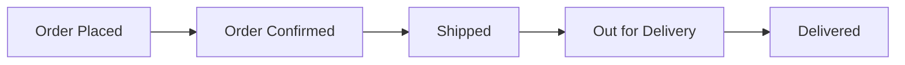

**Status Stages:**
1. **Order Placed**
   - Date and time
   - Order confirmed by system

2. **Order Confirmed**
   - Seller accepted order
   - Expected processing time

3. **Shipped**
   - Shipping partner name
   - Tracking number (linked)
   - Expected delivery date

4. **Out for Delivery**
   - Delivery partner details
   - Contact number

5. **Delivered**
   - Delivery date and time
   - Delivered to (person name)

**Order Details Card:**
- Order ID
- Order date
- Payment method
- Shipping address
- Items ordered (list)

**Actions:**
- Track on shipping partner website
- Contact seller
- Cancel order (if eligible)
- Request return (after delivery)
- Download invoice
- Write review (after delivery)

**API Endpoints:**
- GET /api/orders/{orderId}
- GET /api/orders/{orderId}/tracking
- POST /api/orders/{orderId}/cancel
- GET /api/orders/{orderId}/invoice

#### 5.9.3 My Orders Page

**Purpose:** View all order history

**Page Components:**
- Orders list with filters
- Each order card shows:
  - Order ID
  - Order date
  - Product images (first 3 items)
  - Total items
  - Total amount
  - Order status (badge)
  - Track Order button
  - View Details button

**Filters:**
- All Orders
- Pending
- Shipped
- Delivered
- Cancelled
- Returned

**Time Range Filter:**
- Last 30 days (default)
- Last 3 months
- Last 6 months
- Last year
- All orders

**Sort Options:**
- Most Recent
- Oldest First

**Actions per Order:**
- View details
- Track order
- Cancel order (if eligible)
- Return order (if eligible)
- Download invoice
- Reorder
- Write review

**API Endpoints:**
- GET /api/orders?status={status}&date_range={range}
- GET /api/orders/{orderId}

### 5.10 Returns & Refunds

#### 5.10.1 Return Request Page

**Purpose:** Allow customers to initiate return requests

**Eligibility Criteria:**
- Within return window (7 days standard, 14 days premium)
- Product unused with tags
- Original packaging
- Invoice copy

**Return Request Form:**

**Order Selection:**
- Order ID (dropdown from eligible orders)
- Auto-populate order details once selected

**Items to Return:**
- List all items in order
- Multi-select checkboxes
- Quantity selector (if multiple units)

**Return Reason*** (dropdown):
- Wrong item received
- Defective/damaged product
- Size/fit issue
- Quality not as expected
- Color/design mismatch
- Changed mind
- Other (with text input)

**Return Type*** (radio):
- Refund
- Exchange (if available)
- Store Credit

**Upload Images** (optional but recommended):
- Product images showing issue
- Max 5 images
- File size limit: 5 MB each

**Description** (textarea):
- Detailed explanation
- Max 500 characters

**Pickup Address***:
- Use saved addresses
- Or enter new address

**Actions:**
- Submit return request
- Cancel
- Save as draft

**API Endpoints:**
- GET /api/orders/{orderId}/return-eligibility
- POST /api/returns/create
- POST /api/returns/upload-images

#### 5.10.2 Return Tracking Page

**Purpose:** Track status of return requests

**Return Status Flow:**
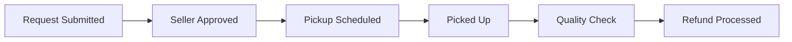

**Status Stages:**
1. **Request Submitted** - Waiting for seller approval
2. **Approved** - Return approved by seller
3. **Pickup Scheduled** - Pickup date assigned
4. **Picked Up** - Product collected
5. **Quality Check** - Seller inspecting product
6. **Approved/Rejected** - Final decision
7. **Refund Initiated** - Money being processed
8. **Refund Completed** - Money credited

**Return Details Card:**
- Return ID
- Order ID (linked)
- Return date
- Items returned
- Return reason
- Status (badge)
- Refund amount
- Refund method

**Actions:**
- Cancel return request (if before pickup)
- Contact seller
- Track return
- Escalate to admin (if delayed)

**API Endpoints:**
- GET /api/returns/{returnId}
- GET /api/returns/list
- DELETE /api/returns/{returnId}/cancel

**Refund Processing:**
- Original payment method: 5-7 business days
- Wallet credit: Instant
- Bank transfer: 3-5 business days

---
### 5.11 Customer Profile & Account Management

#### 5.11.1 Profile Settings Page

**Purpose:** Manage personal information and preferences

**Page Sections:**

**Personal Information:**
- Profile Photo (upload)
- Full Name* (text)
- Email* (email, verified badge)
- Phone Number* (tel, verified badge)
- Date of Birth (date picker)
- Gender (dropdown: Male, Female, Other, Prefer not to say)
- Anniversary Date (date picker, optional)

**Preferences:**
- Preferred Language (dropdown)
- Size Preferences (multi-select: XS, S, M, L, XL, etc.)
- Style Preferences (multi-select: Traditional, Modern, Fusion, etc.)
- Occasion Interests (multi-select: Wedding, Festive, Party, Casual)

**Account Settings:**
- Change Password
- Two-Factor Authentication (toggle)
- Email Notifications (toggle)
- SMS Notifications (toggle)
- Push Notifications (toggle)
- Marketing Communications (toggle)

**Privacy Settings:**
- Profile Visibility (Public/Private)
- Show Reviews Publicly (toggle)
- Allow Personalized Recommendations (toggle)

**Actions:**
- Save Changes
- Cancel
- Verify Email (if not verified)
- Verify Phone (if not verified)

**API Endpoints:**
- GET /api/user/profile
- PUT /api/user/profile
- POST /api/user/change-password
- POST /api/user/upload-photo

#### 5.11.2 Saved Addresses

**Purpose:** Manage delivery addresses

**Page Components:**
- List of saved addresses
- Add new address button
- Default address indicator

**Address Card:**
- Name
- Complete address
- Phone number
- Address type (Home/Work/Other)
- Default badge (if applicable)
- Edit button
- Delete button
- Set as Default button

**Add/Edit Address Form:**
(Same fields as checkout address form)

**Actions:**
- Add new address
- Edit existing address
- Delete address
- Set as default

**API Endpoints:**
- GET /api/user/addresses
- POST /api/user/addresses
- PUT /api/user/addresses/{addressId}
- DELETE /api/user/addresses/{addressId}

#### 5.11.3 Payment Methods

**Purpose:** Manage saved payment methods

**Page Components:**
- Saved cards list
- Add new card button
- Security notice

**Saved Card Display:**
- Card type logo (Visa/Mastercard/etc.)
- Card number (masked: **** **** **** 1234)
- Cardholder name
- Expiry date
- Default card badge (if applicable)
- Remove button

**Add Card Form:**
- Card number
- Cardholder name
- Expiry date
- CVV (not saved)
- Save as default (checkbox)

**Security Notes:**
- CVV never stored
- PCI DSS compliant
- Encrypted storage

**API Endpoints:**
- GET /api/user/payment-methods
- POST /api/user/payment-methods
- DELETE /api/user/payment-methods/{cardId}

#### 5.11.4 Wallet

**Purpose:** Manage GURNAAZ wallet balance

**Page Components:**

**Wallet Balance:**
- Current balance (large, prominent)
- Add Money button
- Transaction history

**Add Money Section:**
- Amount input (predefined: ₹500, ₹1000, ₹2000, ₹5000, or custom)
- Payment method selection
- Add Money button

**Transaction History:**
- Date and time
- Transaction type (Credit/Debit)
- Description
- Amount
- Balance after transaction
- Transaction ID

**Filters:**
- All transactions
- Credits
- Debits
- Date range

**API Endpoints:**
- GET /api/wallet/balance
- POST /api/wallet/add-money
- GET /api/wallet/transactions

#### 5.11.5 My Reviews

**Purpose:** View and manage product reviews

**Page Components:**
- Reviews list
- Filters
- Each review shows:
  - Product image (linked)
  - Product name
  - Rating given
  - Review text
  - Images (if uploaded)
  - Review date
  - Seller response (if any)
  - Edit button
  - Delete button

**Filters:**
- All reviews
- With seller response
- Without seller response

**Actions:**
- Edit review
- Delete review
- Add images to review
- View product

**API Endpoints:**
- GET /api/user/reviews
- PUT /api/reviews/{reviewId}
- DELETE /api/reviews/{reviewId}

#### 5.11.6 Notifications

**Purpose:** View all notifications

**Page Components:**
- Notification list
- Mark all as read button
- Notification preferences link

**Notification Types:**
- Order updates
- Shipping updates
- Delivery confirmation
- Return/refund updates
- Payment confirmations
- Promotional offers
- Price drop alerts
- Back in stock alerts
- Wishlist reminders

**Notification Card:**
- Icon (based on type)
- Title
- Description
- Timestamp
- Read/Unread indicator
- Action button (if applicable)

**Actions:**
- Mark as read
- Mark all as read
- Delete notification
- Navigate to related page
- Manage notification preferences

**API Endpoints:**
- GET /api/notifications
- PUT /api/notifications/{notificationId}/mark-read
- PUT /api/notifications/mark-all-read
- DELETE /api/notifications/{notificationId}

#### 5.11.7 My Coupons

**Purpose:** View available and used coupons

**Page Tabs:**
- Available Coupons
- Used Coupons
- Expired Coupons

**Coupon Card:**
- Coupon code (with copy button)
- Discount description
- Minimum order value
- Valid until date
- Terms & conditions link
- Apply/Use Now button

**Actions:**
- Copy coupon code
- Apply coupon (redirects to cart)
- View terms

**API Endpoints:**
- GET /api/user/coupons

#### 5.11.8 Referral Program

**Purpose:** Refer friends and earn rewards

**Page Components:**

**Referral Stats:**
- Total referrals
- Successful referrals
- Total earned
- Available balance

**Your Referral Code:**
- Unique code (with copy button)
- Referral link (with copy button)
- Share buttons (WhatsApp, Facebook, Twitter, Email)

**How It Works:**
1. Share your code
2. Friend signs up and makes first purchase
3. Both get rewards

**Referral History:**
- Friend name (or anonymized)
- Signup date
- Order status
- Reward status (Pending/Credited)
- Reward amount

**Actions:**
- Copy referral code
- Share via social media
- Send invitation email

**API Endpoints:**
- GET /api/referrals/my-code
- GET /api/referrals/history
- GET /api/referrals/stats

### 5.12 Customer Support

#### 5.12.1 Support Center / FAQ

**Purpose:** Self-service help and common questions

**Page Sections:**

**Search Bar:**
- Search for help topics
- Auto-suggest common questions

**FAQ Categories:**
1. **Account & Login**
   - How to create an account?
   - Forgot password
   - Update profile
   - Delete account

2. **Orders & Payments**
   - How to place an order?
   - Payment methods
   - Order tracking
   - Cancel order

3. **Shipping & Delivery**
   - Shipping charges
   - Delivery time
   - Track shipment
   - Delivery issues

4. **Returns & Refunds**
   - Return policy
   - How to return?
   - Refund process
   - Exchange policy

5. **Products & Sizing**
   - How to choose size?
   - Product authenticity
   - Product care
   - Size guide

6. **Seller Information**
   - About sellers
   - Contact seller
   - Seller ratings
   - Report seller

**Each FAQ:**
- Question (expandable)
- Detailed answer
- Helpful/Not Helpful buttons
- Related articles

**Quick Actions:**
- Contact Us
- Track Order
- Start Return
- Report Issue

**API Endpoints:**
- GET /api/support/faqs
- GET /api/support/search?q={query}

#### 5.12.2 Contact Us Page

**Purpose:** Multiple ways to reach support

**Contact Methods:**

**1. Live Chat:**
- Availability: 9 AM - 9 PM
- Average response time
- Start Chat button

**2. Email Support:**
- Support email address
- Expected response time: 24-48 hours

**3. Phone Support:**
- Support phone number
- Availability hours

**4. Submit a Ticket:**
- Contact form

**Contact Form:**
- Name* (auto-filled if logged in)
- Email* (auto-filled if logged in)
- Phone* (auto-filled if logged in)
- Order ID (if related to an order)
- Subject* (text)
- Category* (dropdown: Order, Payment, Technical, Product, Other)
- Message* (textarea, max 1000 chars)
- Attachments (optional, max 5 files)

**Actions:**
- Submit ticket
- Start live chat
- Call support

**API Endpoints:**
- POST /api/support/create-ticket
- POST /api/support/upload-attachment

#### 5.12.3 My Tickets

**Purpose:** Track support ticket status

**Page Components:**
- Tickets list
- Create new ticket button
- Filters

**Filters:**
- All tickets
- Open
- In Progress
- Resolved
- Closed

**Ticket Card:**
- Ticket ID
- Subject
- Category
- Created date
- Status (badge)
- Last updated
- View Details button

**Ticket Detail Page:**
- Ticket information
- Conversation thread
- Reply form
- Attachments
- Status history

**Actions:**
- View ticket details
- Reply to ticket
- Close ticket
- Reopen ticket

**API Endpoints:**
- GET /api/support/tickets
- GET /api/support/tickets/{ticketId}
- POST /api/support/tickets/{ticketId}/reply

#### 5.12.4 Live Chat

**Purpose:** Real-time support chat

**Chat Interface:**
- Chat window (overlay or full page)
- Agent information
- Message thread
- Input field with emoji picker
- File attachment button
- End chat button

**Features:**
- Typing indicators
- Read receipts
- Chat history (for logged-in users)
- Pre-chat form (for guests)
- Auto-suggestions
- Transfer to different department

**Pre-Chat Form (for guests):**
- Name*
- Email*
- Issue category*

**API Endpoints:**
- WebSocket: /ws/chat
- POST /api/chat/start-session
- POST /api/chat/send-message
- POST /api/chat/end-session

### 5.13 Additional Customer Features

#### 5.13.1 Fashion Journal / Blog

**Purpose:** Provide styling inspiration and fashion content

**Page Layout:**

**Blog Listing:**
- Featured article (large card)
- Article grid (3 columns)
- Categories filter
- Search articles
- Pagination

**Article Card:**
- Featured image
- Category badge
- Title
- Excerpt
- Author
- Published date
- Read time
- Read More button

**Article Detail Page:**
- Hero image
- Title
- Author info (name, photo)
- Published date
- Read time
- Share buttons
- Article content (rich text, images)
- Tags
- Related articles
- Comments section

**Blog Categories:**
- Wedding Style Guide
- Festive Fashion
- Designer Spotlight
- Fabric Guide
- Styling Tips
- Trend Report
- Boutique Stories

**API Endpoints:**
- GET /api/blog/articles
- GET /api/blog/articles/{slug}
- GET /api/blog/categories

#### 5.13.2 Size Guide

**Purpose:** Help customers choose the right size

**Page Components:**

**How to Measure:**
- Step-by-step instructions with images
- Measurement points (bust, waist, hips, length)
- Tips for accurate measurement

**Size Charts:**
- Standard size chart (table)
- Different charts for different categories
- International size conversion

**Size Chart Table Example:**
| Size | Bust (inches) | Waist (inches) | Hips (inches) |
|------|---------------|----------------|---------------|
| XS | 30-32 | 24-26 | 34-36 |
| S | 32-34 | 26-28 | 36-38 |
| M | 34-36 | 28-30 | 38-40 |
| L | 36-38 | 30-32 | 40-42 |
| XL | 38-40 | 32-34 | 42-44 |
| XXL | 40-42 | 34-36 | 44-46 |

**Fit Types:**
- Regular Fit
- Slim Fit
- Loose Fit
- Description of each fit type

**Custom Size Information:**
- How to order custom size
- Additional charges (if any)
- Delivery time for custom orders

**API Endpoints:**
- GET /api/size-guide

#### 5.13.3 Store Locator (Future Phase)

**Purpose:** Find physical boutique locations

**Page Components:**
- Search by city/pincode
- Map view with store markers
- List view of stores
- Store details (address, phone, hours)
- Get directions button

### 5.14 Customer Journey Summary

**Guest User Journey:**
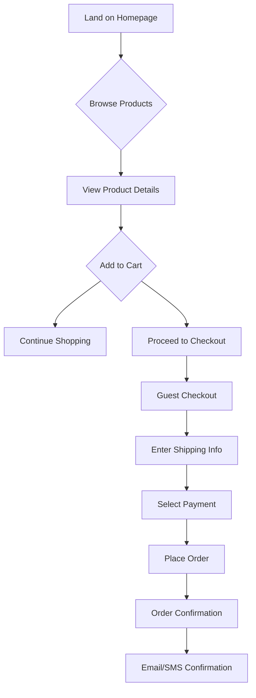

**Registered User Journey:**
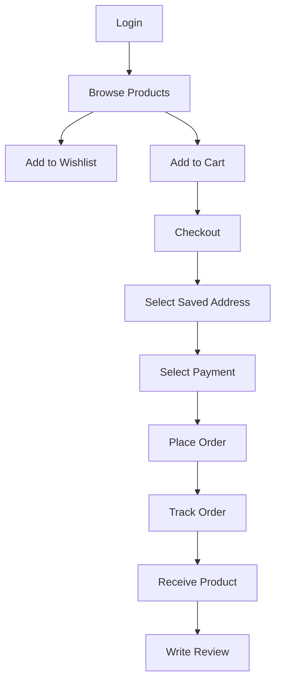

**Purchase Decision Journey:**
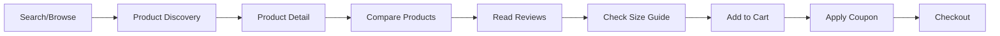

---
## 6. Seller Side - Complete Ecosystem

### 6.1 Seller Authentication & Onboarding

#### 6.1.1 Seller Registration Page

**Purpose:** Allow boutiques and designers to sign up as sellers

**Registration Form:**

**Business Information:**
- Business Name* (text, 3-100 chars, unique)
- Business Type* (dropdown):
  - Boutique
  - Designer
  - Manufacturer
  - Retailer
  - Wholesaler
- Business Category* (multi-select):
  - Punjabi Suits
  - Pakistani Suits
  - Designer Wear
  - Wedding Collection
  - Accessories
  - Others
- Year Established* (number, 1900-current year)
- Business Description* (textarea, 100-500 words)

**Contact Information:**
- Owner Name* (text)
- Email* (email, unique)
- Phone Number* (tel, 10 digits, unique)
- Alternate Phone (tel, optional)
- Website URL (url, optional)
- Social Media Links (text, optional):
  - Instagram
  - Facebook
  - Pinterest

**Business Address:**
- Address Line 1* (text)
- Address Line 2 (text)
- City* (text)
- State* (dropdown)
- Pincode* (number, 6 digits)
- Country* (dropdown, default: India)

**Legal Documents:**
- Business Registration Certificate* (file upload, PDF/JPG)
- GST Number* (text, 15 chars, format validation)
- GST Certificate* (file upload, PDF/JPG)
- PAN Card* (text, 10 chars, format validation)
- PAN Card Copy* (file upload, PDF/JPG)
- Aadhaar Card (optional, file upload)
- Bank Account Statement (last 3 months)* (file upload, PDF)

**Bank Details:**
- Account Holder Name* (text)
- Bank Name* (text)
- Account Number* (text, 10-18 digits)
- Confirm Account Number* (text)
- IFSC Code* (text, 11 chars)
- Branch Name (text)
- Account Type* (dropdown: Savings, Current)

**Login Credentials:**
- Email* (auto-filled from above)
- Password* (password, validation same as customer)
- Confirm Password* (password)

**Terms & Agreements:**
- Terms & Conditions* (checkbox)
- Privacy Policy* (checkbox)
- Seller Agreement* (checkbox)
- Commission Structure Agreement* (checkbox)

**Actions:**
- Submit Application
- Save as Draft
- Preview Application

**API Endpoints:**
- POST /api/seller/register
- POST /api/seller/upload-document
- POST /api/seller/verify-gst
- POST /api/seller/verify-pan

**Validation Rules:**
- GST format: 22AAAAA0000A1Z5
- PAN format: AAAAA0000A
- IFSC format: AAAA0000000
- Email domain verification
- Phone OTP verification
- Document file size limit: 5 MB
- Allowed formats: PDF, JPG, PNG

#### 6.1.2 Seller Verification Process

**Verification Stages:**

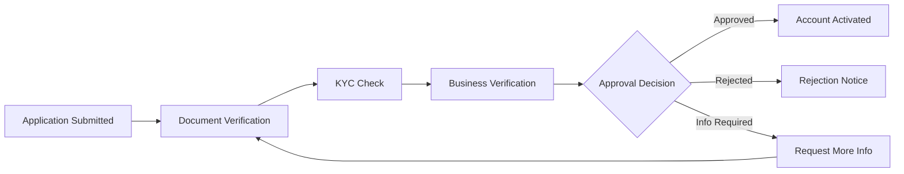

**Document Verification Checklist:**
- Business registration certificate validity
- GST certificate verification (via API)
- PAN card verification (via API)
- Bank account verification (penny drop test)
- Address proof verification
- Identity proof verification

**Verification Timeline:**
- Document verification: 2-3 business days
- Business verification: 3-5 business days
- Total: 5-7 business days

**Verification Status Page:**
- Application ID
- Current status
- Submitted documents list with status
- Pending items
- Estimated approval date
- Contact support button

**Possible Status:**
- Pending Submission
- Under Review
- Information Required
- Approved
- Rejected

**Notification:**
- Email at each stage
- SMS for status updates
- In-dashboard notifications

#### 6.1.3 Seller Onboarding Wizard

**Purpose:** Guide approved sellers through initial setup

**Onboarding Steps:**

**Step 1: Welcome**
- Congratulations message
- Quick tour video
- Key features overview
- "Get Started" button

**Step 2: Store Profile**
- Store Logo* (image upload, 500x500px, max 2 MB)
- Store Banner (image upload, 1920x400px, max 5 MB)
- Store Name* (auto-filled, editable)
- Store Tagline (text, max 100 chars)
- Store Description* (textarea, 200-1000 words)
- Specialization Tags (multi-select)

**Step 3: Store Policies**
- Shipping Policy* (textarea or rich text)
- Return Policy* (textarea or rich text)
- Exchange Policy* (textarea or rich text)
- Cancellation Policy* (textarea or rich text)
- Processing Time* (number, in days)
- Shipping Time* (number, in days)

**Step 4: Payment Setup**
- Bank details verification (read-only, from registration)
- Payment preferences:
  - Payout frequency (dropdown: Weekly, Bi-weekly, Monthly)
  - Minimum payout threshold (number, min ₹500)
- Payment confirmation

**Step 5: Product Categories**
- Select categories you'll sell (multi-select)
- Primary category (dropdown)
- Enable category-specific fields

**Step 6: First Product (Optional)**
- Quick add first product
- Or skip to dashboard

**Actions:**
- Next
- Previous
- Skip
- Complete Setup

**API Endpoints:**
- POST /api/seller/onboarding/store-profile
- POST /api/seller/onboarding/policies
- POST /api/seller/onboarding/complete

### 6.2 Seller Dashboard

**Purpose:** Central hub for seller activities and metrics

#### 6.2.1 Dashboard Overview Page

**Key Metrics (Top Cards):**

**Today's Sales:**
- Total sales amount (₹)
- Number of orders
- Percentage change from yesterday
- Graph icon linking to detailed sales

**Pending Orders:**
- Count of orders needing action
- Breakdown by status (Pending, Processing)
- Link to orders page

**Total Products:**
- Active products count
- Out of stock count
- Draft products count
- Link to products page

**Store Views:**
- Today's store visits
- Total views this month
- Percentage change from last month

**Wallet Balance:**
- Current balance (₹)
- Pending payouts (₹)
- Last payout date
- Link to wallet page

**Store Rating:**
- Average rating (out of 5 stars)
- Total reviews count
- Link to reviews page

**Sales Chart:**
- Line/bar chart showing sales trend
- Toggle: Last 7 days / 30 days / 90 days / 1 year
- Metrics: Sales amount, Order count
- Date range selector

**Recent Orders Table:**
- Columns:
  - Order ID (linked)
  - Customer Name
  - Items (count)
  - Amount (₹)
  - Status (badge)
  - Date
  - Actions (View, Process, Ship)
- Pagination
- "View All Orders" link

**Top Selling Products:**
- Product image
- Product name (linked)
- Units sold (this month)
- Revenue (₹)
- Stock status
- Top 5 products displayed

**Low Stock Alerts:**
- Product name
- Current stock
- Reorder level
- Actions: Update Stock, View Product
- "View All" link

**Recent Activities:**
- Activity log with timestamps
- Types: New order, Product approved, Payout received, Review received
- Last 10 activities
- "View All" link

**Quick Actions Panel:**
- Add New Product (button)
- View Orders (button)
- Manage Inventory (button)
- Check Payouts (button)
- View Messages (button)

**Performance Metrics:**
- Order Fulfillment Rate (percentage)
- Average Shipping Time (days)
- Return Rate (percentage)
- Customer Satisfaction (star rating)
- Response Time (hours)

**Alerts & Notifications:**
- Pending actions count
- Important announcements
- Policy updates
- Payment reminders
- Verification pending items

**API Endpoints:**
- GET /api/seller/dashboard/metrics
- GET /api/seller/dashboard/sales-chart
- GET /api/seller/dashboard/recent-orders
- GET /api/seller/dashboard/top-products
- GET /api/seller/dashboard/activities

#### 6.2.2 Analytics Page

**Purpose:** Detailed business intelligence and insights

**Analytics Sections:**

**1. Sales Analytics:**

**Overview Metrics:**
- Total Revenue
- Total Orders
- Average Order Value
- Total Units Sold
- Time period selector

**Sales Trend Chart:**
- Line/Bar/Area chart
- Daily/Weekly/Monthly view
- Revenue vs Orders comparison
- Export as CSV/PDF

**Sales by Category:**
- Pie chart or bar chart
- Revenue breakdown by product category
- Units sold by category

**Sales by Product:**
- Table with top products
- Columns: Product Name, Units Sold, Revenue, Percentage of Total
- Sort and filter options

**2. Customer Analytics:**

**Customer Metrics:**
- Total Customers
- New Customers (this period)
- Repeat Customers
- Customer Retention Rate

**Customer Segmentation:**
- One-time buyers
- Repeat buyers
- High-value customers (top 20%)

**Geographic Distribution:**
- Map or chart showing orders by state/city
- Top 10 cities by sales

**3. Product Analytics:**

**Product Performance:**
- Total Products
- Published Products
- Out of Stock
- Products Sold
- Products with 0 sales

**Top Performers:**
- Best selling products (by revenue)
- Best selling products (by units)
- Products with highest ratings

**Underperformers:**
- Products with no sales (last 30 days)
- Products with low ratings
- Slow-moving inventory

**Product Views vs Sales:**
- Conversion rate by product
- Views to cart add rate
- Cart to purchase rate

**4. Order Analytics:**

**Order Metrics:**
- Total Orders
- Average Order Value
- Order Status Breakdown (pie chart)

**Order Fulfillment:**
- Average Processing Time
- Average Shipping Time
- On-time Delivery Rate
- Late Deliveries

**Order by Time:**
- Peak ordering hours
- Peak ordering days
- Seasonal trends

**5. Financial Analytics:**

**Revenue Metrics:**
- Gross Revenue
- Platform Commission
- Net Revenue
- Pending Payouts

**Revenue Trend:**
- Monthly revenue chart
- Commission breakdown
- Refunds and returns impact

**Payout History:**
- Table of all payouts
- Date, Amount, Status, Transaction ID

**6. Marketing Analytics:**

**Traffic Sources:**
- Direct
- Organic Search
- Social Media
- Referrals
- Paid Ads

**Conversion Funnel:**
- Store Visits → Product Views → Add to Cart → Purchase
- Conversion rate at each stage

**Campaign Performance:**
- Active campaigns
- Campaign ROI
- Coupons used
- Discount given vs Revenue gained

**7. Reviews & Ratings:**

**Rating Overview:**
- Average Rating
- Total Reviews
- Rating Distribution (5 to 1 stars)

**Recent Reviews:**
- Latest customer reviews
- Positive vs Negative sentiment
- Response rate

**8. Competitor Benchmarking (Premium):**
- Category average metrics
- Your position vs category average
- Top sellers in your category (anonymized)

**Date Range Selector:**
- Today
- Yesterday
- Last 7 days
- Last 30 days
- Last 90 days
- This Month
- Last Month
- This Year
- Custom Range

**Export Options:**
- Export to CSV
- Export to Excel
- Export to PDF
- Schedule Reports (email delivery)

**API Endpoints:**
- GET /api/seller/analytics/sales
- GET /api/seller/analytics/customers
- GET /api/seller/analytics/products
- GET /api/seller/analytics/orders
- GET /api/seller/analytics/financial
- GET /api/seller/analytics/marketing
- GET /api/seller/analytics/export

### 6.3 Product Management

#### 6.3.1 Product List Page

**Purpose:** View and manage all products

**Page Layout:**

**Filter Sidebar:**

**Status Filter:**
- All Products
- Published
- Draft
- Pending Approval
- Rejected
- Out of Stock
- Low Stock

**Category Filter:**
- Multi-select checkboxes
- All categories

**Price Range:**
- Min-Max slider

**Date Added:**
- Last 7 days
- Last 30 days
- Last 3 months
- Custom range

**Stock Status:**
- In Stock
- Low Stock
- Out of Stock

**Sort Options:**
- Recently Added
- Oldest First
- Price: Low to High
- Price: High to Low
- Most Popular
- Name: A to Z

**Bulk Actions:**
- Select all checkbox
- Actions dropdown:
  - Publish Selected
  - Unpublish Selected
  - Delete Selected
  - Export Selected
  - Update Stock
  - Apply Discount

**Product Table/Grid View Toggle:**

**Table View Columns:**
- Checkbox (for bulk selection)
- Product Image (thumbnail)
- Product Name
- SKU
- Category
- Price
- Stock
- Status
- Views
- Sales
- Actions (Edit, Delete, Duplicate, View)

**Grid View:**
- Product cards in grid
- Image, Name, Price, Stock, Status
- Quick actions on hover

**Search Bar:**
- Search by product name, SKU, description

**Actions:**
- Add New Product (prominent button)
- Bulk Upload
- Import from CSV
- Export to CSV

**Pagination:**
- Items per page selector (10, 25, 50, 100)
- Page navigation

**API Endpoints:**
- GET /api/seller/products?filters={}&sort={}&page={}
- POST /api/seller/products/bulk-action
- DELETE /api/seller/products/{productId}

#### 6.3.2 Add/Edit Product Page

**Purpose:** Create new product or edit existing product

**This is covered in detail in Section 7: Product Creation Module**

(Will be detailed in the next section)

#### 6.3.3 Bulk Upload

**Purpose:** Upload multiple products at once

**Page Layout:**

**Step 1: Download Template**
- Download CSV template button
- Sample CSV file with all required fields
- Field descriptions and guidelines

**Step 2: Upload CSV**
- Drag and drop area
- Or click to browse
- File validation (CSV only, max 50 MB)
- Maximum products per upload:
  - Standard: 50 products
  - Premium: 500 products

**Step 3: Validation**
- System validates CSV
- Shows errors and warnings
- Error types:
  - Missing required fields
  - Invalid data format
  - Duplicate SKUs
  - Invalid category
- Downloadable error report

**Step 4: Map Fields**
- Map CSV columns to system fields
- Preview mapping
- Confirm mapping

**Step 5: Import**
- Import progress bar
- Success/Failure count
- View imported products
- Downloadable import report

**Step 6: Upload Images**
- Bulk image upload (ZIP file)
- Image naming convention: SKU_1.jpg, SKU_2.jpg
- Image association to products

**API Endpoints:**
- GET /api/seller/products/template
- POST /api/seller/products/bulk-upload
- POST /api/seller/products/bulk-upload/validate
- POST /api/seller/products/bulk-upload/import
- POST /api/seller/products/bulk-images

#### 6.3.4 Inventory Management

**Purpose:** Track and manage product stock levels

**Page Layout:**

**Inventory Overview:**
- Total Products
- In Stock
- Low Stock (below reorder level)
- Out of Stock
- Total Stock Value (₹)

**Inventory Table:**

**Columns:**
- Product Image
- Product Name
- SKU
- Current Stock
- Reorder Level
- Stock Status (badge)
- Price
- Stock Value (Price × Stock)
- Last Updated
- Actions (Update Stock, View Product)

**Filters:**
- All
- In Stock
- Low Stock
- Out of Stock

**Search:**
- Search by product name or SKU

**Bulk Stock Update:**
- Select multiple products
- Update stock in bulk
- Upload CSV for stock update

**Stock Update Form (Modal):**
- Product Name (display)
- Current Stock (display)
- Stock Adjustment Type (dropdown):
  - Add Stock
  - Remove Stock
  - Set Stock
- Quantity* (number)
- Reason* (dropdown):
  - New Purchase
  - Return from Customer
  - Damaged
  - Lost
  - Sold Offline
  - Inventory Correction
  - Other
- Notes (textarea, optional)

**Stock History:**
- Date and time
- Adjustment type
- Quantity
- Reason
- Updated by
- New stock level

**Low Stock Alerts:**
- Email alerts when stock below reorder level
- Dashboard notifications
- SMS alerts (Premium)

**API Endpoints:**
- GET /api/seller/inventory
- PUT /api/seller/inventory/update-stock
- GET /api/seller/inventory/history/{productId}
- POST /api/seller/inventory/bulk-update

### 6.4 Order Management

#### 6.4.1 Orders List Page

**Purpose:** View and manage all orders

**Page Layout:**

**Status Tabs:**
- All Orders (count)
- Pending (count) [requires action]
- Confirmed (count)
- Processing (count)
- Shipped (count)
- Delivered (count)
- Cancelled (count)
- Returns (count)

**Filters:**
- Date Range
- Order Value (min-max)
- Payment Status (Paid, COD, Pending)
- Delivery Method
- Customer Name

**Search:**
- Search by Order ID, Customer Name, Phone, Email

**Orders Table:**

**Columns:**
- Order ID (linked to detail page)
- Customer Name
- Items (product count)
- Amount (₹)
- Payment Method
- Order Date
- Status (badge with color coding)
- Actions (View, Process, Print Invoice, Contact Customer)

**Color Coding:**
- Pending: Orange
- Confirmed: Blue
- Processing: Purple
- Shipped: Cyan
- Delivered: Green
- Cancelled: Red
- Returned: Grey

**Sort Options:**
- Newest First (default)
- Oldest First
- Highest Value
- Lowest Value

**Bulk Actions:**
- Select multiple orders
- Actions:
  - Mark as Processing
  - Mark as Shipped
  - Print Invoices
  - Export Orders

**Quick Stats (Top):**
- Today's Orders (count and value)
- Pending Orders (count)
- Orders to Ship Today (count)
- Revenue Today (₹)

**API Endpoints:**
- GET /api/seller/orders?status={}&filters={}
- PUT /api/seller/orders/{orderId}/status
- POST /api/seller/orders/bulk-action

#### 6.4.2 Order Detail Page

**Purpose:** View complete order information and take actions

**Page Layout:**

**Order Header:**
- Order ID (large, prominent)
- Order Date and Time
- Current Status (badge)
- Status Timeline (visual progress bar)

**Status Timeline:**
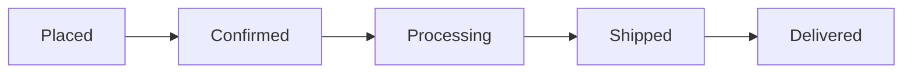

**Customer Information Card:**
- Customer Name
- Email
- Phone Number
- Contact Customer (button)
- View Customer Orders (link)

**Shipping Address Card:**
- Recipient Name
- Complete Address
- Phone Number
- Pincode
- Copy Address (button)

**Billing Address Card:**
- (Same as shipping or different)

**Order Items Table:**

**Columns:**
- Product Image (thumbnail)
- Product Name (linked)
- SKU
- Size
- Color
- Quantity
- Unit Price
- Total Price

**Price Breakdown:**
- Subtotal
- Discount (if any)
- Shipping Charges
- Tax (GST)
- **Total Amount**

**Commission Breakdown:**
- Order Total
- Platform Commission (% and ₹)
- Your Earnings

**Payment Information:**
- Payment Method
- Payment Status (Paid/COD/Pending)
- Transaction ID (if online payment)
- Payment Date

**Order Actions:**
- Confirm Order (if pending)
- Mark as Processing
- Ship Order (opens shipping form)
- Cancel Order
- Print Invoice
- Print Shipping Label
- Contact Customer
- Refund (if applicable)

**Shipping Information (if shipped):**
- Shipping Partner
- Tracking Number (linked)
- Shipped Date
- Expected Delivery Date
- Track Shipment (button)

**Order Timeline:**
- Chronological log of all order events
- Timestamps
- Actions taken
- Status changes
- Notes added

**Add Note Section:**
- Add internal notes about the order
- Notes visible only to seller
- Timestamp and author

**Communication History:**
- All communications with customer
- Email sent
- Messages exchanged

**API Endpoints:**
- GET /api/seller/orders/{orderId}
- PUT /api/seller/orders/{orderId}/confirm
- PUT /api/seller/orders/{orderId}/ship
- PUT /api/seller/orders/{orderId}/cancel
- POST /api/seller/orders/{orderId}/add-note
- GET /api/seller/orders/{orderId}/invoice

#### 6.4.3 Shipping Management

**Purpose:** Manage order shipments

**Ship Order Form (Modal/Page):**

**Order Details:**
- Order ID
- Customer Name
- Shipping Address
- Items to Ship (list)

**Package Information:**
- Package Weight* (number, in kg)
- Package Dimensions:
  - Length* (cm)
  - Width* (cm)
  - Height* (cm)
- Number of Packages (default: 1)

**Shipping Partner:**
- Select Courier* (dropdown):
  - Delhivery
  - Blue Dart
  - FedEx
  - DTDC
  - India Post
  - Other
- Tracking Number* (text)
- Shipping Method* (dropdown):
  - Standard
  - Express
  - Economy
- Expected Delivery Date* (date picker)

**Shipping Documents:**
- Generate Shipping Label (button)
- Generate Invoice (button)
- Generate Manifest (button)

**Actions:**
- Confirm Shipment (button)
- Save as Draft
- Cancel

**Post-Shipment:**
- Order status updated to "Shipped"
- Customer notified via email and SMS
- Tracking link sent to customer
- Seller can update tracking info if needed

**Shipping Integrations:**
- API integration with major courier partners
- Auto-generate AWB number
- Real-time tracking updates
- Pickup request automation

**API Endpoints:**
- POST /api/seller/orders/{orderId}/ship
- POST /api/seller/shipping/generate-label
- GET /api/seller/shipping/partners
- POST /api/seller/shipping/request-pickup

#### 6.4.4 Returns Management

**Purpose:** Handle return requests from customers

**Returns List Page:**

**Status Tabs:**
- All Returns
- Pending Approval
- Approved
- Pickup Scheduled
- Picked Up
- Under Quality Check
- Approved for Refund
- Rejected
- Completed

**Returns Table:**

**Columns:**
- Return ID
- Order ID (linked)
- Customer Name
- Product(s)
- Reason
- Amount
- Requested Date
- Status
- Actions (View, Approve, Reject)

**Return Detail Page:**

**Return Information:**
- Return ID
- Order ID (linked)
- Return Date
- Status

**Customer Information:**
- Name
- Contact Details

**Return Items:**
- Product details
- Quantity
- Price

**Return Reason:**
- Selected reason
- Customer description
- Uploaded images (if any)

**Return Type:**
- Refund
- Exchange
- Store Credit

**Pickup Information:**
- Pickup Address
- Pickup Date (if scheduled)
- Courier Partner

**Quality Check (after pickup):**
- Condition Assessment (dropdown):
  - As Expected
  - Minor Issue
  - Major Issue
  - Item Not as Described
- Quality Notes (textarea)
- Upload Images (if condition issue)

**Actions:**
- Approve Return (approve refund amount)
- Reject Return (with reason)
- Schedule Pickup
- Mark as Received
- Complete Quality Check
- Process Refund
- Contact Customer

**Reject Return Form:**
- Rejection Reason* (dropdown):
  - Return window expired
  - Product used/damaged by customer
  - Tags removed
  - Hygiene issue
  - Does not match return policy
  - Other
- Detailed Explanation* (textarea)

**Approve Return:**
- Refund Amount* (editable, default: full amount)
- Deduct Return Shipping (checkbox, if applicable)
- Restocking Fee (if applicable)
- Refund Method (original payment method or store credit)
- Process Refund (button)

**API Endpoints:**
- GET /api/seller/returns
- GET /api/seller/returns/{returnId}
- PUT /api/seller/returns/{returnId}/approve
- PUT /api/seller/returns/{returnId}/reject
- POST /api/seller/returns/{returnId}/schedule-pickup
- PUT /api/seller/returns/{returnId}/quality-check
- POST /api/seller/returns/{returnId}/refund

---
**Product Selection:**
- Select products to feature
- Multi-select from product list
- Filter by category, performance

**Placement Options:**
- Homepage banner
- Category page top
- Search results (sponsored)
- "Featured" section

**Duration:**
- Start Date*
- End Date*
- Auto-renew (toggle)

**Pricing:**
- Cost per day
- Total cost calculation
- Payment method

**Performance Tracking:**
- Impressions
- Clicks
- Conversions
- ROI

**API Endpoints:**
- GET /api/seller/featured-listings
- POST /api/seller/featured-listings
- DELETE /api/seller/featured-listings/{listingId}

#### 6.7.4 Customer Reviews Management

**Purpose:** Monitor and respond to customer reviews

**Reviews Dashboard:**

**Overview Metrics:**
- Average Rating (stars)
- Total Reviews
- Recent Reviews (last 7 days)
- Response Rate (%)
- Positive Reviews (%)
- Reviews Needing Response

**Reviews List:**

**Filters:**
- All Reviews
- 5 Stars
- 4 Stars
- 3 Stars
- 2 Stars
- 1 Star
- With Response
- Without Response
- With Images
- Verified Purchases

**Sort Options:**
- Most Recent
- Oldest First
- Highest Rating
- Lowest Rating
- Most Helpful

**Review Card:**
- Customer name (or anonymous)
- Product name (linked)
- Rating (stars)
- Review title
- Review text
- Images (if uploaded)
- Date
- Verified Purchase badge
- Helpful count
- Your response (if any)
- Actions (Respond, Report)

**Respond to Review:**
- Modal/inline form
- Response text (textarea, max 500 chars)
- Tips for responding
- Submit button

**Response Guidelines:**
- Thank the customer
- Address specific concerns
- Professional tone
- Offer solutions
- Encourage future purchases

**Report Review:**
- Reason (dropdown): Fake, Inappropriate, Spam, Other
- Description (textarea)
- Submit to admin for review

**API Endpoints:**
- GET /api/seller/reviews
- POST /api/seller/reviews/{reviewId}/respond
- POST /api/seller/reviews/{reviewId}/report

### 6.8 Seller Support

#### 6.8.1 Messages/Chat

**Purpose:** Communicate with customers and support

**Messages Inbox:**

**Conversation List:**
- Customer name
- Last message preview
- Timestamp
- Unread badge
- Order ID (if related to order)

**Filters:**
- All Messages
- Unread
- Order-related
- General Inquiries
- Archived

**Chat Interface:**
- Customer info (name, past orders count)
- Order context (if applicable)
- Message thread
- Input field
- Emoji picker
- Attach files button
- Quick replies (templates)

**Quick Reply Templates:**
- Greeting
- Order status inquiry
- Shipping information
- Return process
- Custom size request
- Thank you message

**API Endpoints:**
- GET /api/seller/messages
- GET /api/seller/messages/{conversationId}
- POST /api/seller/messages/{conversationId}/send

#### 6.8.2 Support Tickets

**Purpose:** Get help from platform support

(Same structure as customer tickets)

**Ticket Categories:**
- Account Issues
- Technical Problems
- Payment Issues
- Product Approval
- Policy Questions
- Feature Requests
- Other

#### 6.8.3 Help Center

**Purpose:** Self-service help for sellers

**Help Categories:**
- Getting Started
- Product Management
- Order Fulfillment
- Payments & Payouts
- Marketing & Promotions
- Store Settings
- Policies & Guidelines
- Best Practices
- Video Tutorials

**Featured Articles:**
- How to add your first product
- Understanding commission structure
- Tips for better product photos
- How to handle returns
- Maximizing your store visibility

### 6.9 Settings

**Purpose:** Configure seller account settings

**Settings Sections:**

#### 6.9.1 Account Settings
- Email (display only)
- Change Password
- Two-Factor Authentication
- Notification Preferences
- Language & Region
- Timezone

#### 6.9.2 Store Settings
- Store Status (Active/Inactive)
- Vacation Mode (toggle)
- Auto-reply message
- Order processing time
- Minimum order value

#### 6.9.3 Notification Settings
- Email Notifications (toggles):
  - New orders
  - Low stock alerts
  - Customer messages
  - Reviews received
  - Payout updates
  - Policy updates
- SMS Notifications (toggles)
- Push Notifications (toggles)

#### 6.9.4 Team Management (Premium)
- Add team members
- Assign roles (View Only, Manager, Full Access)
- Set permissions
- Activity log

---

## 7. Product Creation Module

### 7.1 Product Creation Overview

**Purpose:** Comprehensive product upload with all necessary details

**Navigation:** Seller Dashboard → Products → Add New Product

**Form Sections:**
1. Basic Information
2. Pricing & Inventory
3. Media (Images & Videos)
4. Variants
5. Fabric & Material Details
6. Attributes & Specifications
7. SEO & Metadata
8. Shipping Information
9. Returns & Exchange
10. Collections & Tags
11. AI Enhancement

### 7.2 Section 1: Basic Information

**Product Title*** (text, 10-200 chars)
- Clear, descriptive product name
- Example: "Red Embroidered Punjabi Suit with Dupatta"
- Character counter
- SEO tips displayed

**Product Description*** (rich text editor, 200-5000 words)
- Detailed product description
- Formatting tools: bold, italic, lists, headings
- Mention key features, occasion, styling tips
- Placeholder text with guidelines

**Short Description** (textarea, 50-200 chars)
- Brief summary for listings
- Displayed on product cards

**Category*** (dropdown, hierarchical)
- Primary Category (Level 1)
  - Punjabi Suits
  - Pakistani Suits
  - Designer Wear
  - Wedding Collection
  - Luxury Pret
  - Accessories
- Subcategory (Level 2)
  - Based on primary selection
  - Example under Punjabi Suits: Patiala, Anarkali, Salwar Kameez
- Sub-subcategory (Level 3, if applicable)

**Brand/Designer** (text or dropdown)
- Your brand name
- Or select from verified designers

**Product Code/SKU*** (text, 5-50 chars, unique)
- Internal product identifier
- Auto-generate button
- Format: Store prefix + number

**Condition*** (radio)
- New
- Handmade
- Vintage

**Country of Origin*** (dropdown)
- Default: India

**Manufactured By** (text)
- Your business name or manufacturer

**Tags** (multi-input)
- Comma-separated or tag input
- Suggestions based on category
- Max 20 tags
- Example: "wedding", "red", "embroidered", "silk"

### 7.3 Section 2: Pricing & Inventory

**Pricing:**

**Regular Price*** (number, ₹)
- Base price of product
- Must be > 0

**Sale Price** (number, ₹)
- Discounted price (optional)
- Must be < Regular Price
- Discount % auto-calculated and displayed

**Price Display:**
- Preview how price shows to customers
- Strike-through original price if sale price set

**Tax/GST*** (dropdown)
- GST Applicable (Yes/No)
- If Yes, select GST % (5%, 12%, 18%, 28%)

**Bulk Pricing** (optional, Premium feature)
- Add tiered pricing
- Quantity ranges and prices
- Example: 
  - 1-2 items: ₹5,000
  - 3-5 items: ₹4,500
  - 6+ items: ₹4,000

**Inventory:**

**Stock Management*** (radio)
- Manage Stock (enable inventory tracking)
- Don't Manage Stock (always in stock)

**If "Manage Stock" selected:**

**Current Stock*** (number)
- Available quantity
- Must be ≥ 0

**Low Stock Threshold** (number)
- Alert when stock falls below this number
- Default: 5

**Allow Backorders** (dropdown)
- Do not allow
- Allow, but notify customer
- Allow

**Stock Status*** (dropdown, auto-set based on stock)
- In Stock
- Out of Stock
- Made to Order

**Inventory Policy:**
- Track inventory (toggle)
- Continue selling when out of stock (toggle)

### 7.4 Section 3: Media (Images & Videos)

**Product Images*** (minimum 3, maximum 10)

**Upload Interface:**
- Drag and drop area
- Or click to browse
- Multiple file selection
- Image requirements displayed

**Image Requirements:**
- Format: JPG, PNG, WebP
- Size: Minimum 800x800px, recommended 2000x2000px
- Max file size: 5 MB per image
- Aspect ratio: 1:1 (square) or 3:4 (portrait)

**Image Types:**
- Main Image (first image)
- Alternate Views
- Model Wearing Product
- Close-up of Details
- Fabric/Work Close-up
- Product in Use/Styled

**Image Actions:**
- Reorder (drag and drop)
- Set as main image
- Crop/Rotate
- Delete
- Add alt text (for SEO)

**AI Image Enhancement** (Premium feature)
- Background removal
- Auto-enhancement (brightness, contrast)
- Shadow correction
- Color balance
- Upscaling

**Image Quality Score:**
- AI analyzes image quality
- Score 1-10 displayed
- Suggestions for improvement

**360° View Images** (optional, Premium)
- Upload sequence of images for 360° viewer
- Minimum 12 images required
- Auto-stitch into 360° view

**Product Videos** (optional, max 2)
- Upload video files
- Or YouTube/Vimeo link
- Max duration: 2 minutes
- Max size: 100 MB
- Formats: MP4, MOV

**Video Guidelines:**
- Show product from all angles
- Demonstrate draping/styling
- Show fabric movement
- Keep under 60 seconds

### 7.5 Section 4: Variants

**Purpose:** Define product variations (size, color, style)

**Enable Variants** (toggle)

**If enabled:**

**Variant Options:**

**Option 1: Size*** (if applicable)
- Add size values
- Examples: XS, S, M, L, XL, XXL, Free Size, Custom
- Multi-add with commas
- Drag to reorder

**Option 2: Color** (if applicable)
- Add color values
- Color name + color swatch picker
- Examples: Red (#FF0000), Blue (#0000FF)
- Upload color swatch image (optional)

**Option 3: Custom Option** (optional)
- Option name (e.g., "Style", "Length", "Work Type")
- Add values

**Variant Combinations:**
- System auto-generates all combinations
- Example: If 3 sizes × 2 colors = 6 variants

**Variant Table:**

**Columns:**
- Variant Image (thumbnail)
- Variant Name (e.g., "Red - M")
- SKU (auto-generated or custom)
- Price (inherit from base or custom)
- Stock (individual stock tracking)
- Status (Active/Inactive)
- Actions (Edit, Delete)

**Bulk Edit Variants:**
- Set price for all
- Set stock for all
- Enable/disable all

**Variant-Specific Fields:**
- Each variant can have:
  - Unique image
  - Unique price
  - Unique stock
  - Unique SKU
  - Unique weight (for shipping)

### 7.6 Section 5: Fabric & Material Details

**Purpose:** Detailed fabric and material information

**Primary Fabric*** (dropdown)
- Silk
  - Pure Silk
  - Art Silk
  - Tussar Silk
  - Banarasi Silk
- Cotton
  - Pure Cotton
  - Cotton Blend
  - Cambric Cotton
- Georgette
- Chiffon
- Velvet
- Net
- Crepe
- Satin
- Chanderi
- Linen
- Rayon
- Polyester
- Other (with text input)

**Fabric Composition** (text)
- Example: "70% Silk, 30% Cotton"

**Secondary Fabric** (dropdown, optional)
- For dupatta, lining, etc.
- Same options as primary fabric

**Blouse/Top Fabric** (dropdown, if applicable)
- Same options

**Bottom/Pants Fabric** (dropdown, if applicable)
- Same options

**Dupatta/Scarf Fabric** (dropdown, if applicable)
- Same options

**Lining** (dropdown)
- Unlined
- Cotton Lining
- Silk Lining
- Satin Lining

**Fabric Weight** (dropdown)
- Lightweight
- Medium Weight
- Heavyweight

**Fabric Finish** (multi-select)
- Matte
- Glossy
- Textured
- Sheer
- Opaque

**Fabric Care***
- Dry Clean Only
- Hand Wash
- Machine Wash (Cold)
- Iron on Low/Medium/High
- Do Not Bleach
- Special care instructions (textarea)

**Sustainability** (optional, Premium)
- Eco-Friendly Fabric (toggle)
- Organic (toggle)
- Sustainable Source (toggle)
- Fair Trade (toggle)
- Certifications (text, e.g., "GOTS Certified")

### 7.7 Section 6: Attributes & Specifications

**Work/Embellishment Type*** (multi-select)
- Embroidered
- Printed
- Plain/Solid
- Hand-Painted
- Block Printed
- Digital Printed
- Zari Work
- Stone Work
- Sequin Work
- Thread Work
- Mirror Work
- Cutwork
- Appliqué
- Beadwork
- Gota Patti
- Phulkari
- Chikankari
- Others (with text input)

**Pattern*** (dropdown)
- Solid/Plain
- Floral
- Geometric
- Abstract
- Paisley
- Traditional Motifs
- Contemporary
- Ombre
- Striped
- Checkered
- Polka Dots
- Animal Print
- Other

**Color Family*** (multi-select)
- Red
- Blue
- Green
- Yellow
- Pink
- Purple
- Orange
- Black
- White
- Golden
- Silver
- Multi-Color
- Pastel Shades
- Bright Shades
- Dark Shades

**Occasion*** (multi-select)
- Wedding
- Engagement
- Reception
- Sangeet/Mehndi
- Festive/Diwali
- Party
- Casual
- Formal
- Daily Wear
- Festival
- Religious Ceremony

**Season** (multi-select)
- Summer
- Winter
- Monsoon
- All Season

**Style*** (multi-select)
- Traditional
- Contemporary
- Fusion
- Ethnic
- Modern
- Vintage
- Bohemian
- Minimal

**Neckline/Neck Style** (dropdown, if applicable)
- Round Neck
- V-Neck
- Boat Neck
- Square Neck
- Collar Neck
- Keyhole Neck
- High Neck
- Sweetheart Neck
- Off-Shoulder
- Halter Neck

**Sleeve Style** (dropdown, if applicable)
- Sleeveless
- Short Sleeve
- 3/4 Sleeve
- Full Sleeve
- Bell Sleeve
- Cap Sleeve
- Puff Sleeve
- Cold Shoulder

**Bottom Style** (dropdown, if applicable)
- Patiala
- Straight Pants
- Palazzo
- Churidar
- Dhoti
- Leggings
- Sharara
- Gharara
- Cigarette Pants
- Skirt

**Dupatta/Scarf Included*** (radio)
- Yes
- No
- Optional (Extra Cost)

**Dupatta Length** (if included)
- Number in meters
- Example: 2.5m

**Blouse/Top Included*** (radio)
- Yes (Stitched)
- Yes (Unstitched)
- No

**Blouse Piece Length** (if unstitched)
- Number in meters

**Fit Type*** (dropdown)
- Regular Fit
- Slim Fit
- Loose Fit
- Relaxed Fit
- Flowy

**Length*** (dropdown)
- Short
- Knee-Length
- Below Knee
- Ankle-Length
- Floor-Length
- Custom Length

**Customization Available*** (radio)
- No
- Yes (Size Customization)
- Yes (Full Customization)

**If customization available:**
- Customization charges (₹)
- Additional time required (days)
- Customization instructions (textarea)

### 7.8 Section 7: SEO & Metadata

**Purpose:** Optimize product for search engines

**SEO Title** (text, 50-60 chars)
- Meta title for search engines
- Auto-generated from product title
- Editable
- Character counter

**SEO Description** (textarea, 150-160 chars)
- Meta description
- Auto-generated from short description
- Editable
- Character counter

**Focus Keyword** (text)
- Primary keyword for this product
- Example: "red bridal lehenga"

**SEO Keywords** (multi-input)
- Additional keywords
- Comma-separated
- Max 10 keywords

**URL Slug** (text)
- Auto-generated from title
- Editable
- Must be unique
- Format: lowercase, hyphens
- Example: "red-embroidered-punjabi-suit"

**Structured Data Preview:**
- Shows how product appears in search results
- Rich snippet preview

### 7.9 Section 8: Shipping Information

**Purpose:** Define shipping parameters

**Product Weight*** (number, in kg)
- For shipping calculation
- Example: 0.5 kg

**Package Dimensions**
- Length (cm)
- Width (cm)
- Height (cm)

**Shipping Class** (dropdown)
- Standard
- Express
- Fragile
- Heavy

**Processing Time*** (number, in days)
- Time needed to prepare order
- Default: 2-3 days
- Range: 1-7 days

**Shipping Methods Available*** (multi-select)
- Standard Shipping
- Express Shipping
- Overnight Delivery
- Free Shipping (conditions apply)

**Shipping Charges** (dropdown)
- Free Shipping
- Flat Rate (specify amount)
- Weight-Based (auto-calculated)
- Location-Based (auto-calculated)

**If Flat Rate selected:**
- Shipping charge amount (₹)

**Shipping Restrictions** (optional)
- Pin codes not serviceable (textarea, comma-separated)
- States not serviceable (multi-select)

**International Shipping** (toggle)
- If enabled:
  - Countries serviceable (multi-select)
  - International shipping charge (₹)
  - Customs information (textarea)

### 7.10 Section 9: Returns & Exchange

**Purpose:** Define product-specific return policy

**Returns Accepted*** (radio)
- Yes
- No (Final Sale)

**If "Yes" selected:**

**Return Window** (number, in days)
- Default: 7 days
- Max: 30 days

**Return Conditions*** (multi-select)
- Product unused
- Original tags intact
- Original packaging
- With invoice
- No alterations

**Return Shipping Paid By*** (radio)
- Customer
- Seller
- Shared

**Exchange Available*** (radio)
- Yes
- No

**If "Yes" selected:**
- Exchange for size (toggle)
- Exchange for color (toggle)
- Exchange for different product (toggle)

**Restocking Fee** (dropdown)
- No Fee
- Flat Fee (specify amount)
- Percentage (specify %)

**Non-Returnable Reasons** (multi-select, if not accepting returns)
- Custom Made/Tailored
- Hygiene Reasons
- Final Sale Item
- Clearance Item

### 7.11 Section 10: Collections & Tags

**Purpose:** Organize products into collections

**Add to Collections** (multi-select)
- Select existing collections
- Or create new collection
- Examples:
  - "New Arrivals"
  - "Wedding Special"
  - "Festive Collection"
  - "Best Sellers"
  - "Under ₹10,000"

**Create New Collection:**
- Collection name
- Collection description
- Collection banner image
- Sort order

**Product Tags** (multi-input)
- Already entered in Basic Info
- Additional opportunity to add tags
- Suggestions based on:
  - Category
  - Color
  - Occasion
  - Fabric
  - Style

**Internal Notes** (textarea)
- Private notes for seller
- Not visible to customers
- Order management reminders
- Supplier information
- Custom requirements

### 7.12 Section 11: AI Enhancement (Premium Feature)

**Purpose:** Use AI to improve product listing

**AI Features:**

**1. Image Enhancement:**
- Click "Enhance All Images"
- AI improves:
  - Lighting and brightness
  - Color correction
  - Background removal/replacement
  - Shadow correction
  - Upscaling resolution
- Preview before/after
- Apply to all or select images

**2. Image Quality Analysis:**
- AI scores each image (1-10)
- Identifies issues:
  - Low resolution
  - Poor lighting
  - Blurry
  - Cluttered background
- Recommendations for improvement

**3. Auto-Generate Description:**
- AI analyzes product images and details
- Generates comprehensive description
- Editable output
- Multiple tone options:
  - Professional
  - Casual
  - Luxurious
  - Minimalist

**4. SEO Optimization:**
- AI suggests:
  - SEO-friendly title
  - Meta description
  - Keywords
  - URL slug
- Based on category and trends

**5. Tag Suggestions:**
- AI analyzes product
- Suggests relevant tags
- Based on:
  - Image content
  - Description
  - Category trends

**6. Price Recommendation:**
- AI suggests competitive price
- Based on:
  - Similar products
  - Market trends
  - Fabric and work type
- Shows price range

**7. Similar Product Analysis:**
- AI finds similar products on platform
- Shows how your product compares
- Suggests unique selling points

**8. Background Replacement:**
- Replace background with:
  - Solid white (professional)
  - Gradient
  - Lifestyle scene
  - Custom upload
- Model on runway
- Studio setting

### 7.13 Product Creation - Actions & Workflow

**Form Actions:**

**Save as Draft:**
- Save partially completed form
- Return later to complete
- Not visible to customers

**Preview:**
- See how product appears on site
- Desktop and mobile preview
- Customer view

**Submit for Approval:**
- Complete form required
- Submits to admin for review
- Notification sent

**Publish Immediately:** (if auto-approval enabled)
- Product goes live immediately
- Visible to customers

**Schedule Publication:**
- Set publish date and time
- Auto-publish on schedule

**Validation Rules:**
- All required fields (*) must be filled
- At least 3 product images
- Valid pricing (sale < regular)
- Stock quantity if managing stock
- Real-time validation feedback

**Save Behavior:**
- Auto-save every 2 minutes
- Manual save button
- Save progress notification

**Duplication:**
- Option to duplicate existing product
- Useful for variants or similar products
- All fields copied, can be edited

**Bulk Edit:**
- Edit multiple products simultaneously
- Update prices, stock, collections
- Upload CSV to update

### 7.14 Product Approval Workflow

**For New Sellers (First 10 Products):**
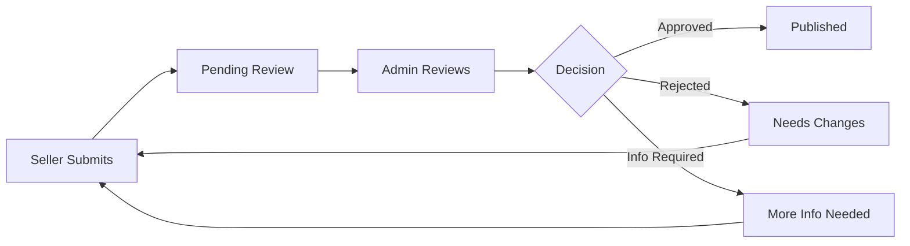

**For Verified Sellers:**
- Auto-approval (products go live immediately)
- Random quality checks by admin
- Flagging system for policy violations

**Approval Timeline:**
- Standard: 24-48 hours
- Priority (Premium): 2-4 hours

**Rejection Reasons:**
- Poor quality images
- Incomplete information
- Misleading description
- Prohibited items
- Policy violation
- Duplicate product

**Notification:**
- Email on approval/rejection
- Dashboard notification
- SMS for rejection (with reasons)

---
## 8. Admin Panel - Platform Management

### 8.1 Admin Dashboard

**Purpose:** Central hub for platform oversight and management

#### 8.1.1 Dashboard Overview

**Key Performance Indicators (Top Row):**

**Total Users:**
- Count with growth percentage
- Icon and trend indicator
- Click to view details

**Total Sellers:**
- Active sellers count
- Pending approvals count
- Growth percentage

**Total Products:**
- Published products
- Pending moderation
- Total revenue impact

**Today's Orders:**
- Order count
- Total value (₹)
- Comparison with yesterday

**Platform Revenue:**
- Total commission earned (today/month)
- Revenue trend
- Graph icon

**Active Support Tickets:**
- Open tickets count
- Average response time
- SLA compliance

**Platform Health Metrics:**

**System Status:**
- All Systems Operational ✓
- Or warning indicators
- Uptime percentage

**Performance Metrics:**
- API Response Time: <300ms
- Page Load Time: <2s
- Error Rate: <0.1%

**Real-Time Activity Feed:**
- New user registrations
- New seller applications
- New orders
- New products submitted
- Reviews posted
- Support tickets created
- Payments processed
- Last 20 activities displayed
- Auto-refresh

**Pending Actions (Priority Queue):**
- Seller Verification Pending (count with link)
- Products Awaiting Approval (count)
- Disputes Requiring Resolution (count)
- Returns/Refunds Pending (count)
- Reported Reviews (count)
- Flagged Content (count)

**Sales Analytics Chart:**
- Line chart showing daily sales
- Last 30 days
- Toggle: Orders vs Revenue
- Comparison with previous period

**Top Performing Categories:**
- Pie chart or bar chart
- Revenue by category
- Top 5 categories

**Recent Orders Table:**
- Order ID
- Customer Name
- Seller Name
- Amount
- Status
- Date
- Quick actions

**Top Sellers (This Month):**
- Seller name
- Orders count
- Revenue
- Commission earned
- View store link

**Geographic Distribution:**
- Map showing orders by state
- Heat map or markers
- Top 10 cities by orders

**User Growth Chart:**
- Line chart
- Customers vs Sellers
- Last 6 months

**Quick Actions Panel:**
- Approve Seller
- Review Product
- Resolve Dispute
- View Reports
- Manage Coupons
- Create Campaign

**API Endpoints:**
- GET /api/admin/dashboard/kpi
- GET /api/admin/dashboard/activity-feed
- GET /api/admin/dashboard/sales-chart
- GET /api/admin/dashboard/pending-actions

### 8.2 User Management

**Purpose:** Manage customer accounts

#### 8.2.1 Users List Page

**User Stats Cards:**
- Total Users
- Active Users (last 30 days)
- New Users (this month)
- Suspended Users

**Users Table:**

**Columns:**
- User ID
- Name
- Email
- Phone
- Registration Date
- Last Active
- Total Orders
- Total Spent (₹)
- Status (Active/Suspended/Banned)
- Actions (View, Edit, Suspend, Ban)

**Filters:**
- Status (All, Active, Suspended, Banned)
- Registration Date Range
- Last Active Date Range
- Order Count (Min-Max)
- Total Spent (Min-Max)
- Verification Status (Verified, Unverified)

**Search:**
- Search by name, email, phone, user ID

**Sort Options:**
- Recently Registered
- Most Active
- Highest Spender
- Most Orders

**Bulk Actions:**
- Select multiple users
- Send email
- Suspend accounts
- Export data

**Actions per User:**
- View full profile
- View order history
- View reviews
- Suspend account
- Ban account
- Delete account (with confirmation)
- Reset password
- Send notification

#### 8.2.2 User Detail Page

**User Information Card:**
- Profile photo
- Name
- Email (verified badge)
- Phone (verified badge)
- User ID
- Registration date
- Last active
- Account status

**Account Stats:**
- Total Orders
- Total Spent (₹)
- Average Order Value
- Reviews Written
- Returns Made
- Support Tickets
- Referrals Made

**Order History:**
- List of all orders
- Order ID, Date, Amount, Status
- View order details

**Reviews:**
- All reviews written by user
- Product, Rating, Date
- Moderate reviews

**Support Tickets:**
- All tickets created by user
- Status and resolution

**Account Actions:**
- Edit profile
- Change email/phone
- Reset password
- Suspend account (with reason)
- Ban account (with reason)
- Delete account (requires confirmation)
- Refund wallet balance
- Send notification

**Activity Log:**
- Login history
- Order history
- Profile changes
- Support interactions

**API Endpoints:**
- GET /api/admin/users/{userId}
- PUT /api/admin/users/{userId}
- POST /api/admin/users/{userId}/suspend
- POST /api/admin/users/{userId}/ban
- DELETE /api/admin/users/{userId}

### 8.3 Seller Management

**Purpose:** Manage seller accounts and verification

#### 8.3.1 Sellers List Page

**Seller Stats:**
- Total Sellers
- Active Sellers
- Pending Approval
- Suspended Sellers
- Total Stores
- Average Rating

**Status Tabs:**
- All Sellers
- Pending Approval (count)
- Active (count)
- Suspended (count)
- Rejected (count)

**Sellers Table:**

**Columns:**
- Seller ID
- Store Name
- Owner Name
- Email
- Phone
- Business Type
- Application Date
- Verification Status
- Rating
- Total Products
- Total Orders
- Total Revenue (₹)
- Commission Earned (₹)
- Status
- Actions

**Filters:**
- Verification Status
- Business Type
- Registration Date Range
- Revenue Range
- Rating
- Product Count
- Location (State/City)

**Search:**
- By store name, seller name, email, phone

**Sort Options:**
- Recently Applied
- Highest Revenue
- Most Products
- Highest Rated
- Most Orders

**Bulk Actions:**
- Approve sellers
- Suspend sellers
- Export data
- Send email

**Actions per Seller:**
- View application details
- Approve application
- Reject application (with reason)
- Request more information
- View store
- View products
- View orders
- Suspend account
- Edit details
- View analytics

#### 8.3.2 Seller Verification Page

**Seller Application Details:**

**Business Information:**
- Business Name
- Business Type
- Category
- Year Established
- Description

**Contact Information:**
- Owner Name
- Email
- Phone
- Address

**Documents Submitted:**
- Business Registration (view/download)
- GST Certificate (view/download)
- PAN Card (view/download)
- Bank Statement (view/download)
- Identity Proof (view/download)
- Address Proof (view/download)

**Document Verification Checklist:**
- [ ] Business Registration Valid
- [ ] GST Number Verified (auto-check via API)
- [ ] PAN Valid (auto-check via API)
- [ ] Bank Account Verified (penny drop test)
- [ ] Address Verified
- [ ] Identity Verified
- [ ] No Duplicate Applications

**Verification Notes:**
- Internal notes section
- Previous verification attempts
- Admin comments

**Bank Details:**
- Account Holder Name
- Bank Name
- Account Number
- IFSC Code
- Account Type
- Verification Status

**Decision Actions:**

**Approve Application:**
- Confirmation dialog
- Welcome email sent automatically
- Seller account activated
- Notification sent

**Reject Application:**
- Rejection reason* (dropdown + textarea):
  - Incomplete Documents
  - Invalid Documents
  - Business Not Eligible
  - Duplicate Application
  - Fraudulent Information
  - Other
- Detailed explanation*
- Email notification sent
- Option to reapply

**Request More Information:**
- Select missing/unclear documents
- Add specific requests
- Email sent to seller
- Application status: Information Required

**Verification Timeline:**
- Track verification progress
- Timestamps for each action
- Assigned admin
- Status history

**API Endpoints:**
- GET /api/admin/sellers/pending
- GET /api/admin/sellers/{sellerId}/application
- POST /api/admin/sellers/{sellerId}/approve
- POST /api/admin/sellers/{sellerId}/reject
- POST /api/admin/sellers/{sellerId}/request-info

#### 8.3.3 Seller Detail Page

**Store Overview:**
- Store Logo
- Store Name
- Store URL (link)
- Verification Badge
- Rating
- Total Reviews
- Store Created Date

**Seller Stats:**
- Total Products (Published/Draft/Pending)
- Total Orders
- Orders This Month
- Total Revenue
- Revenue This Month
- Average Order Value
- Commission Paid (Total/This Month)
- Return Rate (%)
- Customer Rating
- Response Time

**Performance Metrics:**
- Order Fulfillment Rate
- On-Time Shipping Rate
- Return Rate
- Cancellation Rate
- Customer Satisfaction Score
- Performance Trend Chart

**Products:**
- List of all seller products
- Filter by status
- Quick approve/reject
- View product details

**Orders:**
- All orders for this seller
- Filter by status
- Order value
- View order details

**Financial:**
- Wallet Balance
- Pending Payouts
- Commission History
- Transaction History
- Export financial data

**Reviews:**
- Customer reviews of store
- Product reviews
- Average rating
- Response rate

**Policies:**
- Shipping Policy
- Return Policy
- Exchange Policy
- Cancellation Policy

**Account Actions:**
- Edit seller details
- Suspend seller (with reason)
- Ban seller (with reason)
- Adjust commission rate
- Reset password
- Contact seller
- View verification documents

**Activity Log:**
- Login history
- Product submissions
- Order activities
- Policy changes
- Support interactions

**API Endpoints:**
- GET /api/admin/sellers/{sellerId}
- PUT /api/admin/sellers/{sellerId}
- POST /api/admin/sellers/{sellerId}/suspend
- GET /api/admin/sellers/{sellerId}/products
- GET /api/admin/sellers/{sellerId}/orders
- GET /api/admin/sellers/{sellerId}/financial

### 8.4 Product Management

**Purpose:** Moderate and manage all products on platform

#### 8.4.1 Products List Page

**Product Stats:**
- Total Products
- Published
- Pending Approval
- Rejected
- Out of Stock
- Total Value

**Status Tabs:**
- All Products
- Pending Approval (count)
- Published (count)
- Rejected (count)
- Out of Stock (count)
- Flagged (count)

**Products Table:**

**Columns:**
- Product Image (thumbnail)
- Product Name
- SKU
- Seller Name
- Category
- Price (₹)
- Stock
- Status
- Views
- Sales
- Rating
- Submitted Date
- Actions

**Filters:**
- Status
- Category
- Price Range
- Stock Status
- Seller
- Date Range
- Rating

**Search:**
- By product name, SKU, seller name

**Sort Options:**
- Recently Added
- Price: Low to High
- Price: High to Low
- Most Viewed
- Most Sold
- Highest Rated

**Bulk Actions:**
- Approve selected
- Reject selected
- Publish selected
- Unpublish selected
- Export data

**Actions per Product:**
- View details
- Approve
- Reject (with reason)
- Edit product
- Unpublish
- Delete
- View on site

#### 8.4.2 Product Approval Page

**Product Information:**
- All product details (as entered by seller)
- Images gallery
- Videos
- Description
- Specifications
- Pricing
- Variants
- Inventory

**Seller Information:**
- Seller name (linked)
- Store rating
- Total products
- View store link

**Quality Checklist:**
- [ ] Images are clear and professional
- [ ] Minimum 3 images uploaded
- [ ] Product title is descriptive
- [ ] Description is detailed (min 200 words)
- [ ] All required fields completed
- [ ] Category correctly selected
- [ ] Pricing is reasonable
- [ ] No prohibited content
- [ ] No misleading information
- [ ] Specifications accurate
- [ ] Images match description

**Policy Compliance:**
- [ ] No copyrighted content
- [ ] No branded replicas
- [ ] Appropriate content (no adult/violence)
- [ ] Follows platform guidelines
- [ ] Accurate representation

**Moderation Notes:**
- Internal notes (textarea)
- Previous moderation history (if resubmitted)

**Decision Actions:**

**Approve Product:**
- Product goes live
- Seller notified
- Published date recorded

**Reject Product:**
- Rejection reason* (select multiple):
  - Poor Quality Images
  - Incomplete Information
  - Misleading Description
  - Incorrect Category
  - Prohibited Item
  - Policy Violation
  - Duplicate Product
  - Inappropriate Content
  - Other (specify)
- Detailed feedback* (textarea)
- Seller notified with feedback
- Option to resubmit

**Request Changes:**
- Specify required changes
- Product remains in "Needs Update" status
- Seller can edit and resubmit

**Flag for Review:**
- Escalate to senior admin
- Add flag reason
- Requires additional review

**Moderation Timeline:**
- Submission date
- Review started
- Decision made
- Reviewed by (admin name)

**API Endpoints:**
- GET /api/admin/products/pending
- GET /api/admin/products/{productId}
- POST /api/admin/products/{productId}/approve
- POST /api/admin/products/{productId}/reject
- POST /api/admin/products/{productId}/request-changes

#### 8.4.3 Category Management

**Purpose:** Manage product categories and attributes

**Categories Tree View:**
- Hierarchical display
- Level 1: Main Categories
- Level 2: Subcategories
- Level 3: Sub-subcategories
- Drag and drop to reorder

**Category Details:**
- Category Name
- Slug (URL)
- Description
- Parent Category
- Category Image
- SEO Title
- SEO Description
- Status (Active/Inactive)
- Display Order

**Actions:**
- Add New Category
- Edit Category
- Delete Category
- Reorder Categories
- Bulk Import/Export

**Attributes Management:**
- Define attributes for each category
- Example: "Size", "Color", "Fabric"
- Attribute values
- Mandatory vs Optional

### 8.5 Order Management

**Purpose:** Monitor and manage all platform orders

#### 8.5.1 Orders List Page

**Order Stats:**
- Total Orders (Today/Month)
- Total Revenue (Today/Month)
- Average Order Value
- Pending Orders
- Completed Orders
- Cancelled Orders
- Return Requests

**Status Tabs:**
- All Orders
- Pending
- Processing
- Shipped
- Delivered
- Cancelled
- Returns/Refunds

**Orders Table:**

**Columns:**
- Order ID
- Customer Name
- Seller Name
- Items
- Amount (₹)
- Payment Method
- Order Date
- Status
- Actions

**Filters:**
- Status
- Date Range
- Payment Method
- Amount Range
- Seller
- Customer

**Search:**
- By Order ID, Customer Name, Seller Name

**Sort Options:**
- Most Recent
- Oldest First
- Highest Value
- Lowest Value

**Actions per Order:**
- View details
- Track shipment
- Contact customer
- Contact seller
- Resolve dispute
- Process refund
- Cancel order
- View invoice

#### 8.5.2 Order Detail Page

(Similar structure to Seller Order Detail, with additional admin controls)

**Admin-Specific Actions:**
- Force cancel order
- Force refund
- Override shipping
- Adjust commission
- Resolve disputes
- Ban user/seller (if fraud detected)

**Order Timeline:**
- Complete order history
- All status changes
- Admin interventions
- Customer/Seller communications

### 8.6 Finance Management

**Purpose:** Manage platform finances and payouts

#### 8.6.1 Transactions Overview

**Financial Stats:**
- Total Revenue (Commission)
- Today's Commission
- This Month's Commission
- Pending Payouts
- Completed Payouts
- Refunds Processed

**Transactions Table:**
- Transaction ID
- Order ID
- Seller
- Customer
- Amount
- Commission
- Type (Sale/Refund/Payout)
- Date
- Status

**Filters:**
- Transaction Type
- Date Range
- Seller
- Amount Range
- Status

#### 8.6.2 Payouts Management

**Pending Payouts:**
- List of seller payout requests
- Seller name
- Request date
- Amount
- Bank details
- Actions (Approve, Reject, Hold)

**Approve Payout:**
- Verify bank details
- Initiate transfer
- Update status
- Notify seller

**Payout History:**
- All completed payouts
- Transaction details
- UTR number
- Export data

#### 8.6.3 Commission Reports

**Commission Overview:**
- Total commission earned
- By category
- By seller tier
- Trend chart

**Commission Structure Display:**
- Current commission rates
- By category
- By seller level
- Edit commission (if Super Admin permission)

**Detailed Reports:**
- Commission by seller
- Commission by category
- Commission by time period
- Export options

### 8.7 Content Management System (CMS)

**Purpose:** Manage website content

#### 8.7.1 Pages Management

**Static Pages:**
- About Us
- How It Works
- Privacy Policy
- Terms & Conditions
- Shipping Policy
- Return Policy
- FAQ
- Contact Us

**Page Editor:**
- Page Title
- URL Slug
- Content (Rich Text Editor)
- SEO Title
- SEO Description
- Status (Published/Draft)
- Publish Date

#### 8.7.2 Blog Management

**Blog Posts List:**
- Title
- Author
- Category
- Publish Date
- Status
- Views
- Actions

**Create/Edit Blog Post:**
- Title
- Featured Image
- Content (Rich Text Editor)
- Category
- Tags
- Author
- SEO Settings
- Publish Date
- Status

#### 8.7.3 Collections Management

**Collections List:**
- Collection name
- Description
- Products count
- Status
- Featured

**Create/Edit Collection:**
- Collection Name
- Description
- Banner Image
- Select Products (multi-select)
- Display Order
- SEO Settings
- Status (Active/Inactive)
- Featured on Homepage (toggle)

#### 8.7.4 Banner Management

**Homepage Banners:**
- Upload banner image
- Link URL
- Display Order
- Active Date Range
- Target (All/Mobile/Desktop)
- Position (Hero/Middle/Footer)

**Banners List:**
- Preview
- Title
- Position
- Status
- Active Period
- Actions (Edit, Delete, Duplicate)

### 8.8 Marketing Management

**Purpose:** Manage platform-wide marketing campaigns

#### 8.8.1 Campaigns Management

**Campaign Types:**
- Flash Sale
- Seasonal Sale
- Category Discount
- First Order Discount
- Referral Campaign

**Create Campaign:**
- Campaign Name
- Type
- Description
- Start Date
- End Date
- Discount Type (%, Flat)
- Discount Value
- Applicable To (All/Categories/Sellers)
- Budget Limit
- Banner Assets

**Campaign Performance:**
- Impressions
- Clicks
- Conversions
- Revenue Generated
- ROI

#### 8.8.2 Coupon Management

**Platform-Wide Coupons:**
- Similar to seller coupons
- But applicable across all sellers
- Platform bears the discount cost

**Coupon List:**
- Code
- Discount
- Usage/Limit
- Validity
- Status
- Actions

#### 8.8.3 Email Marketing

**Email Campaigns:**
- Newsletter
- Promotional
- Transactional
- Abandoned Cart
- Re-engagement

**Create Email Campaign:**
- Template Selection
- Subject Line
- Email Content (HTML Editor)
- Target Audience (Segment)
- Schedule
- A/B Testing (Premium)

**Campaign Performance:**
- Sent
- Opened
- Clicked
- Conversions
- Unsubscribed

#### 8.8.4 Push Notifications

**Send Push Notification:**
- Title
- Message
- Target (All/Segment)
- Image (optional)
- Action Link
- Schedule

**Notification History:**
- Sent notifications
- Delivery rate
- Click rate
- Conversions

### 8.9 Reports & Analytics

**Purpose:** Comprehensive business intelligence

#### 8.9.1 Sales Reports

**Reports Available:**
- Sales by Date
- Sales by Category
- Sales by Seller
- Sales by Location
- Payment Method Wise
- Top Products
- Revenue vs Commission

**Report Filters:**
- Date Range
- Category
- Seller
- Location
- Export Format (CSV/Excel/PDF)

#### 8.9.2 User Reports

- User Growth
- User Retention
- User Segmentation
- Active Users
- Churned Users
- User Lifetime Value

#### 8.9.3 Seller Reports

- Seller Performance
- Top Sellers
- Seller Growth
- Commission Earned
- Average Response Time
- Fulfillment Metrics

#### 8.9.4 Product Reports

- Top Products
- Product Views
- Conversion Rate
- Category Performance
- Inventory Levels
- Out of Stock Report

#### 8.9.5 Financial Reports

- Revenue Report
- Commission Report
- Payout Report
- Refund Report
- Tax Report
- P&L Statement

**Export Options:**
- All reports exportable to CSV/Excel/PDF
- Schedule automated reports (email delivery)
- API access for custom reporting

### 8.10 Settings

**Purpose:** Configure platform-wide settings

#### 8.10.1 General Settings

- Platform Name
- Logo
- Favicon
- Contact Email
- Support Phone
- Address
- Default Language
- Default Currency
- Timezone
- Date Format

#### 8.10.2 Payment Settings

**Payment Gateways:**
- Razorpay (toggle, API keys)
- Stripe (toggle, API keys)
- PayU (toggle, API keys)
- COD (toggle)

**Payment Settings:**
- Default Gateway
- Test Mode (toggle)
- COD Charges
- COD Limit
- Payment Currency

#### 8.10.3 Shipping Settings

**Shipping Providers:**
- Delhivery (API credentials)
- Blue Dart (API credentials)
- FedEx (API credentials)
- DTDC (API credentials)

**Shipping Configuration:**
- Default Provider
- Free Shipping Threshold (₹)
- Standard Shipping Charge
- Express Shipping Charge
- COD Availability Pincodes

#### 8.10.4 Email Templates

**Template Categories:**
- Order Confirmation
- Shipping Confirmation
- Delivery Confirmation
- Return Approved
- Refund Processed
- Welcome Email
- Password Reset
- Seller Approved
- Product Approved

**Template Editor:**
- Subject Line
- Email Body (HTML Editor)
- Variables Available
- Preview
- Send Test Email

#### 8.10.5 SMS Templates

**Template Categories:**
- Order Confirmation
- OTP Verification
- Shipping Update
- Delivery Update

**Template Editor:**
- Message Text
- Variables
- Character Count
- Preview

#### 8.10.6 Notification Settings

**Channel Configuration:**
- Email (toggle)
- SMS (toggle)
- Push Notifications (toggle)
- In-App Notifications (toggle)

**Notification Rules:**
- Configure which events trigger notifications
- Recipient rules
- Frequency limits

---
## 9. Super Admin Panel - System Controls

### 9.1 Super Admin Dashboard

**Purpose:** High-level system oversight and configuration

**System Health Monitoring:**
- Server Status (All servers)
- Database Performance
  - Query response time
  - Connection pool status
  - Storage usage
- API Performance
  - Request per second
  - Average response time
  - Error rate
- CDN Status
- Cache Hit Rate
- Queue Status (background jobs)

**Critical Metrics:**
- Platform Uptime (%)
- Active Users (real-time)
- Concurrent Sessions
- Database Size
- Storage Used/Available
- Bandwidth Usage
- Error Logs (critical errors count)

**Admin Activity Monitor:**
- Recent admin actions
- Permission changes
- Configuration updates
- Sensitive operations
- Failed login attempts

**Security Alerts:**
- Suspicious activities
- Failed login attempts (>threshold)
- Unauthorized access attempts
- IP blocklist triggers
- DDoS detection
- Data breach alerts

**System Logs:**
- Application logs
- Error logs
- Access logs
- Audit logs
- Real-time log streaming

### 9.2 Roles & Permissions Management

**Purpose:** Manage admin roles and access control

#### 9.2.1 Roles List

**Pre-defined Roles:**
- Super Admin
- Senior Admin
- Admin
- Moderator
- Support Admin
- Finance Admin
- Marketing Admin
- Content Admin

**Roles Table:**
- Role Name
- Description
- Users Count
- Created Date
- Actions (View, Edit, Duplicate, Delete)

**Create/Edit Role:**

**Role Information:**
- Role Name*
- Description
- Status (Active/Inactive)

**Permissions (Granular):**

**User Management:**
- View Users
- Create User
- Edit User
- Delete User
- Suspend User
- Ban User

**Seller Management:**
- View Sellers
- Approve Sellers
- Reject Sellers
- Edit Sellers
- Suspend Sellers
- Delete Sellers

**Product Management:**
- View Products
- Approve Products
- Reject Products
- Edit Products
- Delete Products
- Manage Categories

**Order Management:**
- View Orders
- Edit Orders
- Cancel Orders
- Process Refunds
- Resolve Disputes

**Financial:**
- View Transactions
- Approve Payouts
- Process Refunds
- View Reports
- Edit Commission

**Content Management:**
- Manage Pages
- Manage Blogs
- Manage Banners
- Manage Collections

**Marketing:**
- Create Campaigns
- Manage Coupons
- Send Notifications
- Email Marketing

**Reports:**
- View Reports
- Export Data
- Schedule Reports

**Settings:**
- View Settings
- Edit Settings
- Payment Settings
- Shipping Settings

**System:**
- View Logs
- Manage Roles
- Manage Permissions
- API Management
- Database Access

**Permissions Matrix:**
- Checkbox grid for easy assignment
- Permission groups (expand/collapse)
- Select All/None for each group

#### 9.2.2 Admin Users Management

**Admin Users List:**
- Name
- Email
- Role
- Department
- Last Login
- Status
- Actions

**Create Admin User:**
- Full Name*
- Email*
- Phone*
- Role* (dropdown)
- Department
- Reporting To (select admin)
- Status (Active/Inactive)
- Two-Factor Auth Required (toggle)
- IP Whitelist (optional, comma-separated IPs)

**Admin Detail Page:**
- Personal information
- Assigned role
- Permissions
- Activity log
- Login history
- Actions performed
- Edit/Suspend/Delete actions

### 9.3 System Configuration

**Purpose:** Configure platform-wide system settings

#### 9.3.1 General Configuration

**Platform Settings:**
- Platform Name
- Primary Domain
- Admin Email
- Support Email
- Support Phone
- Company Name
- Company Address
- Tax ID
- Legal Entity

**Regional Settings:**
- Default Country
- Default Language
- Supported Languages (multi-select)
- Default Currency
- Supported Currencies
- Timezone
- Date Format
- Time Format
- Number Format

**Maintenance Mode:**
- Enable Maintenance Mode (toggle)
- Maintenance Message (textarea)
- Allowed IPs (to bypass maintenance)
- Scheduled Maintenance (date/time)

**Feature Flags:**
- Enable/Disable features platform-wide
- Customer Features:
  - Wishlist
  - Reviews
  - Referral Program
  - Wallet
  - Social Login
- Seller Features:
  - Bulk Upload
  - Advanced Analytics
  - API Access
  - Custom Store Themes
- Platform Features:
  - AI Recommendations
  - Image Enhancement
  - Video Support
  - Live Chat
  - Multi-language
  - Multi-currency

**Performance Settings:**
- Cache Duration (seconds)
- Image Optimization (toggle)
- Lazy Loading (toggle)
- CDN (toggle)
- Compression (toggle)

#### 9.3.2 Platform Fees & Commission Structure

**Purpose:** Configure revenue model

**Commission Structure:**

**Global Commission Rate:**
- Default commission % for all sellers
- Range: 5-20%

**Category-Based Commission:**
- Different rates for different categories
- Table with Category and Commission %

**Seller Tier-Based Commission:**
- Bronze: 15%
- Silver: 12%
- Gold: 10%
- Platinum: 8%

**Volume-Based Commission (Tiered):**
| Monthly Sales Volume | Commission % |
|----------------------|--------------|
| ₹0 - ₹50,000 | 15% |
| ₹50,001 - ₹1,00,000 | 12% |
| ₹1,00,001 - ₹2,00,000 | 10% |
| ₹2,00,001 - ₹5,00,000 | 8% |
| Above ₹5,00,000 | 5% |

**Transaction Fees:**
- Payment Gateway Fee (%)
- COD Handling Fee (₹)
- Platform Fee (fixed, ₹)

**Subscription Plans:**

**Customer Plans:**
- Free (default)
- Premium:
  - Monthly Price (₹)
  - Annual Price (₹)
  - Benefits configuration

**Seller Plans:**
- Standard (default)
- Premium:
  - Monthly Price (₹)
  - Annual Price (₹)
  - Features included
  - Commission discount (%)

**Featured Listing Fees:**
- Homepage Banner (₹/day)
- Category Page Top (₹/day)
- Search Sponsored (₹/click)

**Other Fees:**
- Seller Onboarding Fee (one-time, ₹)
- Annual Renewal Fee (₹)
- Priority Support Fee (₹/month)

#### 9.3.3 Commission Rules Configuration

**Rule-Based Commission:**

**Create Commission Rule:**
- Rule Name*
- Priority (for conflict resolution)
- Conditions (multi-condition):
  - Category = [select]
  - Seller Tier = [select]
  - Product Price Range [min-max]
  - Order Value [min-max]
  - Date Range [start-end]
- Commission Type* (Percentage / Fixed)
- Commission Value*
- Status (Active/Inactive)

**Rule Examples:**
1. "Wedding Category High Ticket": If category = Wedding AND price > ₹50,000, then 8% commission
2. "New Seller Promotion": If seller tier = Bronze AND registration < 3 months, then 10% commission
3. "Festival Sale": If date between Oct 1 - Oct 31, then 12% commission for all

**Commission Override:**
- Manual override for specific sellers
- Reason required
- Approval workflow
- Audit trail

### 9.4 Security Controls

**Purpose:** Manage platform security

#### 9.4.1 Access Management

**IP Whitelist:**
- Add IP addresses that can access admin panel
- IP Range support
- Description per entry
- Enable/Disable per entry

**IP Blacklist:**
- Block malicious IPs
- Auto-block after failed attempts (threshold)
- Manual addition
- View blocked access attempts

**Two-Factor Authentication:**
- Enforce 2FA for all admins (toggle)
- 2FA method (Email/SMS/Authenticator App)
- Grace period for enrollment

**Session Management:**
- Session timeout (minutes)
- Concurrent session limit
- Force logout all sessions (button)

**Password Policy:**
- Minimum length (default: 8)
- Require uppercase (toggle)
- Require lowercase (toggle)
- Require numbers (toggle)
- Require special characters (toggle)
- Password expiry (days)
- Password history (prevent reuse of last N passwords)

**Login Security:**
- Max failed attempts before lockout
- Lockout duration (minutes)
- CAPTCHA after N failed attempts
- Email alert on suspicious login

#### 9.4.2 Data Privacy & Compliance

**GDPR Compliance:**
- Data retention period (days)
- Right to be forgotten (enable/disable)
- Data export format
- Cookie consent (enable/disable)

**Data Encryption:**
- Encrypt sensitive data at rest (toggle)
- Encrypt data in transit (toggle, always recommended)
- Encryption algorithm (AES-256)

**Data Backup:**
- Auto backup frequency (Daily/Weekly)
- Backup retention period (days)
- Backup location
- Test backup restoration (button)

**Audit Trail:**
- Log all sensitive operations (toggle)
- Log retention period (days)
- Audit log access (restricted to Super Admin)

#### 9.4.3 API Security

**API Keys Management:**
- Generate API keys
- Revoke API keys
- Key expiration
- Rate limiting per key
- Allowed IP addresses per key

**API Rate Limiting:**
- Requests per minute (global)
- Requests per minute (per user)
- Requests per minute (per IP)
- Throttle policy (block/queue)

**API Monitoring:**
- API usage statistics
- Endpoint performance
- Error rate by endpoint
- Top API consumers
- Suspicious activity detection

### 9.5 Audit Logs

**Purpose:** Track all system and admin activities

#### 9.5.1 Audit Log Viewer

**Log Filters:**
- Date Range
- Event Type (User Action, Admin Action, System Event, Security Event)
- Severity (Info, Warning, Error, Critical)
- User/Admin
- IP Address
- Resource Type (User, Product, Order, etc.)
- Action Type (Create, Read, Update, Delete)

**Log Table:**

**Columns:**
- Timestamp
- Event Type
- Severity
- User/Admin (who performed action)
- Action (what was done)
- Resource (what was affected)
- IP Address
- User Agent
- Details (expandable)
- Status (Success/Failed)

**Log Details (Expandable):**
- Before state (if update)
- After state (if update)
- Error message (if failed)
- Stack trace (if error)

**Export Logs:**
- Date range selection
- Format (CSV/JSON)
- Email delivery option

**Real-Time Logs:**
- Live log streaming
- Auto-refresh
- Filter on-the-fly

**Audit Report Generation:**
- Compliance reports
- Security reports
- User activity reports
- Admin activity reports
- Scheduled report delivery

#### 9.5.2 Security Events Log

**Specific Security Events:**
- Failed login attempts
- Unauthorized access attempts
- Permission denied events
- Data breach attempts
- Suspicious activities
- Admin actions on sensitive data
- API abuse
- DDoS attempts

**Alert Configuration:**
- Email alerts for critical events
- SMS alerts for security breaches
- Slack/webhook integration
- Alert threshold configuration

### 9.6 Database Management

**Purpose:** Manage database operations (Use with extreme caution)

#### 9.6.1 Database Overview

**Database Stats:**
- Database Size
- Table Count
- Row Count (total)
- Index Size
- Storage Used/Available
- Connection Count (active)

**Tables List:**
- Table Name
- Row Count
- Size
- Last Modified
- Actions (View Schema, Optimize, Repair)

**Performance Metrics:**
- Slow Query Log
- Query performance analysis
- Index usage statistics
- Lock wait time

#### 9.6.2 Backup & Recovery

**Create Backup:**
- Full Database Backup
- Selective Tables Backup
- Backup Compression (toggle)
- Encryption (toggle)

**Backup List:**
- Backup Name
- Size
- Created Date
- Status
- Actions (Download, Restore, Delete)

**Restore Database:**
- Select backup file
- Confirmation required (with warnings)
- Restore options (full/selective)

**Scheduled Backups:**
- Frequency (Daily/Weekly/Monthly)
- Time
- Retention policy
- Email notification on completion

**Disaster Recovery:**
- Failover configuration
- Replication status
- Recovery point objective (RPO)
- Recovery time objective (RTO)

### 9.7 Integration Settings

**Purpose:** Configure third-party integrations

#### 9.7.1 Payment Gateways

**For each gateway:**
- Enable/Disable (toggle)
- Test Mode (toggle)
- API Credentials (secure input)
- Webhook URL
- Supported Payment Methods
- Currency Support
- Test Connection (button)

**Supported Gateways:**
- Razorpay
- Stripe
- PayU
- Paytm
- PhonePe
- Google Pay
- Amazon Pay

#### 9.7.2 Shipping Providers

**For each provider:**
- Enable/Disable
- API Credentials
- Supported Services (Standard, Express, etc.)
- Weight Limits
- Serviceable Pincodes
- Test Integration

**Supported Providers:**
- Delhivery
- Blue Dart
- FedEx
- DTDC
- India Post
- Shiprocket

#### 9.7.3 SMS Provider

- Provider (Twilio, MSG91, etc.)
- API Credentials
- Sender ID
- SMS Templates
- Test SMS

#### 9.7.4 Email Service

- Provider (SendGrid, Amazon SES, etc.)
- SMTP Settings
- From Email
- From Name
- Email Templates
- Test Email

#### 9.7.5 Cloud Storage

- Provider (AWS S3, Cloudflare R2, etc.)
- Bucket Name
- Access Key
- Secret Key
- Region
- CDN URL
- Test Connection

#### 9.7.6 Analytics

- Google Analytics (Tracking ID)
- Facebook Pixel (Pixel ID)
- Mixpanel (Project Token)
- Hotjar (Site ID)
- Custom Analytics (script injection)

#### 9.7.7 Social Login

**Google OAuth:**
- Client ID
- Client Secret
- Redirect URI

**Facebook Login:**
- App ID
- App Secret
- Redirect URI

**Apple Sign In:**
- Service ID
- Team ID
- Key ID
- Private Key

#### 9.7.8 AI Services

**Image Enhancement:**
- Provider (Cloudinary AI, etc.)
- API Key
- Features enabled

**Recommendation Engine:**
- Provider (Custom/Third-party)
- API Endpoint
- Configuration

**Chatbot:**
- Provider
- API Key
- Training Data

---
## 10. Database Planning & Entity Relationships

### 10.1 Database Architecture Overview

**Database Type:** PostgreSQL (Primary), Redis (Caching), Elasticsearch (Search)

**Design Principles:**
- Normalized database structure (3NF)
- Optimized for read-heavy operations
- Scalable horizontal partitioning
- Efficient indexing strategy
- Data integrity constraints
- Audit trail for critical tables

### 10.2 Core Entities

#### 10.2.1 Users Table

**Table Name:** `users`

**Columns:**
| Column | Type | Constraints | Description |
|--------|------|-------------|-------------|
| id | UUID | PRIMARY KEY | Unique user identifier |
| email | VARCHAR(255) | UNIQUE, NOT NULL | User email |
| email_verified | BOOLEAN | DEFAULT FALSE | Email verification status |
| phone | VARCHAR(20) | UNIQUE | Phone number |
| phone_verified | BOOLEAN | DEFAULT FALSE | Phone verification status |
| password_hash | VARCHAR(255) | NOT NULL | Hashed password |
| first_name | VARCHAR(100) | NOT NULL | First name |
| last_name | VARCHAR(100) | NOT NULL | Last name |
| date_of_birth | DATE | NULL | Date of birth |
| gender | ENUM | NULL | Male, Female, Other |
| profile_photo | VARCHAR(500) | NULL | Profile photo URL |
| role | ENUM | NOT NULL | Customer, Seller, Admin, SuperAdmin |
| status | ENUM | DEFAULT 'active' | active, suspended, banned, deleted |
| language | VARCHAR(10) | DEFAULT 'en' | Preferred language |
| is_premium | BOOLEAN | DEFAULT FALSE | Premium membership status |
| premium_expires_at | TIMESTAMP | NULL | Premium membership expiry |
| referral_code | VARCHAR(10) | UNIQUE | User's referral code |
| referred_by | UUID | FOREIGN KEY | Referring user ID |
| wallet_balance | DECIMAL(10,2) | DEFAULT 0.00 | Wallet balance |
| reward_points | INTEGER | DEFAULT 0 | Loyalty points |
| last_login_at | TIMESTAMP | NULL | Last login timestamp |
| last_login_ip | VARCHAR(45) | NULL | Last login IP address |
| created_at | TIMESTAMP | DEFAULT NOW() | Record creation time |
| updated_at | TIMESTAMP | DEFAULT NOW() | Last update time |
| deleted_at | TIMESTAMP | NULL | Soft delete timestamp |

**Indexes:**
- PRIMARY KEY (id)
- UNIQUE (email)
- UNIQUE (phone)
- UNIQUE (referral_code)
- INDEX (role, status)
- INDEX (created_at)
- INDEX (referred_by)

**Relationships:**
- Has many: orders, reviews, addresses, wishlist_items, cart_items, notifications
- Has one: seller_profile (if role is Seller)

#### 10.2.2 Seller Profiles Table

**Table Name:** `seller_profiles`

**Columns:**
| Column | Type | Constraints | Description |
|--------|------|-------------|-------------|
| id | UUID | PRIMARY KEY | Unique seller identifier |
| user_id | UUID | FOREIGN KEY, UNIQUE | Reference to users table |
| business_name | VARCHAR(200) | NOT NULL, UNIQUE | Business name |
| business_type | ENUM | NOT NULL | Boutique, Designer, Manufacturer, etc. |
| store_slug | VARCHAR(200) | UNIQUE, NOT NULL | URL-friendly store name |
| store_logo | VARCHAR(500) | NULL | Store logo URL |
| store_banner | VARCHAR(500) | NULL | Store banner URL |
| store_tagline | VARCHAR(200) | NULL | Store tagline |
| store_description | TEXT | NULL | About the store |
| year_established | INTEGER | NULL | Year business started |
| gst_number | VARCHAR(15) | UNIQUE | GST registration number |
| pan_number | VARCHAR(10) | UNIQUE | PAN card number |
| verification_status | ENUM | DEFAULT 'pending' | pending, verified, rejected |
| verification_date | TIMESTAMP | NULL | Date of verification |
| verified_by | UUID | FOREIGN KEY | Admin who verified |
| seller_tier | ENUM | DEFAULT 'bronze' | bronze, silver, gold, platinum |
| commission_rate | DECIMAL(5,2) | NOT NULL | Commission percentage |
| rating | DECIMAL(3,2) | DEFAULT 0 | Average store rating |
| total_reviews | INTEGER | DEFAULT 0 | Number of reviews |
| total_products | INTEGER | DEFAULT 0 | Number of products |
| total_orders | INTEGER | DEFAULT 0 | Number of orders |
| total_sales | DECIMAL(12,2) | DEFAULT 0 | Total sales amount |
| response_time_hours | DECIMAL(5,2) | NULL | Average response time |
| fulfillment_rate | DECIMAL(5,2) | DEFAULT 0 | Order fulfillment percentage |
| return_rate | DECIMAL(5,2) | DEFAULT 0 | Return rate percentage |
| status | ENUM | DEFAULT 'active' | active, suspended, banned |
| is_premium | BOOLEAN | DEFAULT FALSE | Premium seller status |
| created_at | TIMESTAMP | DEFAULT NOW() | Account creation |
| updated_at | TIMESTAMP | DEFAULT NOW() | Last update |

**Indexes:**
- PRIMARY KEY (id)
- UNIQUE (user_id)
- UNIQUE (business_name)
- UNIQUE (store_slug)
- INDEX (verification_status)
- INDEX (seller_tier)
- INDEX (status)
- INDEX (rating)

**Relationships:**
- Belongs to: users
- Has many: products, orders, store_policies, seller_documents
- Has one: bank_details, store_branding

#### 10.2.3 Products Table

**Table Name:** `products`

**Columns:**
| Column | Type | Constraints | Description |
|--------|------|-------------|-------------|
| id | UUID | PRIMARY KEY | Unique product identifier |
| seller_id | UUID | FOREIGN KEY, NOT NULL | Reference to seller_profiles |
| sku | VARCHAR(100) | UNIQUE, NOT NULL | Stock keeping unit |
| title | VARCHAR(500) | NOT NULL | Product title |
| slug | VARCHAR(500) | UNIQUE, NOT NULL | URL slug |
| short_description | TEXT | NULL | Brief description |
| description | TEXT | NOT NULL | Full description |
| category_id | UUID | FOREIGN KEY, NOT NULL | Primary category |
| subcategory_id | UUID | FOREIGN KEY | Subcategory |
| brand | VARCHAR(100) | NULL | Brand/designer name |
| regular_price | DECIMAL(10,2) | NOT NULL | Base price |
| sale_price | DECIMAL(10,2) | NULL | Discounted price |
| cost_price | DECIMAL(10,2) | NULL | Cost to seller |
| tax_rate | DECIMAL(5,2) | NULL | GST/Tax percentage |
| currency | VARCHAR(3) | DEFAULT 'INR' | Currency code |
| stock_quantity | INTEGER | DEFAULT 0 | Available stock |
| low_stock_threshold | INTEGER | DEFAULT 5 | Low stock alert level |
| manage_stock | BOOLEAN | DEFAULT TRUE | Track inventory |
| allow_backorders | BOOLEAN | DEFAULT FALSE | Sell when out of stock |
| weight | DECIMAL(8,2) | NULL | Weight in kg |
| length | DECIMAL(8,2) | NULL | Length in cm |
| width | DECIMAL(8,2) | NULL | Width in cm |
| height | DECIMAL(8,2) | NULL | Height in cm |
| is_featured | BOOLEAN | DEFAULT FALSE | Featured product |
| is_customizable | BOOLEAN | DEFAULT FALSE | Custom orders accepted |
| customization_charges | DECIMAL(10,2) | NULL | Extra charges |
| processing_days | INTEGER | DEFAULT 2 | Order processing time |
| status | ENUM | DEFAULT 'draft' | draft, pending, published, rejected |
| moderation_status | ENUM | DEFAULT 'pending' | pending, approved, rejected |
| moderated_by | UUID | FOREIGN KEY | Admin who moderated |
| moderation_date | TIMESTAMP | NULL | Moderation date |
| rejection_reason | TEXT | NULL | Why rejected |
| views_count | INTEGER | DEFAULT 0 | Total views |
| sales_count | INTEGER | DEFAULT 0 | Total units sold |
| rating | DECIMAL(3,2) | DEFAULT 0 | Average rating |
| reviews_count | INTEGER | DEFAULT 0 | Number of reviews |
| seo_title | VARCHAR(100) | NULL | SEO meta title |
| seo_description | VARCHAR(300) | NULL | SEO meta description |
| seo_keywords | TEXT | NULL | SEO keywords |
| published_at | TIMESTAMP | NULL | Publication date |
| created_at | TIMESTAMP | DEFAULT NOW() | Creation date |
| updated_at | TIMESTAMP | DEFAULT NOW() | Last update |
| deleted_at | TIMESTAMP | NULL | Soft delete |

**Indexes:**
- PRIMARY KEY (id)
- UNIQUE (sku)
- UNIQUE (slug)
- INDEX (seller_id, status)
- INDEX (category_id)
- INDEX (moderation_status)
- INDEX (is_featured)
- INDEX (published_at)
- FULLTEXT INDEX (title, description)

**Relationships:**
- Belongs to: seller_profiles, categories
- Has many: product_images, product_variants, product_attributes, order_items, reviews, wishlist_items, cart_items

#### 10.2.4 Product Images Table

**Table Name:** `product_images`

**Columns:**
| Column | Type | Constraints | Description |
|--------|------|-------------|-------------|
| id | UUID | PRIMARY KEY | Image identifier |
| product_id | UUID | FOREIGN KEY, NOT NULL | Reference to products |
| image_url | VARCHAR(500) | NOT NULL | Image URL |
| thumbnail_url | VARCHAR(500) | NULL | Thumbnail URL |
| display_order | INTEGER | DEFAULT 0 | Image order |
| is_primary | BOOLEAN | DEFAULT FALSE | Main product image |
| alt_text | VARCHAR(200) | NULL | Alt text for SEO |
| created_at | TIMESTAMP | DEFAULT NOW() | Upload date |

**Indexes:**
- PRIMARY KEY (id)
- INDEX (product_id, display_order)
- INDEX (is_primary)

#### 10.2.5 Product Variants Table

**Table Name:** `product_variants`

**Columns:**
| Column | Type | Constraints | Description |
|--------|------|-------------|-------------|
| id | UUID | PRIMARY KEY | Variant identifier |
| product_id | UUID | FOREIGN KEY, NOT NULL | Reference to products |
| variant_sku | VARCHAR(100) | UNIQUE, NOT NULL | Variant SKU |
| option1_name | VARCHAR(50) | NULL | e.g., "Size" |
| option1_value | VARCHAR(50) | NULL | e.g., "M" |
| option2_name | VARCHAR(50) | NULL | e.g., "Color" |
| option2_value | VARCHAR(50) | NULL | e.g., "Red" |
| option3_name | VARCHAR(50) | NULL | Custom option |
| option3_value | VARCHAR(50) | NULL | Custom value |
| price | DECIMAL(10,2) | NULL | Variant-specific price |
| stock_quantity | INTEGER | DEFAULT 0 | Variant stock |
| weight | DECIMAL(8,2) | NULL | Variant weight |
| image_url | VARCHAR(500) | NULL | Variant image |
| status | ENUM | DEFAULT 'active' | active, inactive |
| created_at | TIMESTAMP | DEFAULT NOW() | Creation date |
| updated_at | TIMESTAMP | DEFAULT NOW() | Last update |

**Indexes:**
- PRIMARY KEY (id)
- UNIQUE (variant_sku)
- INDEX (product_id)
- INDEX (option1_value, option2_value)

#### 10.2.6 Categories Table

**Table Name:** `categories`

**Columns:**
| Column | Type | Constraints | Description |
|--------|------|-------------|-------------|
| id | UUID | PRIMARY KEY | Category identifier |
| parent_id | UUID | FOREIGN KEY | Parent category (NULL for root) |
| name | VARCHAR(100) | NOT NULL | Category name |
| slug | VARCHAR(100) | UNIQUE, NOT NULL | URL slug |
| description | TEXT | NULL | Category description |
| image_url | VARCHAR(500) | NULL | Category image |
| level | INTEGER | DEFAULT 0 | Hierarchy level (0, 1, 2) |
| display_order | INTEGER | DEFAULT 0 | Sort order |
| is_active | BOOLEAN | DEFAULT TRUE | Active status |
| seo_title | VARCHAR(100) | NULL | SEO title |
| seo_description | VARCHAR(300) | NULL | SEO description |
| created_at | TIMESTAMP | DEFAULT NOW() | Creation date |
| updated_at | TIMESTAMP | DEFAULT NOW() | Last update |

**Indexes:**
- PRIMARY KEY (id)
- UNIQUE (slug)
- INDEX (parent_id)
- INDEX (level, display_order)

**Relationships:**
- Self-referencing: parent categories
- Has many: products, subcategories

#### 10.2.7 Orders Table

**Table Name:** `orders`

**Columns:**
| Column | Type | Constraints | Description |
|--------|------|-------------|-------------|
| id | UUID | PRIMARY KEY | Order identifier |
| order_number | VARCHAR(20) | UNIQUE, NOT NULL | Human-readable order ID |
| user_id | UUID | FOREIGN KEY, NOT NULL | Customer ID |
| seller_id | UUID | FOREIGN KEY, NOT NULL | Seller ID |
| status | ENUM | NOT NULL | pending, confirmed, processing, shipped, delivered, cancelled, returned |
| payment_status | ENUM | NOT NULL | pending, paid, failed, refunded |
| payment_method | ENUM | NOT NULL | card, upi, wallet, cod, netbanking |
| subtotal | DECIMAL(10,2) | NOT NULL | Items subtotal |
| discount_amount | DECIMAL(10,2) | DEFAULT 0 | Discount applied |
| shipping_charges | DECIMAL(10,2) | DEFAULT 0 | Shipping cost |
| tax_amount | DECIMAL(10,2) | DEFAULT 0 | Tax/GST |
| total_amount | DECIMAL(10,2) | NOT NULL | Final order total |
| commission_rate | DECIMAL(5,2) | NOT NULL | Platform commission % |
| commission_amount | DECIMAL(10,2) | NOT NULL | Commission in ₹ |
| seller_earnings | DECIMAL(10,2) | NOT NULL | Seller's net amount |
| coupon_code | VARCHAR(50) | NULL | Applied coupon |
| coupon_discount | DECIMAL(10,2) | DEFAULT 0 | Coupon discount |
| shipping_address_id | UUID | FOREIGN KEY | Shipping address |
| billing_address_id | UUID | FOREIGN KEY | Billing address |
| tracking_number | VARCHAR(100) | NULL | Shipment tracking |
| shipping_partner | VARCHAR(100) | NULL | Courier partner |
| shipped_at | TIMESTAMP | NULL | Shipping date |
| delivered_at | TIMESTAMP | NULL | Delivery date |
| cancelled_at | TIMESTAMP | NULL | Cancellation date |
| cancellation_reason | TEXT | NULL | Why cancelled |
| notes | TEXT | NULL | Order notes |
| created_at | TIMESTAMP | DEFAULT NOW() | Order placement |
| updated_at | TIMESTAMP | DEFAULT NOW() | Last update |

**Indexes:**
- PRIMARY KEY (id)
- UNIQUE (order_number)
- INDEX (user_id, created_at)
- INDEX (seller_id, created_at)
- INDEX (status)
- INDEX (payment_status)
- INDEX (created_at DESC)

**Relationships:**
- Belongs to: users (customer), seller_profiles, addresses (shipping, billing)
- Has many: order_items, order_status_history, transactions, reviews

#### 10.2.8 Order Items Table

**Table Name:** `order_items`

**Columns:**
| Column | Type | Constraints | Description |
|--------|------|-------------|-------------|
| id | UUID | PRIMARY KEY | Item identifier |
| order_id | UUID | FOREIGN KEY, NOT NULL | Reference to orders |
| product_id | UUID | FOREIGN KEY, NOT NULL | Product ordered |
| variant_id | UUID | FOREIGN KEY | Product variant |
| product_name | VARCHAR(500) | NOT NULL | Product title (snapshot) |
| product_sku | VARCHAR(100) | NOT NULL | SKU (snapshot) |
| variant_options | JSONB | NULL | Variant details (size, color) |
| quantity | INTEGER | NOT NULL | Quantity ordered |
| unit_price | DECIMAL(10,2) | NOT NULL | Price per unit |
| total_price | DECIMAL(10,2) | NOT NULL | Quantity × Price |
| discount | DECIMAL(10,2) | DEFAULT 0 | Item discount |
| tax | DECIMAL(10,2) | DEFAULT 0 | Item tax |
| final_price | DECIMAL(10,2) | NOT NULL | After discount & tax |
| created_at | TIMESTAMP | DEFAULT NOW() | Record creation |

**Indexes:**
- PRIMARY KEY (id)
- INDEX (order_id)
- INDEX (product_id)

**Relationships:**
- Belongs to: orders, products, product_variants

#### 10.2.9 Reviews Table

**Table Name:** `reviews`

**Columns:**
| Column | Type | Constraints | Description |
|--------|------|-------------|-------------|
| id | UUID | PRIMARY KEY | Review identifier |
| product_id | UUID | FOREIGN KEY, NOT NULL | Product reviewed |
| user_id | UUID | FOREIGN KEY, NOT NULL | Reviewer |
| order_id | UUID | FOREIGN KEY | Related order |
| seller_id | UUID | FOREIGN KEY, NOT NULL | Seller being reviewed |
| rating | INTEGER | NOT NULL, CHECK (1-5) | Star rating |
| title | VARCHAR(200) | NULL | Review headline |
| comment | TEXT | NULL | Review text |
| pros | TEXT | NULL | Positive aspects |
| cons | TEXT | NULL | Negative aspects |
| is_verified_purchase | BOOLEAN | DEFAULT FALSE | Bought on platform |
| is_anonymous | BOOLEAN | DEFAULT FALSE | Hide reviewer name |
| status | ENUM | DEFAULT 'pending' | pending, approved, rejected |
| moderated_by | UUID | FOREIGN KEY | Admin who moderated |
| moderation_date | TIMESTAMP | NULL | Moderation date |
| helpful_count | INTEGER | DEFAULT 0 | Helpful votes |
| seller_response | TEXT | NULL | Seller's reply |
| seller_responded_at | TIMESTAMP | NULL | Response date |
| created_at | TIMESTAMP | DEFAULT NOW() | Review date |
| updated_at | TIMESTAMP | DEFAULT NOW() | Last update |

**Indexes:**
- PRIMARY KEY (id)
- INDEX (product_id, status)
- INDEX (user_id)
- INDEX (seller_id)
- INDEX (rating, created_at)

**Relationships:**
- Belongs to: users, products, orders, seller_profiles
- Has many: review_images

#### 10.2.10 Addresses Table

**Table Name:** `addresses`

**Columns:**
| Column | Type | Constraints | Description |
|--------|------|-------------|-------------|
| id | UUID | PRIMARY KEY | Address identifier |
| user_id | UUID | FOREIGN KEY, NOT NULL | User owning address |
| full_name | VARCHAR(200) | NOT NULL | Recipient name |
| phone | VARCHAR(20) | NOT NULL | Contact number |
| address_line1 | VARCHAR(300) | NOT NULL | Street address |
| address_line2 | VARCHAR(300) | NULL | Additional info |
| landmark | VARCHAR(200) | NULL | Nearby landmark |
| city | VARCHAR(100) | NOT NULL | City |
| state | VARCHAR(100) | NOT NULL | State |
| pincode | VARCHAR(10) | NOT NULL | Postal code |
| country | VARCHAR(100) | DEFAULT 'India' | Country |
| address_type | ENUM | DEFAULT 'home' | home, work, other |
| is_default | BOOLEAN | DEFAULT FALSE | Default address |
| created_at | TIMESTAMP | DEFAULT NOW() | Creation date |
| updated_at | TIMESTAMP | DEFAULT NOW() | Last update |

**Indexes:**
- PRIMARY KEY (id)
- INDEX (user_id)
- INDEX (pincode)

**Relationships:**
- Belongs to: users
- Has many: orders (as shipping or billing address)

### 10.3 Supporting Entities

#### 10.3.1 Coupons Table

**Table Name:** `coupons`

**Columns:**
| Column | Type | Constraints | Description |
|--------|------|-------------|-------------|
| id | UUID | PRIMARY KEY | Coupon identifier |
| code | VARCHAR(50) | UNIQUE, NOT NULL | Coupon code |
| title | VARCHAR(200) | NOT NULL | Internal title |
| description | TEXT | NULL | Description |
| type | ENUM | NOT NULL | percentage, flat, free_shipping |
| value | DECIMAL(10,2) | NOT NULL | Discount value |
| max_discount | DECIMAL(10,2) | NULL | Max discount cap |
| min_order_value | DECIMAL(10,2) | DEFAULT 0 | Minimum order |
| usage_limit | INTEGER | NULL | Total usage limit |
| per_user_limit | INTEGER | DEFAULT 1 | Per user limit |
| used_count | INTEGER | DEFAULT 0 | Times used |
| applicable_to | ENUM | NOT NULL | all, categories, products |
| applicable_ids | JSONB | NULL | Category/Product IDs |
| seller_id | UUID | FOREIGN KEY | Seller coupon (NULL for platform) |
| start_date | TIMESTAMP | NOT NULL | Valid from |
| end_date | TIMESTAMP | NOT NULL | Valid until |
| is_active | BOOLEAN | DEFAULT TRUE | Active status |
| is_public | BOOLEAN | DEFAULT TRUE | Public visibility |
| created_at | TIMESTAMP | DEFAULT NOW() | Creation date |
| updated_at | TIMESTAMP | DEFAULT NOW() | Last update |

**Indexes:**
- PRIMARY KEY (id)
- UNIQUE (code)
- INDEX (seller_id)
- INDEX (start_date, end_date, is_active)

#### 10.3.2 Wishlist Table

**Table Name:** `wishlist_items`

**Columns:**
| Column | Type | Constraints | Description |
|--------|------|-------------|-------------|
| id | UUID | PRIMARY KEY | Wishlist item ID |
| user_id | UUID | FOREIGN KEY, NOT NULL | User |
| product_id | UUID | FOREIGN KEY, NOT NULL | Product |
| variant_id | UUID | FOREIGN KEY | Specific variant |
| added_at | TIMESTAMP | DEFAULT NOW() | Date added |

**Indexes:**
- PRIMARY KEY (id)
- INDEX (user_id, added_at)
- UNIQUE (user_id, product_id, variant_id)

#### 10.3.3 Cart Table

**Table Name:** `cart_items`

**Columns:**
| Column | Type | Constraints | Description |
|--------|------|-------------|-------------|
| id | UUID | PRIMARY KEY | Cart item ID |
| user_id | UUID | FOREIGN KEY | User (NULL for guest) |
| session_id | VARCHAR(100) | NULL | Guest session |
| product_id | UUID | FOREIGN KEY, NOT NULL | Product |
| variant_id | UUID | FOREIGN KEY | Variant |
| quantity | INTEGER | NOT NULL | Quantity |
| added_at | TIMESTAMP | DEFAULT NOW() | Date added |
| updated_at | TIMESTAMP | DEFAULT NOW() | Last updated |

**Indexes:**
- PRIMARY KEY (id)
- INDEX (user_id)
- INDEX (session_id)
- INDEX (product_id)

#### 10.3.4 Notifications Table

**Table Name:** `notifications`

**Columns:**
| Column | Type | Constraints | Description |
|--------|------|-------------|-------------|
| id | UUID | PRIMARY KEY | Notification ID |
| user_id | UUID | FOREIGN KEY, NOT NULL | Recipient |
| type | VARCHAR(50) | NOT NULL | Notification type |
| title | VARCHAR(200) | NOT NULL | Title |
| message | TEXT | NOT NULL | Message body |
| data | JSONB | NULL | Additional data |
| is_read | BOOLEAN | DEFAULT FALSE | Read status |
| read_at | TIMESTAMP | NULL | Read timestamp |
| action_url | VARCHAR(500) | NULL | Action link |
| created_at | TIMESTAMP | DEFAULT NOW() | Creation date |

**Indexes:**
- PRIMARY KEY (id)
- INDEX (user_id, is_read, created_at)

#### 10.3.5 Transactions Table

**Table Name:** `transactions`

**Columns:**
| Column | Type | Constraints | Description |
|--------|------|-------------|-------------|
| id | UUID | PRIMARY KEY | Transaction ID |
| user_id | UUID | FOREIGN KEY, NOT NULL | User |
| seller_id | UUID | FOREIGN KEY | Seller (if applicable) |
| order_id | UUID | FOREIGN KEY | Related order |
| type | ENUM | NOT NULL | payment, refund, payout, commission |
| amount | DECIMAL(10,2) | NOT NULL | Transaction amount |
| currency | VARCHAR(3) | DEFAULT 'INR' | Currency |
| payment_method | VARCHAR(50) | NULL | Payment method |
| payment_gateway | VARCHAR(50) | NULL | Gateway used |
| gateway_transaction_id | VARCHAR(200) | NULL | Gateway reference |
| status | ENUM | NOT NULL | pending, success, failed |
| description | TEXT | NULL | Description |
| metadata | JSONB | NULL | Additional data |
| created_at | TIMESTAMP | DEFAULT NOW() | Transaction date |

**Indexes:**
- PRIMARY KEY (id)
- INDEX (user_id, created_at)
- INDEX (seller_id, created_at)
- INDEX (order_id)
- INDEX (type, status)

#### 10.3.6 Support Tickets Table

**Table Name:** `support_tickets`

**Columns:**
| Column | Type | Constraints | Description |
|--------|------|-------------|-------------|
| id | UUID | PRIMARY KEY | Ticket ID |
| ticket_number | VARCHAR(20) | UNIQUE, NOT NULL | Ticket number |
| user_id | UUID | FOREIGN KEY, NOT NULL | Ticket creator |
| category | VARCHAR(100) | NOT NULL | Issue category |
| subject | VARCHAR(300) | NOT NULL | Subject |
| description | TEXT | NOT NULL | Description |
| status | ENUM | DEFAULT 'open' | open, in_progress, resolved, closed |
| priority | ENUM | DEFAULT 'medium' | low, medium, high, urgent |
| assigned_to | UUID | FOREIGN KEY | Assigned admin |
| order_id | UUID | FOREIGN KEY | Related order |
| created_at | TIMESTAMP | DEFAULT NOW() | Creation date |
| updated_at | TIMESTAMP | DEFAULT NOW() | Last update |
| resolved_at | TIMESTAMP | NULL | Resolution date |
| closed_at | TIMESTAMP | NULL | Closure date |

**Indexes:**
- PRIMARY KEY (id)
- UNIQUE (ticket_number)
- INDEX (user_id, status)
- INDEX (assigned_to, status)
- INDEX (created_at DESC)

### 10.4 Entity Relationship Diagram (ERD)

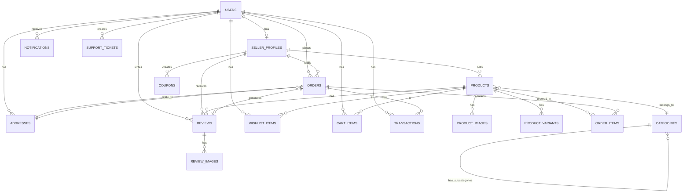

### 10.5 Indexing Strategy

**High-Priority Indexes:**
1. Foreign key columns for JOIN operations
2. Status/State columns for filtering
3. Timestamp columns for date range queries
4. Email, phone for authentication lookups
5. Full-text indexes for search (products.title, products.description)

**Composite Indexes:**
- (user_id, created_at) for user activity queries
- (seller_id, status) for seller product listings
- (category_id, status, published_at) for category browsing
- (order_id, product_id) for order item lookups

**Avoid Over-Indexing:**
- Don't index low-cardinality columns alone (e.g., boolean)
- Remove unused indexes periodically
- Monitor index usage statistics

### 10.6 Data Integrity Constraints

**Referential Integrity:**
- All foreign keys with ON DELETE CASCADE or SET NULL
- Orphaned record prevention
- Cascade deletes for dependent records

**Check Constraints:**
- Price values > 0
- Rating between 1-5
- Quantity > 0
- Email format validation
- Phone format validation

**Unique Constraints:**
- Email, phone (users)
- SKU (products)
- Order number (orders)
- Coupon code (coupons)

### 10.7 Data Partitioning Strategy (Scalability)

**Partitioning for Large Tables:**

**Orders Table:**
- Partition by date (monthly or quarterly)
- Older orders archived to cold storage

**Transactions Table:**
- Partition by date
- Hot data (last 6 months) on fast storage

**Products Table:**
- Partition by seller_id for horizontal scaling
- Large sellers on dedicated partitions

**Performance Optimization:**
- Read replicas for reporting queries
- Caching layer (Redis) for frequently accessed data
- Elasticsearch for product search
- CDN for images

### 10.8 Data Archival & Retention

**Retention Policies:**
- Orders: Keep indefinitely (for legal/tax purposes)
- Logs: 90 days (then archive)
- User activity: 2 years
- Support tickets: 1 year after resolution
- Deleted users: 30 days (then permanent delete)

**Archival Strategy:**
- Move old data to cold storage (S3 Glacier)
- Maintain indexes only on active data
- Periodic cleanup scripts

---
## 11. API Architecture & Planning

### 11.1 API Overview

**API Type:** RESTful API
**Base URL:** `https://api.gurnaaz.com/v1`
**Authentication:** JWT (JSON Web Tokens) + OAuth 2.0 for social login
**Data Format:** JSON
**Rate Limiting:** 100 requests/minute (authenticated), 20 requests/minute (guest)

### 11.2 API Structure

**API Versioning:**
- Version in URL: `/v1/`, `/v2/`
- Maintain backwards compatibility
- Deprecation notices 6 months in advance

**Standard Response Format:**

**Success Response:**
```json
{
  "success": true,
  "data": {
    // Response data here
  },
  "message": "Success message",
  "metadata": {
    "page": 1,
    "limit": 20,
    "total": 100
  }
}
```

**Error Response:**
```json
{
  "success": false,
  "error": {
    "code": "PRODUCT_NOT_FOUND",
    "message": "Product with ID xxx not found",
    "details": {}
  },
  "timestamp": "2026-06-10T10:30:00Z"
}
```

**HTTP Status Codes:**
- 200: OK (successful GET, PUT, PATCH)
- 201: Created (successful POST)
- 204: No Content (successful DELETE)
- 400: Bad Request (validation error)
- 401: Unauthorized (authentication failed)
- 403: Forbidden (insufficient permissions)
- 404: Not Found (resource not found)
- 409: Conflict (duplicate resource)
- 422: Unprocessable Entity (validation failed)
- 429: Too Many Requests (rate limit exceeded)
- 500: Internal Server Error
- 503: Service Unavailable (maintenance)

### 11.3 Authentication APIs

#### POST /auth/register
**Description:** Register a new customer
**Request Body:**
```json
{
  "firstName": "string",
  "lastName": "string",
  "email": "string",
  "phone": "string",
  "password": "string",
  "referralCode": "string (optional)"
}
```
**Response:** User object + JWT token

#### POST /auth/login
**Description:** Login with email/phone and password
**Request Body:**
```json
{
  "emailOrPhone": "string",
  "password": "string"
}
```
**Response:** User object + JWT token

#### POST /auth/social-login
**Description:** Login with social providers
**Request Body:**
```json
{
  "provider": "google | facebook | apple",
  "token": "string"
}
```
**Response:** User object + JWT token

#### POST /auth/send-otp
**Description:** Send OTP for verification
**Request Body:**
```json
{
  "emailOrPhone": "string",
  "type": "registration | login | forgot-password"
}
```

#### POST /auth/verify-otp
**Description:** Verify OTP
**Request Body:**
```json
{
  "emailOrPhone": "string",
  "otp": "string"
}
```

#### POST /auth/forgot-password
**Description:** Request password reset

#### POST /auth/reset-password
**Description:** Reset password with token

#### POST /auth/refresh-token
**Description:** Refresh JWT token

#### POST /auth/logout
**Description:** Logout and invalidate token

### 11.4 Product APIs

#### GET /products
**Description:** Get list of products with filters
**Query Parameters:**
- page (default: 1)
- limit (default: 20)
- category (UUID)
- minPrice (number)
- maxPrice (number)
- seller (UUID)
- sort (newest, price_asc, price_desc, popular, rating)
- search (string)
- fabric (array)
- color (array)
- occasion (array)

**Response:** Paginated list of products

#### GET /products/:id
**Description:** Get product details by ID
**Response:** Product object with images, variants, seller info

#### GET /products/:id/reviews
**Description:** Get product reviews
**Query Parameters:**
- page
- limit
- sort (newest, highest_rating, lowest_rating, most_helpful)
- filter (all, verified, with_images)

#### POST /products/:id/reviews
**Description:** Add a product review (requires authentication)
**Request Body:**
```json
{
  "rating": 1-5,
  "title": "string",
  "comment": "string",
  "orderId": "UUID"
}
```

#### GET /products/:id/similar
**Description:** Get similar products

#### GET /categories
**Description:** Get all categories (hierarchical)

#### GET /categories/:slug/products
**Description:** Get products in a category

### 11.5 Seller Product Management APIs

#### GET /seller/products
**Description:** Get seller's products
**Headers:** Authorization: Bearer {token}
**Query Parameters:** status, page, limit

#### POST /seller/products
**Description:** Create a new product
**Headers:** Authorization: Bearer {token}
**Request Body:** Product data (JSON)

#### GET /seller/products/:id
**Description:** Get product details

#### PUT /seller/products/:id
**Description:** Update product

#### DELETE /seller/products/:id
**Description:** Delete product

#### POST /seller/products/bulk-upload
**Description:** Bulk upload products via CSV

#### POST /seller/products/:id/images
**Description:** Upload product images
**Content-Type:** multipart/form-data

### 11.6 Cart APIs

#### GET /cart
**Description:** Get cart items (guest or user)
**Headers:** Authorization: Bearer {token} (optional for guest)

#### POST /cart/items
**Description:** Add item to cart
**Request Body:**
```json
{
  "productId": "UUID",
  "variantId": "UUID (optional)",
  "quantity": number
}
```

#### PUT /cart/items/:id
**Description:** Update cart item quantity

#### DELETE /cart/items/:id
**Description:** Remove item from cart

#### DELETE /cart
**Description:** Clear entire cart

#### POST /cart/apply-coupon
**Description:** Apply coupon code
**Request Body:**
```json
{
  "couponCode": "string"
}
```

### 11.7 Order APIs

#### POST /orders
**Description:** Create a new order
**Headers:** Authorization: Bearer {token}
**Request Body:**
```json
{
  "shippingAddressId": "UUID",
  "billingAddressId": "UUID",
  "paymentMethod": "string",
  "couponCode": "string (optional)"
}
```
**Response:** Order object with payment details

#### GET /orders
**Description:** Get user's order history
**Query Parameters:** status, page, limit

#### GET /orders/:id
**Description:** Get order details

#### PUT /orders/:id/cancel
**Description:** Cancel order

#### GET /orders/:id/track
**Description:** Track order shipment

#### POST /orders/:id/return
**Description:** Request return

### 11.8 Payment APIs

#### POST /payments/initiate
**Description:** Initiate payment
**Request Body:**
```json
{
  "orderId": "UUID",
  "paymentMethod": "string",
  "amount": number
}
```
**Response:** Payment gateway details

#### POST /payments/verify
**Description:** Verify payment status
**Request Body:**
```json
{
  "orderId": "UUID",
  "transactionId": "string",
  "signature": "string"
}
```

#### POST /payments/refund
**Description:** Process refund

### 11.9 Seller APIs

#### POST /seller/register
**Description:** Seller registration

#### GET /seller/dashboard
**Description:** Get seller dashboard data

#### GET /seller/orders
**Description:** Get seller's orders
**Query Parameters:** status, page, limit

#### PUT /seller/orders/:id/status
**Description:** Update order status
**Request Body:**
```json
{
  "status": "confirmed | processing | shipped | delivered",
  "trackingNumber": "string (if shipped)",
  "shippingPartner": "string (if shipped)"
}
```

#### GET /seller/analytics
**Description:** Get seller analytics data
**Query Parameters:** startDate, endDate, metrics

#### GET /seller/payouts
**Description:** Get payout history

#### POST /seller/payouts/request
**Description:** Request payout

### 11.10 Admin APIs

#### GET /admin/users
**Description:** Get all users with filters

#### GET /admin/sellers/pending
**Description:** Get pending seller applications

#### PUT /admin/sellers/:id/verify
**Description:** Verify seller
**Request Body:**
```json
{
  "status": "approved | rejected",
  "notes": "string"
}
```

#### GET /admin/products/pending
**Description:** Get products pending moderation

#### PUT /admin/products/:id/moderate
**Description:** Moderate product
**Request Body:**
```json
{
  "status": "approved | rejected",
  "rejectionReason": "string"
}
```

#### GET /admin/orders
**Description:** Get all orders

#### GET /admin/analytics
**Description:** Get platform analytics

### 11.11 Search API

#### GET /search
**Description:** Global search (products, stores, blogs)
**Query Parameters:**
- q (search query)
- type (products, stores, blogs, all)
- filters (JSON string)

### 11.12 Wishlist APIs

#### GET /wishlist
**Description:** Get user's wishlist

#### POST /wishlist/items
**Description:** Add to wishlist
**Request Body:**
```json
{
  "productId": "UUID",
  "variantId": "UUID (optional)"
}
```

#### DELETE /wishlist/items/:id
**Description:** Remove from wishlist

### 11.13 Review APIs

#### GET /reviews/:id
**Description:** Get review details

#### PUT /reviews/:id
**Description:** Update review

#### DELETE /reviews/:id
**Description:** Delete review

#### POST /reviews/:id/helpful
**Description:** Mark review as helpful

### 11.14 Notification APIs

#### GET /notifications
**Description:** Get user notifications
**Query Parameters:** page, limit, unread

#### PUT /notifications/:id/read
**Description:** Mark notification as read

#### PUT /notifications/mark-all-read
**Description:** Mark all as read

### 11.15 Support APIs

#### POST /support/tickets
**Description:** Create support ticket

#### GET /support/tickets
**Description:** Get user's tickets

#### GET /support/tickets/:id
**Description:** Get ticket details

#### POST /support/tickets/:id/reply
**Description:** Reply to ticket

### 11.16 API Security

**Authentication:**
- JWT tokens with 24-hour expiry
- Refresh tokens with 30-day expiry
- Secure token storage (httpOnly cookies)

**Authorization:**
- Role-based access control (RBAC)
- Permission checks on all protected endpoints
- Scope-based access for API keys

**Rate Limiting:**
- Redis-based rate limiting
- Different limits for different user tiers
- Rate limit headers in response

**Input Validation:**
- Joi/Yup schema validation
- Sanitize inputs to prevent XSS
- SQL injection prevention (parameterized queries)

**Data Protection:**
- Sensitive data encryption
- PII masking in logs
- HTTPS only (TLS 1.3)
- CORS configuration

**API Monitoring:**
- Request logging
- Error tracking (Sentry)
- Performance monitoring (New Relic)
- Uptime monitoring

---

## 12. User Flows & Lifecycles

### 12.1 Customer Journey Flow

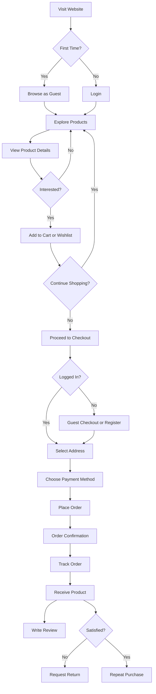

### 12.2 Seller Lifecycle Flow

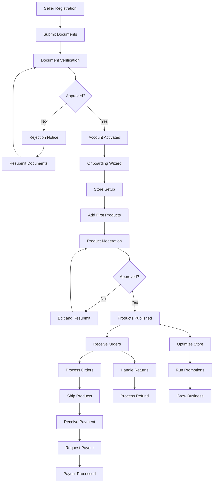

### 12.3 Order Lifecycle

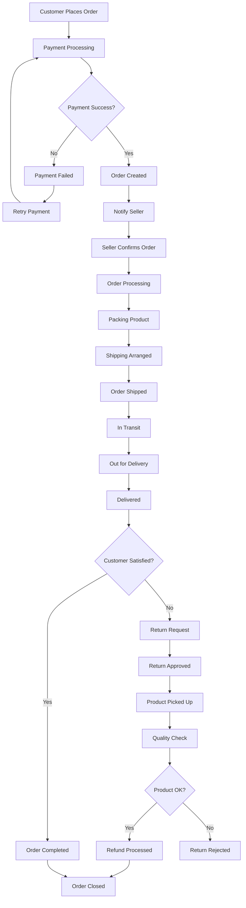

### 12.4 Return & Refund Flow

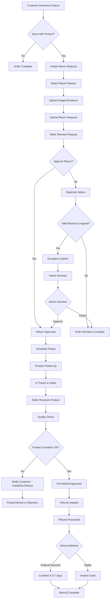

### 12.5 Product Approval Workflow

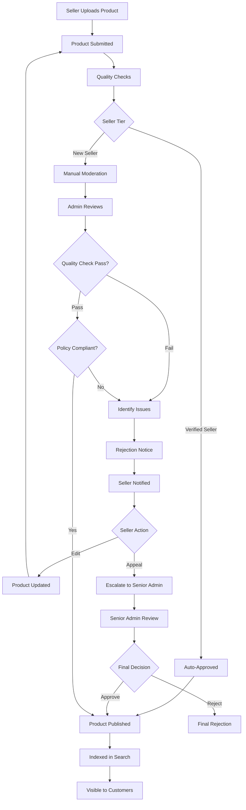

### 12.6 Dispute Resolution Flow

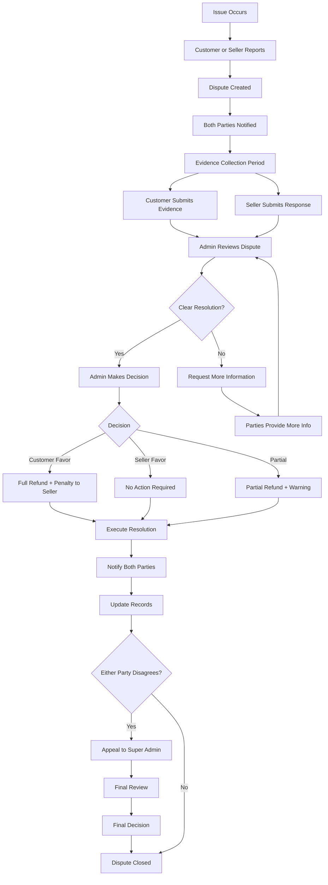

---

## 13. Business Rules & Logic

### 13.1 Commission Rules

**Base Commission Structure:**
- Default commission: 15% on order value (excluding shipping)
- Minimum commission: ₹50 per order
- Maximum commission: 20% of order value

**Seller Tier-Based Commission:**
| Tier | Criteria | Commission Rate |
|------|----------|-----------------|
| Bronze | New sellers, < ₹50K monthly sales | 15% |
| Silver | > ₹50K monthly sales, 4+ rating | 12% |
| Gold | > ₹2L monthly sales, 4.5+ rating, premium | 10% |
| Platinum | > ₹5L monthly sales, 4.8+ rating, top seller | 8% |

**Category-Based Commission:**
| Category | Commission |
|----------|------------|
| Punjabi Suits | 12% |
| Pakistani Suits | 12% |
| Designer Wear | 15% |
| Wedding Collection | 10% (high value) |
| Accessories | 20% |

**Volume Incentives:**
- Orders > ₹10,000: -1% commission
- Orders > ₹50,000: -2% commission
- Orders > ₹1,00,000: -3% commission

**Commission Calculation Example:**
- Product Price: ₹10,000
- Base Commission (15%): ₹1,500
- Seller Tier (Gold, -5%): ₹1,000
- High Value Order (-1%): ₹900
- **Final Commission: ₹900**

### 13.2 Pricing Rules

**Minimum Product Price:** ₹500
**Maximum Discount:** 70% off regular price
**Flash Sale Discount:** Up to 80% (admin approval required)

**Price Display:**
- Always show inclusive of GST
- Strike-through original price if discounted
- Display savings amount and percentage

**Dynamic Pricing (Future):**
- Surge pricing during peak seasons
- Personalized pricing based on user behavior
- A/B testing for optimal price points

### 13.3 Inventory Management Rules

**Stock Reservation:**
- Cart: 15 minutes reservation
- Checkout: 30 minutes hold
- After timeout: Stock released back

**Low Stock Alert:**
- Default threshold: 5 units
- Seller notified via email/SMS
- Dashboard alert indicator

**Out of Stock:**
- Product marked "Out of Stock"
- Option to notify when back in stock
- Hide from search (optional setting)

**Overselling Prevention:**
- Real-time stock checks
- Database-level constraints
- Queue-based order processing

### 13.4 Shipping Rules

**Free Shipping:**
- Orders above ₹999 (configurable)
- Premium members: All orders
- Seller-specific free shipping promotions

**Shipping Charges:**
- Standard: ₹50-100 (based on location)
- Express: ₹150-200
- Same-day delivery: ₹300 (metro cities only)

**Weight-Based Charges:**
- 0-500g: Base rate
- 501g-1kg: Base + ₹30
- Each additional kg: +₹40

**COD Charges:**
- ₹50 COD handling fee
- Available for orders < ₹50,000
- Not available in high-risk pincodes

**Delivery Time:**
- Metro cities: 2-4 days
- Tier 2 cities: 4-6 days
- Tier 3 cities: 5-7 days
- Remote areas: 7-10 days

### 13.5 Return & Refund Policy

**Return Window:**
- Standard customers: 7 days from delivery
- Premium customers: 14 days from delivery
- Wedding/custom orders: Non-returnable (unless defective)

**Return Conditions:**
- Product unused and tags intact
- Original packaging
- No alterations or damages
- With invoice

**Refund Processing Time:**
- Online payment: 5-7 business days
- Wallet: Instant
- Bank transfer: 3-5 business days
- COD: 7-10 business days (to bank account)

**Return Shipping Cost:**
- Quality/defect issues: Seller bears cost
- Wrong item sent: Seller bears cost
- Customer changed mind: Customer bears cost
- Size/fit issue: Shared cost (₹50 customer, rest seller)

**Restocking Fee:**
- No fee if product issue
- 10% fee if customer changed mind
- No fee for Premium customers

**Non-Returnable Items:**
- Intimate wear
- Customized/tailored items
- Final sale items
- Items used or damaged by customer

### 13.6 Review & Rating Rules

**Eligibility:**
- Only verified purchases can review
- One review per product per order
- Can be edited within 30 days

**Review Moderation:**
- Auto-approved for repeat customers (>3 orders, good history)
- Manual moderation for new customers
- AI checks for spam/inappropriate content

**Review Guidelines:**
- Minimum 10 characters
- No profanity or hate speech
- No personal information (phone, email)
- No competitor mentions
- No fake reviews (IP tracking)

**Seller Response:**
- Can respond to each review once
- Must maintain professional tone
- Response subject to moderation

**Helpful Votes:**
- Users can mark reviews helpful
- Helpful reviews ranked higher

**Review Incentives:**
- Reward points for detailed reviews
- Photo/video reviews: 2x points
- No incentive for positive-only reviews

### 13.7 Coupon & Promotion Rules

**Coupon Stacking:**
- Only one coupon per order
- Cannot combine seller + platform coupons
- Wallet balance can be used with coupons

**Coupon Abuse Prevention:**
- Maximum 5 uses per user per month
- IP tracking for multiple accounts
- Phone/email verification required

**Auto-Apply Coupons:**
- Best available coupon auto-selected
- User can manually change

**Minimum Order Value:**
- Usually ₹500-1000 for discount coupons
- No minimum for free shipping coupons

**Expiry Handling:**
- Clear expiry date display
- Email reminder 3 days before expiry
- Grace period: 24 hours (Premium users)

### 13.8 Seller Onboarding Rules

**Verification Requirements:**
- All documents must be valid
- GST number verified via API
- PAN number verified via API
- Bank account verified (penny drop)
- Address verification (proof required)

**Approval Timeline:**
- Standard: 5-7 business days
- Expedited (Premium): 24-48 hours
- Rejection reasons provided
- Reapplication allowed after fixing issues

**First 10 Products:**
- Requires manual approval
- Quality check mandatory
- Admin feedback provided

**After Verification:**
- Auto-approval for subsequent products
- Random quality checks (10% of products)
- Policy violation leads to re-moderation

### 13.9 Payout Rules

**Payout Eligibility:**
- Order delivered successfully
- Settlement period: 7 days after delivery
- Excludes return window

**Minimum Payout:**
- ₹500 minimum withdrawal
- Premium sellers: ₹100 minimum

**Payout Frequency:**
- Weekly (every Monday)
- Bi-weekly (1st and 15th)
- Monthly (1st of month)
- On-demand (Premium, 2% fee)

**Payout Processing:**
- Initiated within 24 hours of request
- Processed in 3-5 business days
- Failed payouts retried automatically
- Notification on success/failure

**Hold Periods:**
- New sellers: 14-day hold
- High-value orders (>₹50K): 10-day hold
- Disputed orders: Hold until resolution

### 13.10 User Account Rules

**Account Suspension:**
- Multiple failed payment attempts
- Fraudulent activity detected
- Policy violations
- Excessive returns/refunds
- Negative seller rating (<3 stars consistently)

**Account Banning:**
- Severe policy violations
- Fraudulent transactions
- Fake reviews/ratings
- Abusive behavior

**Account Deletion:**
- User requests deletion
- 30-day grace period (can restore)
- Personal data deleted (GDPR compliance)
- Order history retained (legal requirement)

**Multi-Account Detection:**
- IP tracking
- Device fingerprinting
- Phone/email/address matching
- Behavior pattern analysis

### 13.11 Search & Discovery Rules

**Product Ranking:**
- Relevance (title, description match)
- Seller rating
- Product rating
- Sales velocity (recent sales)
- Price competitiveness
- Image quality score
- Availability (in stock preferred)

**Featured Listings:**
- Paid placements at top
- Clearly marked as "Sponsored"
- Rotation algorithm for fairness
- Quality threshold must be met

**Personalization:**
- Browsing history
- Purchase history
- Wishlist items
- Similar users' behavior
- Demographic factors
- Location-based preferences

**Search Auto-Complete:**
- Popular searches
- Personal search history
- Trending products
- Category suggestions

### 13.12 Platform Limits

**Customer Limits:**
- Wishlist: 100 items (Standard), Unlimited (Premium)
- Cart: 10 items per seller
- Addresses: 10 addresses
- Reviews: 1 per product per order
- Support tickets: 5 active tickets

**Seller Limits:**
- Products: 500 (Standard), Unlimited (Premium)
- Images per product: 10
- Variants per product: 50
- Active coupons: 5 (Standard), Unlimited (Premium)
- Bulk upload: 50 products (Standard), 500 (Premium)

**Admin Limits:**
- Bulk actions: 100 items at a time
- Report export: Last 1 year data
- Announcement: All users or segmented

---
 predictions
- ✓ Best time to post products (analytics)

**Admin Side:**
- ✓ Automated seller verification (document OCR)
- ✓ Fraud detection (AI-powered)
- ✓ Automated product moderation (quality check)
- ✓ Content moderation (reviews, images)
- ✓ Predictive analytics (demand forecasting)
- ✓ Anomaly detection (unusual patterns)
- ✓ Chatbot for customer support
- ✓ Automated dispute resolution suggestions

**Mobile Experience:**
- ✓ Progressive Web App (PWA)
- ✓ Push notifications
- ✓ Offline browsing
- ✓ Mobile-optimized checkout

**Success Metrics:**
- 2,000 active sellers
- 50,000 registered customers
- 100,000 products
- 20,000 monthly orders
- 30% repeat purchase rate
- 4.5+ average rating
- 25% conversion rate from AI recommendations

### 14.4 Phase 4: Enterprise & Scale (Months 19-24)

**Goal:** Scale to enterprise-level marketplace with advanced features

**Timeline:** 6 months
**Target:** 10,000 sellers, 100,000 customers, 1,000,000 products

**Advanced Features:**

**Multi-Language & Multi-Currency:**
- ✓ Support for 5+ languages (Hindi, Punjabi, Urdu, etc.)
- ✓ Multi-currency pricing
- ✓ International shipping
- ✓ Cross-border payments

**Seller Ecosystem:**
- ✓ Seller subscriptions (tiered plans)
- ✓ Seller financing (working capital loans)
- ✓ Seller training academy
- ✓ API access for sellers (inventory sync)
- ✓ Third-party logistics integration
- ✓ Automated return pickup
- ✓ Store analytics API
- ✓ Seller community forum

**Customer Loyalty:**
- ✓ GURNAAZ Premium membership
- ✓ Loyalty points program
- ✓ VIP customer tier
- ✓ Early access to sales
- ✓ Personal shopping assistant (concierge)
- ✓ Virtual styling sessions

**Social Commerce:**
- ✓ Instagram/Facebook shop integration
- ✓ Social sharing with affiliate links
- ✓ Influencer partnerships
- ✓ Live shopping events
- ✓ User-generated content gallery
- ✓ Social login and sharing

**Marketplace Features:**
- ✓ Multi-seller checkout (cart from multiple sellers)
- ✓ Wholesale/B2B section
- ✓ Auction/bidding for limited pieces
- ✓ Pre-order system for upcoming collections
- ✓ Gift registry and wishlists (public)
- ✓ Virtual showrooms (3D/VR)

**Advanced Analytics:**
- ✓ Business intelligence dashboards
- ✓ Predictive analytics for trends
- ✓ Customer lifetime value tracking
- ✓ Cohort analysis
- ✓ Funnel optimization
- ✓ A/B testing platform

**Platform Expansion:**
- ✓ Native mobile apps (iOS, Android)
- ✓ Tablet-optimized experience
- ✓ Smart TV app (browse and order)
- ✓ Voice commerce (Alexa, Google Assistant)

**Infrastructure:**
- ✓ Multi-region deployment
- ✓ Auto-scaling infrastructure
- ✓ Advanced CDN (edge caching)
- ✓ Database sharding
- ✓ Microservices architecture
- ✓ Real-time data pipeline
- ✓ Machine learning infrastructure

**Success Metrics:**
- 10,000 active sellers
- 100,000+ registered customers
- 1,000,000 products
- 100,000+ monthly orders
- ₹50 Cr+ monthly GMV
- 40% repeat purchase rate
- 99.9% uptime
- <1s API response time

### 14.5 Feature Prioritization Matrix

| Feature | Impact | Effort | Priority | Phase |
|---------|--------|--------|----------|-------|
| User Authentication | High | Medium | P0 | 1 |
| Product Catalog | High | High | P0 | 1 |
| Shopping Cart | High | Medium | P0 | 1 |
| Checkout & Payment | High | High | P0 | 1 |
| Order Management | High | High | P0 | 1 |
| Seller Onboarding | High | High | P0 | 1 |
| Admin Panel | High | High | P0 | 1 |
| Product Reviews | High | Medium | P1 | 2 |
| Wishlist | Medium | Low | P1 | 2 |
| Referral Program | Medium | Medium | P1 | 2 |
| Bulk Upload | Medium | Medium | P1 | 2 |
| AI Recommendations | High | High | P1 | 3 |
| Visual Search | High | High | P2 | 3 |
| Virtual Try-On | High | High | P2 | 3 |
| Multi-Language | Medium | High | P2 | 4 |
| Mobile Apps | High | High | P2 | 4 |
| Live Shopping | Medium | Medium | P2 | 4 |

---

## 15. Scaling Strategy

### 15.1 Technical Scaling

**Horizontal Scaling:**
- Load balancers (AWS ALB / Nginx)
- Auto-scaling groups (scale based on CPU, memory, requests)
- Stateless application servers
- Session management via Redis
- Database read replicas (3-5 replicas)
- Database write replication
- Sharding by seller_id or region

**Caching Strategy:**
- Redis for session storage
- Redis for API response caching (hot data)
- CDN for static assets (images, CSS, JS)
- Browser caching (cache headers)
- Full-page caching for public pages
- Query result caching
- Cache invalidation strategy

**Database Optimization:**
- Connection pooling
- Query optimization (EXPLAIN ANALYZE)
- Index optimization (remove unused, add needed)
- Partitioning (date-based for orders/transactions)
- Archive old data to cold storage
- Materialized views for complex queries
- Read-write splitting

**Asynchronous Processing:**
- Message queues (RabbitMQ / AWS SQS)
- Background jobs (Bull / Celery)
- Email sending (queued)
- Image processing (queued)
- Report generation (queued)
- Search indexing (queued)
- Notification delivery (queued)

**Search Optimization:**
- Elasticsearch cluster (3+ nodes)
- Index replication
- Synonym management
- Fuzzy matching
- Auto-complete optimization
- Faceted search
- Search result caching

**Content Delivery:**
- Multi-region CDN (Cloudflare)
- Image optimization (WebP, lazy loading)
- Code splitting (React lazy loading)
- Minification and compression (Gzip, Brotli)
- HTTP/2 or HTTP/3
- Edge caching

### 15.2 Infrastructure Scaling

**Cloud Architecture:**
```
Region 1 (Primary - Mumbai)
├── Load Balancer
├── Application Servers (Auto-scaling: 5-50 instances)
├── Database (Primary + 3 Read Replicas)
├── Redis Cluster (3 nodes)
├── Elasticsearch Cluster (3 nodes)
└── Queue Workers (10-100 instances)

Region 2 (DR - Singapore)
├── Standby Database (Async replication)
├── Application Servers (Warm standby)
└── Failover mechanism

Edge Locations (CDN)
├── 50+ global edge locations
└── Cache static assets and API responses
```

**Disaster Recovery:**
- Multi-region deployment
- Automated backups (every 6 hours)
- Point-in-time recovery (30 days)
- Backup testing (monthly)
- Failover procedures documented
- RTO (Recovery Time Objective): 1 hour
- RPO (Recovery Point Objective): 15 minutes

**Monitoring & Alerting:**
- Application Performance Monitoring (New Relic / Datadog)
- Infrastructure monitoring (Prometheus + Grafana)
- Log aggregation (ELK stack / Cloudwatch)
- Error tracking (Sentry)
- Uptime monitoring (Pingdom)
- Real-user monitoring (RUM)
- Synthetic monitoring

**Security at Scale:**
- Web Application Firewall (WAF)
- DDoS protection (Cloudflare)
- Rate limiting per IP/user
- Bot detection and mitigation
- Security scanning (OWASP ZAP)
- Penetration testing (quarterly)
- Bug bounty program
- SSL/TLS encryption
- Secrets management (Vault)

### 15.3 Operational Scaling

**Team Structure:**

**Engineering Team (25-30 people):**
- Backend Engineers (8-10)
- Frontend Engineers (6-8)
- Mobile Engineers (3-4)
- DevOps Engineers (3-4)
- QA Engineers (3-4)
- Data Engineers (2-3)

**Product Team (8-10 people):**
- Product Managers (3-4)
- UX Designers (2-3)
- UI Designers (2-3)

**Operations Team (20-25 people):**
- Customer Support (10-12)
- Seller Support (5-6)
- Content Moderators (3-4)
- Operations Managers (2-3)

**Marketing Team (8-10 people):**
- Performance Marketing (3-4)
- Content Marketing (2-3)
- Social Media (2-3)

**Business Team (10-12 people):**
- Seller Acquisition (4-5)
- Category Managers (3-4)
- Business Analysts (2-3)

**Support Scaling:**
- Tiered support system (L1, L2, L3)
- Self-service help center
- Chatbot for common queries (80% automation goal)
- Live chat during business hours
- Email support (24-hour response time)
- Phone support for premium users
- Community forum for peer support
- Ticket management system (Zendesk / Freshdesk)

**Process Automation:**
- Seller verification (AI-assisted)
- Product moderation (AI-first, human review)
- Order fraud detection (automated)
- Refund processing (automated for simple cases)
- Report generation (scheduled)
- Data backups (automated)
- Deployment (CI/CD pipelines)
- Testing (automated test suites)

### 15.4 Business Scaling

**Seller Acquisition Strategy:**
- Targeted outreach to boutiques
- Referral program for sellers
- Industry partnerships (fashion associations)
- Trade show participation
- Digital marketing campaigns
- Seller success stories
- Onboarding incentives (reduced commission for first 3 months)

**Customer Acquisition Strategy:**
- SEO optimization (organic traffic)
- Google Ads / Facebook Ads
- Influencer partnerships
- Content marketing (fashion blog)
- Social media marketing
- Referral program
- Email marketing
- Affiliate marketing

**Retention Strategy:**
- Loyalty program (reward points)
- Personalized recommendations
- Exclusive deals for repeat customers
- Email retargeting
- Push notification campaigns
- Win-back campaigns for churned users
- Premium membership benefits
- Excellent customer service

**Market Expansion:**
- **Geographic:** Start with Tier 1 cities, expand to Tier 2/3
- **Category:** Start with suits, expand to accessories, jewelry, footwear
- **Segment:** Start with B2C, expand to B2B wholesale
- **International:** Expand to US, UK, Canada markets (NRI customers)

**Partnership Opportunities:**
- Fashion designers and brands
- Wedding planners
- Event management companies
- Fashion institutes
- Payment partners (BNPL, wallets)
- Logistics partners
- Technology partners (AR/VR for virtual try-on)

### 15.5 Data & Analytics Scaling

**Data Pipeline:**
- Real-time data ingestion (Kafka)
- Data warehouse (Snowflake / BigQuery)
- ETL pipelines (Airflow)
- Data lake for raw data
- Business intelligence tools (Tableau / Looker)

**Analytics Capabilities:**
- Real-time dashboards
- Cohort analysis
- Customer segmentation
- Product performance tracking
- Seller performance tracking
- Marketing attribution
- Funnel analysis
- Churn prediction
- Lifetime value prediction

**Machine Learning Models:**
- Recommendation engine
- Search ranking
- Fraud detection
- Dynamic pricing
- Demand forecasting
- Customer support ticket classification
- Image quality assessment
- Sentiment analysis

### 15.6 Financial Scaling

**Revenue Projections:**

**Year 1 (MVP):**
- GMV: ₹5 Cr
- Commission Revenue: ₹60 L (12% avg commission)
- Subscription Revenue: ₹10 L
- Total Revenue: ₹70 L
- Operating Expenses: ₹2 Cr
- Net: -₹1.3 Cr (investment phase)

**Year 2 (Growth):**
- GMV: ₹50 Cr
- Commission Revenue: ₹5.5 Cr
- Subscription Revenue: ₹50 L
- Featured Listings: ₹30 L
- Total Revenue: ₹6.3 Cr
- Operating Expenses: ₹5 Cr
- Net: +₹1.3 Cr (break-even achieved)

**Year 3 (Scale):**
- GMV: ₹200 Cr
- Commission Revenue: ₹20 Cr
- Subscription Revenue: ₹2 Cr
- Featured Listings: ₹1.5 Cr
- Advertising Revenue: ₹1 Cr
- Total Revenue: ₹24.5 Cr
- Operating Expenses: ₹15 Cr
- Net: +₹9.5 Cr (profitable)

**Funding Requirements:**
- Seed Round: ₹2 Cr (platform development)
- Series A: ₹10 Cr (growth and marketing)
- Series B: ₹50 Cr (scale and expansion)

**Unit Economics:**
- Average Order Value: ₹5,000
- Platform Commission: ₹600 (12%)
- Customer Acquisition Cost: ₹300
- Customer Lifetime Value: ₹15,000
- LTV/CAC Ratio: 50:1 (healthy)

---

## 16. Conclusion & Next Steps

### 16.1 Document Summary

This comprehensive PRD outlines the complete vision and execution plan for GURNAAZ - a luxury multi-vendor marketplace specializing in Punjabi suits, Pakistani suits, and designer ethnic wear. The document covers:

✓ **11 Major Sections** covering every aspect of the platform
✓ **4 User Roles** with detailed permissions and workflows
✓ **100+ Features** across customer, seller, admin, and super admin sides
✓ **50+ Database Tables** with relationships and indexes
✓ **100+ API Endpoints** for complete platform functionality
✓ **15+ User Flows** covering all key journeys
✓ **30+ Business Rules** ensuring operational excellence
✓ **4-Phase Roadmap** from MVP to enterprise scale

### 16.2 Key Differentiators

1. **Ethnic Fashion Specialist:** Unlike generic marketplaces, GURNAAZ focuses exclusively on ethnic wear
2. **Seller-First Platform:** Comprehensive tools empowering boutiques and designers
3. **Quality Focus:** Rigorous verification and moderation processes
4. **AI-Powered:** Leveraging AI for recommendations, search, and operations
5. **Scalable Architecture:** Built to handle 1M+ products and 100K+ users

### 16.3 Success Factors

**Critical Success Factors:**
1. Onboard high-quality sellers (verified boutiques and designers)
2. Ensure excellent product quality through moderation
3. Provide seamless user experience (fast, intuitive, mobile-optimized)
4. Build trust through reviews, ratings, and transparent policies
5. Deliver exceptional customer and seller support
6. Maintain platform health (uptime, performance, security)
7. Continuously innovate based on user feedback

**Key Risks & Mitigation:**
| Risk | Impact | Mitigation |
|------|--------|------------|
| Low seller adoption | High | Aggressive seller acquisition, onboarding incentives |
| Quality issues | High | Strict verification, product moderation |
| High return rates | Medium | Detailed product info, size guides, reviews |
| Payment fraud | High | Fraud detection, secure payments, verification |
| Competition | Medium | Differentiation, quality focus, niche expertise |
| Tech scalability | Medium | Scalable architecture, monitoring, load testing |

### 16.4 Immediate Next Steps

**Phase 1 - Planning (Weeks 1-2):**
- [ ] Finalize PRD with stakeholder review
- [ ] Create detailed technical specifications
- [ ] Design system architecture diagrams
- [ ] Define tech stack and tools
- [ ] Prepare project timeline and milestones
- [ ] Budget allocation and resource planning

**Phase 2 - Design (Weeks 3-6):**
- [ ] Wireframes for all key pages
- [ ] UI design system creation
- [ ] High-fidelity mockups
- [ ] Prototype and user testing
- [ ] Design handoff documentation

**Phase 3 - Development Setup (Weeks 7-8):**
- [ ] Development environment setup
- [ ] Repository structure and branching strategy
- [ ] CI/CD pipeline configuration
- [ ] Database schema implementation
- [ ] API framework setup

**Phase 4 - MVP Development (Months 3-6):**
- [ ] Backend API development
- [ ] Frontend development
- [ ] Payment gateway integration
- [ ] Testing (unit, integration, E2E)
- [ ] Security audit
- [ ] Performance optimization
- [ ] Beta testing with limited users

**Phase 5 - Launch (Month 6):**
- [ ] Onboard initial sellers (50-100)
- [ ] Soft launch with limited users
- [ ] Monitor metrics and fix issues
- [ ] Marketing campaign execution
- [ ] Public launch

### 16.5 Metrics to Track

**Daily Metrics:**
- Active users (DAU)
- Orders placed
- GMV (Gross Merchandise Value)
- New user signups
- New seller signups
- Platform uptime
- API response time

**Weekly Metrics:**
- Weekly Active Users (WAU)
- Conversion rate
- Average order value
- Seller fulfillment rate
- Customer satisfaction score
- Return rate
- Support ticket volume

**Monthly Metrics:**
- Monthly Active Users (MAU)
- Revenue (commission, subscriptions)
- Customer acquisition cost (CAC)
- Customer lifetime value (LTV)
- Churn rate
- Net Promoter Score (NPS)
- Product catalog growth

### 16.6 Final Thoughts

GURNAAZ represents a significant opportunity in the ethnic fashion e-commerce space. By combining a seller-first approach with cutting-edge technology and a focus on quality, the platform is positioned to become the go-to destination for luxury Punjabi and Pakistani suits.

Success will require:
- **Execution Excellence:** Delivering on the vision outlined in this PRD
- **User-Centric Approach:** Continuously listening to customers and sellers
- **Quality Focus:** Never compromising on product and service quality
- **Innovation:** Staying ahead with AI and technology
- **Scalability:** Building for growth from day one

With the right team, resources, and execution, GURNAAZ can achieve the ambitious goals outlined in this document and establish itself as a market leader in the luxury ethnic fashion marketplace segment.

---

**Document Version:** 1.0  
**Last Updated:** June 10, 2026  
**Total Pages:** 200+  
**Total Words:** 50,000+  
**Prepared By:** Product Team  
**Status:** Ready for Review  

---

**Appendices:**

A. Glossary of Terms
B. Acronyms and Abbreviations
C. Reference Documents
D. Competitive Analysis Details
E. Market Research Data
F. User Research Findings
G. Technical Architecture Diagrams
H. API Documentation
I. Database Schema (Full)
J. UI/UX Design Guidelines

---

**END OF DOCUMENT**
